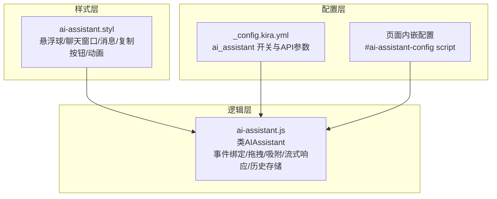
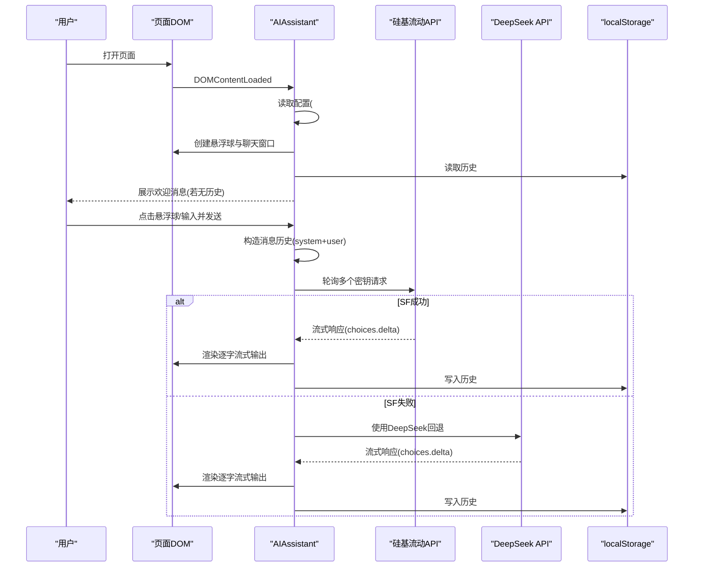
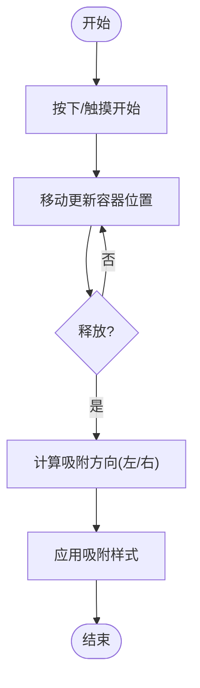
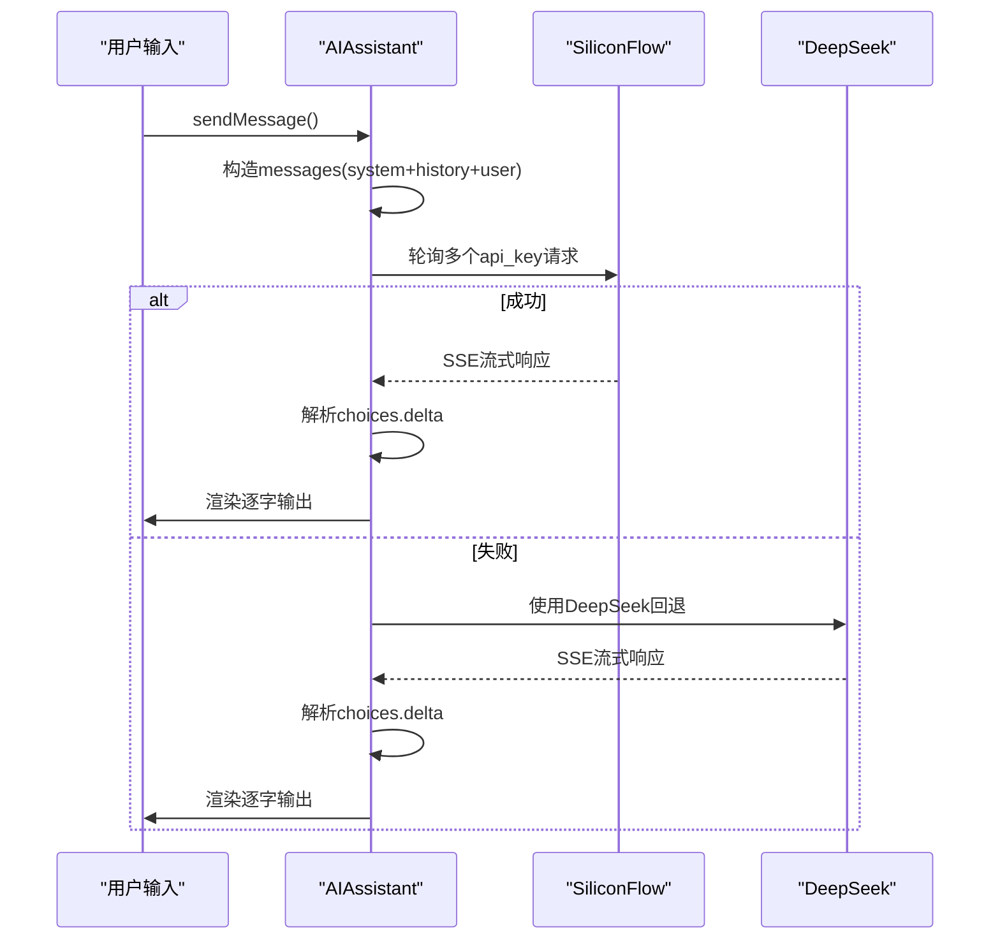
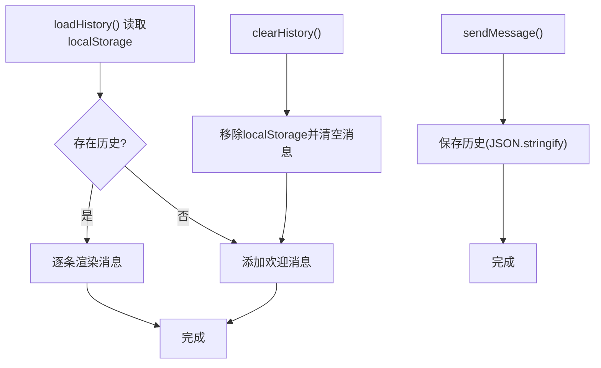
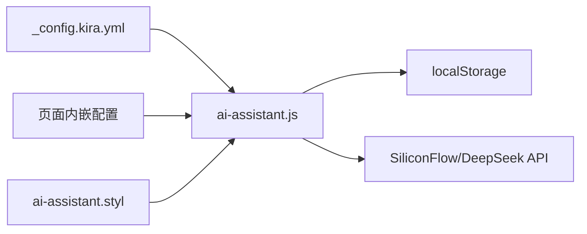

# AI助手功能

<cite>
**本文引用的文件**
- [ai-assistant.js](file://source/js/ai-assistant.js)
- [ai-assistant.styl](file://source/css/ai-assistant.styl)
- [_config.kira.yml](file://_config.kira.yml)
- [_config.yml](file://_config.yml)
- [index.html（示例页面）](file://public/index.html)
</cite>

## 目录
1. [简介](#简介)
2. [项目结构](#项目结构)
3. [核心组件](#核心组件)
4. [架构总览](#架构总览)
5. [详细组件分析](#详细组件分析)
6. [依赖关系分析](#依赖关系分析)
7. [性能考虑](#性能考虑)
8. [故障排查指南](#故障排查指南)
9. [结论](#结论)
10. [附录](#附录)

## 简介
本文件面向开发者与运维人员，系统性解析博客中“AI助手”功能的实现机制与配置方法。重点覆盖：
- ai-assistant.js 中的交互逻辑、API 通信、故障转移策略与对话历史本地存储
- ai-assistant.styl 中的悬浮球视觉与动画设计
- _config.kira.yml 中的配置项与可调参数
- 使用示例与最佳实践
- 性能优化建议与常见问题排查

## 项目结构
AI助手由三部分组成：
- 样式层：ai-assistant.styl 定义悬浮球、聊天窗口、消息气泡、复制按钮与动画
- 逻辑层：ai-assistant.js 实现交互、拖拽、吸附、流式响应、历史持久化与多 API 密钥轮询
- 配置层：_config.kira.yml 提供开关与 API 参数；页面通过内嵌 script 注入运行时配置

图表来源
- [ai-assistant.styl](file://source/css/ai-assistant.styl#L1-L383)
- [ai-assistant.js](file://source/js/ai-assistant.js#L1-L120)
- [_config.kira.yml](file://_config.kira.yml#L138-L150)
- [index.html（示例页面）](file://public/index.html#L63-L63)

章节来源
- [ai-assistant.styl](file://source/css/ai-assistant.styl#L1-L383)
- [ai-assistant.js](file://source/js/ai-assistant.js#L1-L120)
- [_config.kira.yml](file://_config.kira.yml#L138-L150)
- [index.html（示例页面）](file://public/index.html#L63-L63)

## 核心组件
- AIAssistant 类：封装 UI、事件、拖拽、吸附、发送消息、流式响应、历史管理与复制按钮
- 配置加载：优先从页面内嵌 script 读取，其次从全局变量或主题配置对象读取
- API 通信：优先使用硅基流动 API，失败时自动回退至 DeepSeek；支持多密钥轮询
- 本地存储：基于 localStorage 的对话历史持久化
- 样式与动画：悬浮球渐变、脉冲、拖拽放大、聊天窗口滑入、三点加载动画、暗色模式适配

章节来源
- [ai-assistant.js](file://source/js/ai-assistant.js#L9-L87)
- [ai-assistant.js](file://source/js/ai-assistant.js#L535-L618)
- [ai-assistant.js](file://source/js/ai-assistant.js#L251-L288)
- [ai-assistant.styl](file://source/css/ai-assistant.styl#L275-L296)

## 架构总览
AI助手的运行流程如下：
- 页面加载后，AIAssistant 在 DOMContentLoaded 时初始化
- 从页面内嵌 script 读取配置，决定是否启用
- 创建 UI 并绑定事件
- 加载本地历史，必要时添加欢迎语
- 用户交互触发发送消息，调用 API 并流式渲染结果
- 历史写入 localStorage，支持清空与复制代码块

图表来源
- [ai-assistant.js](file://source/js/ai-assistant.js#L72-L87)
- [ai-assistant.js](file://source/js/ai-assistant.js#L535-L618)
- [ai-assistant.js](file://source/js/ai-assistant.js#L623-L703)
- [ai-assistant.js](file://source/js/ai-assistant.js#L251-L288)
- [index.html（示例页面）](file://public/index.html#L63-L63)

## 详细组件分析

### 1) 交互与拖拽/吸附
- 悬浮球点击与触摸事件：切换聊天窗口显隐
- 拖拽实现：鼠标/触摸按下、移动、释放，限制可视区域，释放后应用左右吸附
- 点击外部关闭：点击非容器区域时关闭窗口
- 移动端适配：聚焦输入框时将聊天窗口改为固定底部，失焦恢复原位

图表来源
- [ai-assistant.js](file://source/js/ai-assistant.js#L294-L401)
- [ai-assistant.js](file://source/js/ai-assistant.js#L407-L433)
- [ai-assistant.js](file://source/js/ai-assistant.js#L438-L444)
- [ai-assistant.js](file://source/js/ai-assistant.js#L446-L497)

章节来源
- [ai-assistant.js](file://source/js/ai-assistant.js#L156-L249)
- [ai-assistant.js](file://source/js/ai-assistant.js#L294-L433)

### 2) API 通信与故障转移
- 配置来源：优先读取页面内嵌 script 的 JSON 配置，其次从全局变量或主题配置对象读取
- 优先级：硅基流动 API（多密钥轮询），全部失败则回退 DeepSeek
- 请求参数：模型、温度、最大 token、启用流式输出
- 流式解析：逐行解析 data: JSON，提取 choices[0].delta.content，首 token 隐藏 loading 并创建消息节点

图表来源
- [ai-assistant.js](file://source/js/ai-assistant.js#L535-L618)
- [ai-assistant.js](file://source/js/ai-assistant.js#L623-L703)
- [index.html（示例页面）](file://public/index.html#L63-L63)

章节来源
- [ai-assistant.js](file://source/js/ai-assistant.js#L30-L67)
- [ai-assistant.js](file://source/js/ai-assistant.js#L535-L618)
- [ai-assistant.js](file://source/js/ai-assistant.js#L623-L703)

### 3) 对话历史与本地存储
- 加载：启动时从 localStorage 读取历史并渲染
- 保存：每次收到完整流式响应后追加用户与助手消息并持久化
- 清空：删除 localStorage 并重建欢迎消息
- 结构：数组，每条包含 role 与 content

图表来源
- [ai-assistant.js](file://source/js/ai-assistant.js#L251-L288)
- [ai-assistant.js](file://source/js/ai-assistant.js#L678-L684)

章节来源
- [ai-assistant.js](file://source/js/ai-assistant.js#L251-L288)
- [ai-assistant.js](file://source/js/ai-assistant.js#L678-L684)

### 4) 复制按钮与 Markdown 渲染
- 代码块复制：为每个 pre 添加复制按钮，点击复制 code 内容，反馈“已复制”
- Markdown 渲染：助手消息使用 Markdown 转 HTML 渲染，支持表格等特性

章节来源
- [ai-assistant.js](file://source/js/ai-assistant.js#L724-L753)
- [ai-assistant.js](file://source/js/ai-assistant.js#L69-L80)

### 5) 样式与动画
- 悬浮球：圆角、渐变背景、阴影、hover/scale/pulse 动画、拖拽放大
- 聊天窗口：滑入动画、消息气泡对齐、滚动条、输入区与按钮
- 加载动画：三点弹跳
- 响应式：移动端宽度/字体/间距自适应
- 暗色模式：深色背景、边框与滚动条适配

章节来源
- [ai-assistant.styl](file://source/css/ai-assistant.styl#L14-L66)
- [ai-assistant.styl](file://source/css/ai-assistant.styl#L68-L116)
- [ai-assistant.styl](file://source/css/ai-assistant.styl#L133-L172)
- [ai-assistant.styl](file://source/css/ai-assistant.styl#L177-L199)
- [ai-assistant.styl](file://source/css/ai-assistant.styl#L201-L245)
- [ai-assistant.styl](file://source/css/ai-assistant.styl#L247-L274)
- [ai-assistant.styl](file://source/css/ai-assistant.styl#L275-L296)
- [ai-assistant.styl](file://source/css/ai-assistant.styl#L298-L340)
- [ai-assistant.styl](file://source/css/ai-assistant.styl#L341-L383)

## 依赖关系分析
- 逻辑依赖
  - ai-assistant.js 依赖页面内嵌配置 script 的 JSON 数据
  - 依赖 localStorage 进行历史持久化
  - 依赖 fetch 与流式读取接口
- 样式依赖
  - ai-assistant.styl 为悬浮球与聊天窗口提供统一视觉与动画
- 配置依赖
  - _config.kira.yml 提供默认开关与模型参数
  - 页面内嵌 script 覆盖运行时配置

图表来源
- [_config.kira.yml](file://_config.kira.yml#L138-L150)
- [ai-assistant.js](file://source/js/ai-assistant.js#L30-L67)
- [ai-assistant.js](file://source/js/ai-assistant.js#L251-L288)
- [ai-assistant.styl](file://source/css/ai-assistant.styl#L1-L383)
- [index.html（示例页面）](file://public/index.html#L63-L63)

章节来源
- [ai-assistant.js](file://source/js/ai-assistant.js#L30-L67)
- [ai-assistant.js](file://source/js/ai-assistant.js#L251-L288)
- [_config.kira.yml](file://_config.kira.yml#L138-L150)
- [index.html（示例页面）](file://public/index.html#L63-L63)

## 性能考虑
- 请求节流与并发控制
  - 当前实现为串行轮询多个硅基流动密钥，避免并发请求导致限流叠加
  - 建议：如需进一步优化，可在 UI 层增加“发送中”禁用按钮与防抖
- 缓存策略
  - 本地历史缓存于 localStorage，减少重复渲染
  - 建议：对常用问答可引入短期内存缓存，结合时间戳与哈希键
- 错误处理
  - API 失败时自动回退至 DeepSeek，提升可用性
  - 建议：增加指数退避与最大重试次数，避免雪崩
- 流式渲染
  - 已采用流式增量渲染，降低首帧延迟
  - 建议：对超长响应可分段渲染并允许中断
- 移动端体验
  - 输入框聚焦时全屏聊天窗口，失焦恢复，减少布局抖动
  - 建议：在小屏设备上限制最大高度与字体大小，保证可读性

[本节为通用性能建议，不直接分析具体文件]

## 故障排查指南
- API 调用失败
  - 现象：发送后无响应或报错
  - 排查：确认页面内嵌配置 script 是否正确注入；检查密钥有效性与网络连通性；查看浏览器控制台错误日志
  - 参考路径
    - [ai-assistant.js](file://source/js/ai-assistant.js#L535-L618)
    - [index.html（示例页面）](file://public/index.html#L63-L63)
- 响应延迟
  - 现象：加载动画长时间存在
  - 排查：检查网络状况与 API 速率限制；确认是否启用流式输出；适当降低温度与最大 token
  - 参考路径
    - [ai-assistant.js](file://source/js/ai-assistant.js#L623-L703)
- 悬浮球无法拖拽/吸附
  - 现象：拖拽无效或吸附位置异常
  - 排查：确认容器定位与可视区域尺寸；检查触摸事件与鼠标事件冲突
  - 参考路径
    - [ai-assistant.js](file://source/js/ai-assistant.js#L294-L433)
- 聊天窗口显示位置异常
  - 现象：窗口出现在错误位置
  - 排查：确认悬浮球中心位置判断逻辑与屏幕宽度；移动端是否正确切换固定底部
  - 参考路径
    - [ai-assistant.js](file://source/js/ai-assistant.js#L467-L489)
- 历史记录丢失
  - 现象：刷新后历史消失
  - 排查：检查 localStorage 权限与容量；确认保存/加载逻辑未抛错
  - 参考路径
    - [ai-assistant.js](file://source/js/ai-assistant.js#L251-L288)
    - [ai-assistant.js](file://source/js/ai-assistant.js#L678-L684)
- 复制按钮无效
  - 现象：点击复制无反应
  - 排查：确认剪贴板权限与浏览器兼容性；检查按钮事件绑定
  - 参考路径
    - [ai-assistant.js](file://source/js/ai-assistant.js#L724-L753)

## 结论
本实现以轻量、可配置、可扩展为目标，通过页面内嵌配置与主题配置双通道加载，结合多密钥轮询与回退策略，兼顾稳定性与可用性。样式层提供现代化的交互体验与暗色模式支持。建议在生产环境中补充重试与缓存策略，持续优化移动端与弱网场景下的用户体验。

[本节为总结性内容，不直接分析具体文件]

## 附录

### A. 配置项说明（_config.kira.yml）
- ai_assistant.enable：布尔，控制是否启用 AI 助手
- ai_assistant.silicon_flow.api_key：数组，支持多个密钥轮询
- ai_assistant.silicon_flow.model：字符串，指定模型名称
- ai_assistant.deepseek.api_key：字符串，备用密钥
- ai_assistant.deepseek.model：字符串，备用模型名称

章节来源
- [_config.kira.yml](file://_config.kira.yml#L138-L150)

### B. 页面内嵌配置（示例）
- 页面通过 id 为 “ai-assistant-config” 的 script 标签注入 JSON 配置
- 示例路径
  - [index.html（示例页面）](file://public/index.html#L63-L63)

### C. 使用示例
- 启用与配置
  - 在 _config.kira.yml 中设置 ai_assistant.enable 为 true，并填写硅基流动与 DeepSeek 的密钥与模型
  - 确保页面内嵌配置 script 正确注入
- 与助手互动
  - 点击悬浮球打开聊天窗口
  - 在输入框中输入问题，按回车或点击发送按钮
  - 查看助手的 Markdown 渲染结果与代码块复制按钮
  - 使用清空按钮清理历史记录

章节来源
- [_config.kira.yml](file://_config.kira.yml#L138-L150)
- [index.html（示例页面）](file://public/index.html#L63-L63)
- [ai-assistant.js](file://source/js/ai-assistant.js#L72-L87)
- [ai-assistant.js](file://source/js/ai-assistant.js#L500-L530)