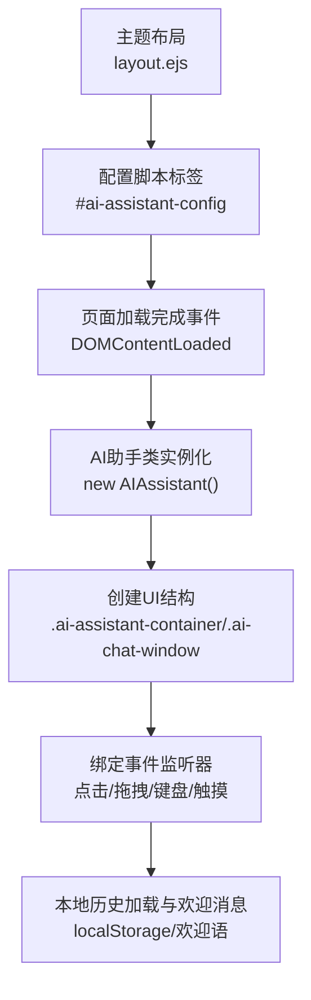
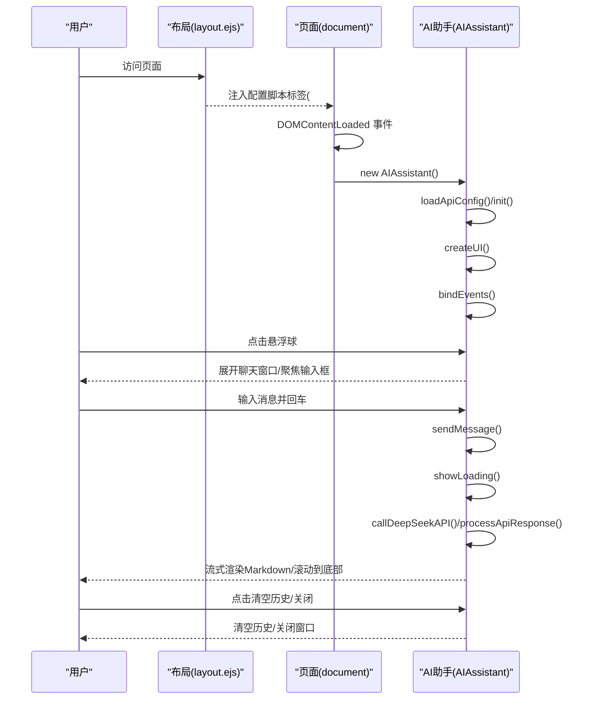
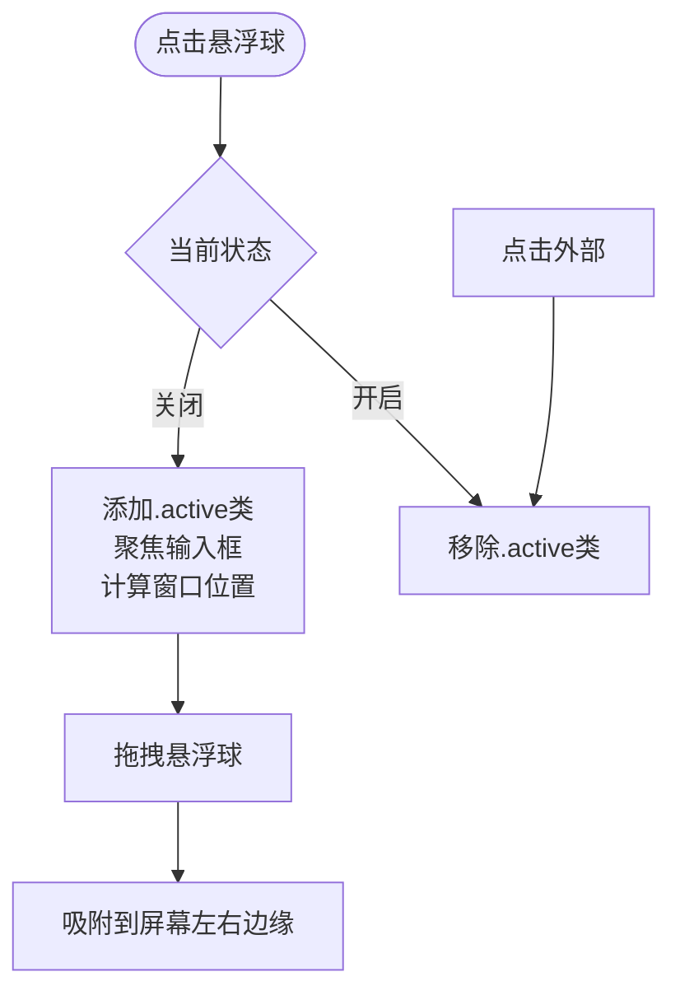
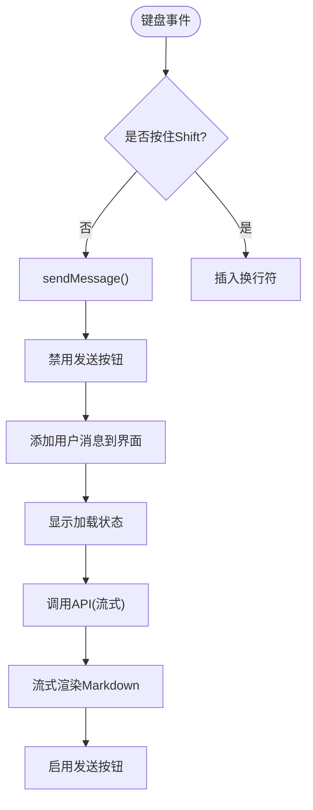
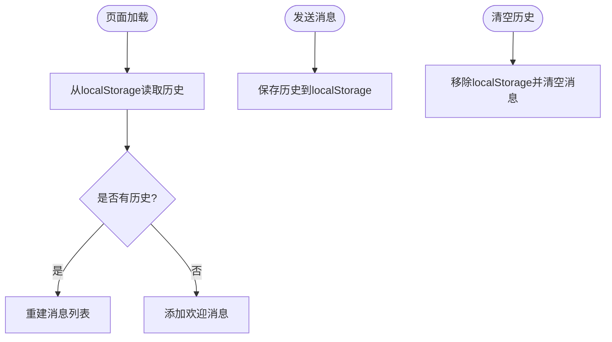
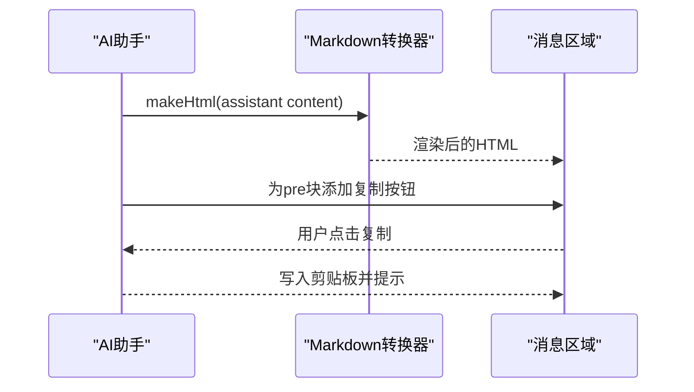
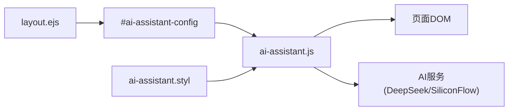

# 使用教程

<cite>
**本文引用的文件**
- [ai-assistant.js](file://source/js/ai-assistant.js)
- [ai-assistant.styl](file://source/css/ai-assistant.styl)
- [layout.ejs](file://themes/kira-custom/layout/layout.ejs)
- [README.md](file://README.md)
</cite>

## 目录
1. [简介](#简介)
2. [项目结构](#项目结构)
3. [核心组件](#核心组件)
4. [架构总览](#架构总览)
5. [详细组件分析](#详细组件分析)
6. [依赖关系分析](#依赖关系分析)
7. [性能与可用性](#性能与可用性)
8. [故障排查指南](#故障排查指南)
9. [结论](#结论)
10. [附录](#附录)

## 简介
本教程面向普通读者，帮助你在博客页面中高效使用“AI悬浮球助手”。你将学会：
- 如何点击悬浮球展开/收起聊天窗口
- 聊天界面各组件的功能与交互方式（输入框、发送按钮、清空历史、关闭按钮）
- 移动端键盘弹出时的界面适配与触摸支持
- 对话流程：提问、AI思考动画、流式响应输出、Markdown 渲染
- 对话历史的本地持久化与刷新后恢复
- 代码块复制功能
- 典型使用场景示例
- 常见问题与解决方案（API 失败、响应延迟、跨域等）

## 项目结构
AI 助手功能由前端 JavaScript 模块与样式共同组成，并通过主题布局注入配置，最终在页面中初始化。

图表来源
- [layout.ejs](file://themes/kira-custom/layout/layout.ejs#L41-L45)
- [ai-assistant.js](file://source/js/ai-assistant.js#L821-L823)

章节来源
- [layout.ejs](file://themes/kira-custom/layout/layout.ejs#L41-L45)
- [README.md](file://README.md#L170-L173)

## 核心组件
- 悬浮球按钮：用于展开/收起聊天窗口，支持鼠标与触摸拖拽。
- 聊天窗口：包含头部（标题与操作按钮）、消息区域、输入区域。
- 输入框：支持回车发送、Shift+Enter 换行、自动高度调整、移动端键盘适配。
- 发送按钮：触发消息发送。
- 清空历史按钮：确认后清空本地历史并重置欢迎语。
- 关闭按钮：关闭聊天窗口。
- Markdown 渲染：将 AI 输出转换为 HTML 并渲染。
- 代码块复制：为代码块添加复制按钮，一键复制代码。

章节来源
- [ai-assistant.js](file://source/js/ai-assistant.js#L92-L151)
- [ai-assistant.js](file://source/js/ai-assistant.js#L156-L249)
- [ai-assistant.js](file://source/js/ai-assistant.js#L705-L753)
- [ai-assistant.styl](file://source/css/ai-assistant.styl#L14-L87)

## 架构总览
AI 助手采用“配置注入 + 类实例化 + DOM 事件绑定”的轻量架构。主题布局将配置注入到页面脚本标签中，页面加载完成后实例化 AI 助手类，创建 UI 并绑定事件。

图表来源
- [layout.ejs](file://themes/kira-custom/layout/layout.ejs#L41-L45)
- [ai-assistant.js](file://source/js/ai-assistant.js#L30-L67)
- [ai-assistant.js](file://source/js/ai-assistant.js#L72-L86)
- [ai-assistant.js](file://source/js/ai-assistant.js#L92-L151)
- [ai-assistant.js](file://source/js/ai-assistant.js#L156-L249)
- [ai-assistant.js](file://source/js/ai-assistant.js#L502-L530)
- [ai-assistant.js](file://source/js/ai-assistant.js#L532-L703)

## 详细组件分析

### 悬浮球与聊天窗口
- 点击悬浮球：切换聊天窗口显示状态，首次打开会自动聚焦输入框并根据悬浮球位置计算窗口显示方向。
- 拖拽悬浮球：支持鼠标与触摸拖拽，拖拽结束自动吸附到屏幕左右边缘，保证悬浮球始终可见。
- 点击外部：点击聊天窗口以外区域可关闭窗口。

图表来源
- [ai-assistant.js](file://source/js/ai-assistant.js#L446-L497)
- [ai-assistant.js](file://source/js/ai-assistant.js#L294-L401)
- [ai-assistant.js](file://source/js/ai-assistant.js#L438-L444)

章节来源
- [ai-assistant.js](file://source/js/ai-assistant.js#L446-L497)
- [ai-assistant.js](file://source/js/ai-assistant.js#L294-L401)
- [ai-assistant.js](file://source/js/ai-assistant.js#L438-L444)

### 输入与发送
- 输入框支持：
  - 回车发送消息（Shift+Enter 换行）
  - 自动高度调整，最大高度限制
  - 禁止输入空格（避免误触发）
- 发送按钮：点击触发发送，发送期间禁用按钮
- 移动端适配：输入框获得焦点时，聊天窗口变为固定底部样式，确保键盘弹出时仍可正常输入与滚动

图表来源
- [ai-assistant.js](file://source/js/ai-assistant.js#L188-L207)
- [ai-assistant.js](file://source/js/ai-assistant.js#L502-L530)
- [ai-assistant.js](file://source/js/ai-assistant.js#L532-L703)
- [ai-assistant.js](file://source/js/ai-assistant.js#L755-L784)
- [ai-assistant.js](file://source/js/ai-assistant.js#L795-L801)
- [ai-assistant.js](file://source/js/ai-assistant.js#L208-L248)

章节来源
- [ai-assistant.js](file://source/js/ai-assistant.js#L188-L207)
- [ai-assistant.js](file://source/js/ai-assistant.js#L502-L530)
- [ai-assistant.js](file://source/js/ai-assistant.js#L755-L784)
- [ai-assistant.js](file://source/js/ai-assistant.js#L795-L801)
- [ai-assistant.js](file://source/js/ai-assistant.js#L208-L248)

### 历史记录与本地存储
- 页面加载时从本地存储恢复历史
- 发送消息后将最新对话追加到历史并保存
- 清空历史会移除本地存储并重置欢迎语

图表来源
- [ai-assistant.js](file://source/js/ai-assistant.js#L251-L267)
- [ai-assistant.js](file://source/js/ai-assistant.js#L269-L278)
- [ai-assistant.js](file://source/js/ai-assistant.js#L280-L288)

章节来源
- [ai-assistant.js](file://source/js/ai-assistant.js#L251-L267)
- [ai-assistant.js](file://source/js/ai-assistant.js#L269-L278)
- [ai-assistant.js](file://source/js/ai-assistant.js#L280-L288)

### Markdown 渲染与代码块复制
- Markdown 渲染：AI 返回内容经转换后以 HTML 形式渲染，支持表格等特性
- 代码块复制：为每个代码块添加复制按钮，点击复制代码，短暂提示后恢复

图表来源
- [ai-assistant.js](file://source/js/ai-assistant.js#L620-L703)
- [ai-assistant.js](file://source/js/ai-assistant.js#L724-L753)

章节来源
- [ai-assistant.js](file://source/js/ai-assistant.js#L620-L703)
- [ai-assistant.js](file://source/js/ai-assistant.js#L724-L753)

### 移动端交互与键盘适配
- 触摸支持：悬浮球支持 touchstart 触发展开/收起
- 键盘弹出适配：输入框聚焦时，聊天窗口转为固定底部样式，确保输入与滚动体验
- 键盘收起恢复：输入框失焦后恢复原样式并重新计算位置

章节来源
- [ai-assistant.js](file://source/js/ai-assistant.js#L162-L167)
- [ai-assistant.js](file://source/js/ai-assistant.js#L208-L248)

## 依赖关系分析
- 配置来源：主题布局通过脚本标签注入配置，页面加载完成后读取
- 样式来源：样式文件定义悬浮球、聊天窗口、消息、输入区、加载动画等
- 第三方库：页面引入 Markdown 转换库用于渲染

图表来源
- [layout.ejs](file://themes/kira-custom/layout/layout.ejs#L41-L45)
- [ai-assistant.js](file://source/js/ai-assistant.js#L821-L823)
- [ai-assistant.styl](file://source/css/ai-assistant.styl#L1-L20)

章节来源
- [layout.ejs](file://themes/kira-custom/layout/layout.ejs#L41-L45)
- [ai-assistant.js](file://source/js/ai-assistant.js#L821-L823)
- [ai-assistant.styl](file://source/css/ai-assistant.styl#L1-L20)

## 性能与可用性
- 流式响应：API 以流式方式返回，首 token 到达即开始渲染，提升感知速度
- 自动滚动：消息新增与流式更新后自动滚动到底部，保证用户看到最新内容
- 本地存储：历史记录本地持久化，刷新后恢复，减少重复请求
- 响应式设计：移动端宽度、字号、间距等按视口比例缩放，适配不同设备

章节来源
- [ai-assistant.js](file://source/js/ai-assistant.js#L620-L703)
- [ai-assistant.js](file://source/js/ai-assistant.js#L803-L808)
- [ai-assistant.styl](file://source/css/ai-assistant.styl#L298-L340)

## 故障排查指南
- API 调用失败
  - 现象：发送消息后出现“暂时无法响应”的提示
  - 排查：检查配置中的 API 密钥是否正确、模型名称是否匹配、网络连通性
  - 备用方案：系统已内置回退逻辑（SiliconFlow 失败后自动切换 DeepSeek），若仍失败请更换密钥或检查服务状态
- 响应延迟
  - 建议：在网络较慢时耐心等待，或减少一次性长文本输入；刷新页面后历史会自动恢复
- 跨域问题
  - 现象：浏览器控制台出现跨域错误
  - 排查：确认服务端允许来自博客域名的请求；若为本地开发，请使用同源或代理
- Markdown 渲染异常
  - 现象：表格或代码块显示不正常
  - 排查：确认 Markdown 转换库已正确加载；检查内容格式是否符合规范
- 代码块复制失败
  - 现象：点击复制按钮无反应或提示失败
  - 排查：确认浏览器允许剪贴板权限；在 HTTPS 环境下使用更稳定

章节来源
- [ai-assistant.js](file://source/js/ai-assistant.js#L532-L703)
- [ai-assistant.js](file://source/js/ai-assistant.js#L724-L753)

## 结论
AI 悬浮球助手提供了简洁、直观、跨设备一致的对话体验。通过本地历史持久化、流式渲染与 Markdown 渲染，以及移动端键盘适配与拖拽吸附，用户可以在任意设备上顺畅地与 AI 互动。遇到问题时，可依据本文提供的排查步骤快速定位并解决。

## 附录

### 使用场景示例
- 查询博客文章内容：向 AI 提问“如何实现虚拟长列表？”或“大文件上传方案”，AI 将优先引用站内文章并给出专业解答
- 获取前端技术解答：例如“React hooks 最佳实践”、“移动端适配方案”等，AI 将结合博客知识与通用实践给出简洁明了的答案

### 快速操作清单
- 点击悬浮球展开/收起聊天窗口
- 在输入框中输入问题，按回车发送（Shift+Enter 换行）
- 点击“清空历史”按钮清空本地历史
- 点击“关闭”按钮关闭聊天窗口
- 在代码块中点击“复制”按钮复制代码

章节来源
- [ai-assistant.js](file://source/js/ai-assistant.js#L92-L151)
- [ai-assistant.js](file://source/js/ai-assistant.js#L156-L249)
- [ai-assistant.js](file://source/js/ai-assistant.js#L724-L753)