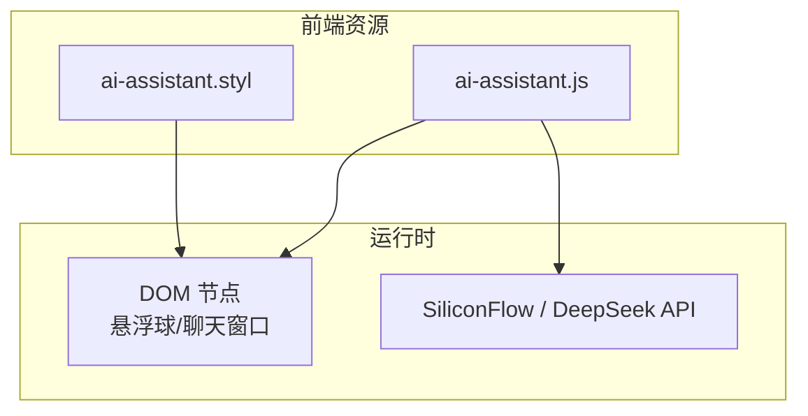
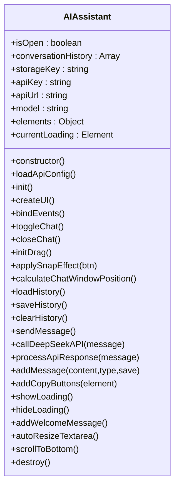
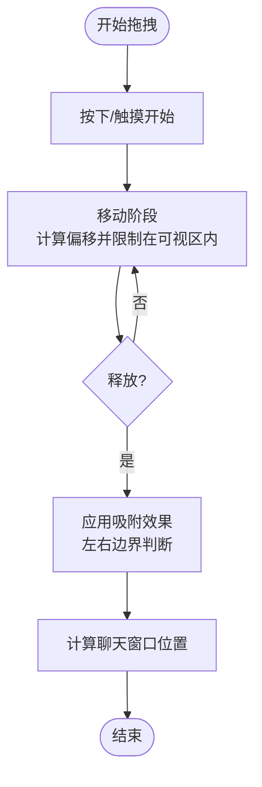
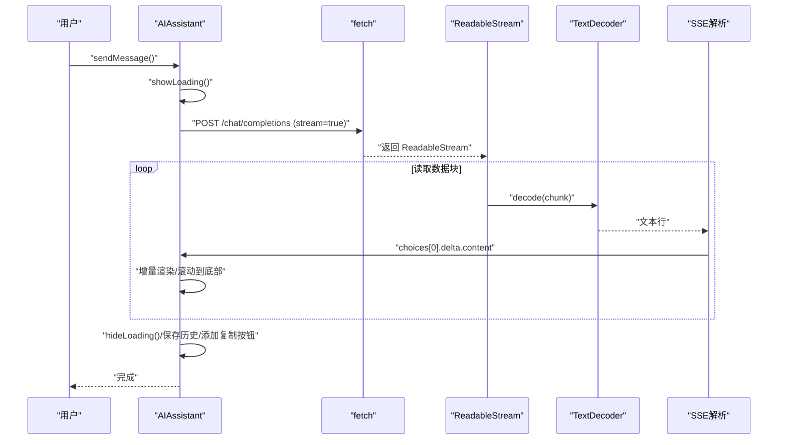

# 实现原理

<cite>
**本文引用的文件**
- [ai-assistant.js](file://source/js/ai-assistant.js)
- [ai-assistant.styl](file://source/css/ai-assistant.styl)
</cite>

## 目录
1. [简介](#简介)
2. [项目结构](#项目结构)
3. [核心组件](#核心组件)
4. [架构总览](#架构总览)
5. [详细组件分析](#详细组件分析)
6. [依赖关系分析](#依赖关系分析)
7. [性能考量](#性能考量)
8. [故障排查指南](#故障排查指南)
9. [结论](#结论)

## 简介
本文件深入解析博客前端中的“AI助手”功能实现，重点围绕 ai-assistant.js 中的核心类 AIAssistant 的架构设计与关键流程，包括：
- 悬浮球交互机制：initDrag 拖拽事件绑定、applySnapEffect 左右吸附判定、移动端触摸兼容
- UI 动态构建：createUI 如何创建聊天窗口 DOM 结构
- 事件系统：bindEvents 注册各类监听器与回调
- 流式响应处理：processApiResponse 中 fetch 流式读取、TextDecoder 解码、SSE 数据解析与增量渲染
- 代码复制能力：addCopyButtons 为代码块添加复制按钮
- 样式体系：ai-assistant.styl 的 CSS 变量、响应式布局、暗色模式适配与关键动画（pulse、slideInUp、bounce）

## 项目结构
AI 助手由一个独立的 JavaScript 类与配套样式组成，位于博客源码目录下：
- JS 入口：source/js/ai-assistant.js
- 样式入口：source/css/ai-assistant.styl
- 页面加载后自动初始化实例并挂载到 window 对象，便于调试与二次集成

图表来源
- [ai-assistant.js](file://source/js/ai-assistant.js#L1-L200)
- [ai-assistant.styl](file://source/css/ai-assistant.styl#L1-L120)

章节来源
- [ai-assistant.js](file://source/js/ai-assistant.js#L1-L120)
- [ai-assistant.styl](file://source/css/ai-assistant.styl#L1-L120)

## 核心组件
AIAssistant 是一个单例式组件，负责：
- 配置加载与 API 选择（SiliconFlow 为主，DeepSeek 为备选）
- UI 构建与事件绑定
- 会话历史持久化（localStorage）
- 流式响应处理与增量渲染
- 代码块复制能力

关键职责划分：
- 配置与生命周期：loadApiConfig、init、destroy
- UI 与交互：createUI、bindEvents、toggleChat、closeChat、calculateChatWindowPosition
- 拖拽与吸附：initDrag、applySnapEffect
- 会话管理：loadHistory、saveHistory、clearHistory、addMessage、addWelcomeMessage
- API 调用与流式处理：callDeepSeekAPI、processApiResponse
- 代码复制：addCopyButtons
- 辅助工具：autoResizeTextarea、scrollToBottom、showLoading、hideLoading

章节来源
- [ai-assistant.js](file://source/js/ai-assistant.js#L1-L200)
- [ai-assistant.js](file://source/js/ai-assistant.js#L200-L500)
- [ai-assistant.js](file://source/js/ai-assistant.js#L500-L828)

## 架构总览
AI 助手采用“类封装 + DOM 操作 + 流式 API”的组合架构：
- 类封装：集中管理状态、事件与业务逻辑
- DOM 操作：动态创建与更新聊天窗口、消息列表、输入区
- 流式 API：通过 fetch + ReadableStream + TextDecoder 实现 SSE 风格的增量渲染
- 样式系统：Stylus 变量 + 响应式媒体查询 + 暗色模式适配

图表来源
- [ai-assistant.js](file://source/js/ai-assistant.js#L1-L828)

## 详细组件分析

### 悬浮球拖拽与吸附机制
- initDrag：统一绑定鼠标与触摸事件，记录初始位置与容器尺寸，拖拽过程中限制在可视区域内，释放时应用吸附效果
- applySnapEffect：根据悬浮球中心点到左右边界的距离，决定吸附至左侧或右侧，并保持垂直位置
- calculateChatWindowPosition：根据悬浮球所在半屏，计算聊天窗口显示在悬浮球左上角或右上角

图表来源
- [ai-assistant.js](file://source/js/ai-assistant.js#L291-L433)
- [ai-assistant.js](file://source/js/ai-assistant.js#L463-L489)

章节来源
- [ai-assistant.js](file://source/js/ai-assistant.js#L291-L433)
- [ai-assistant.js](file://source/js/ai-assistant.js#L435-L489)

### createUI：动态创建聊天窗口 DOM
- 创建容器与悬浮球按钮
- 构建聊天窗口骨架：标题栏（含图标与模型名）、消息区域、输入区（textarea + 发送按钮）、关闭与清空按钮
- 保存关键 DOM 引用，供后续事件与渲染使用

章节来源
- [ai-assistant.js](file://source/js/ai-assistant.js#L92-L151)

### bindEvents：事件监听器注册与回调
- 悬浮球点击与触摸：切换聊天窗口显示状态
- 拖拽：initDrag
- 关闭/清空：closeChat、clearHistory
- 发送：sendMessage（回车禁用 Shift+Enter）
- 文本域：自动高度、移动端键盘弹出/收起时的样式恢复与位置重算
- 点击外部：initClickOutside（点击容器外关闭）

章节来源
- [ai-assistant.js](file://source/js/ai-assistant.js#L156-L249)

### 流式响应处理：processApiResponse
- 调用 callDeepSeekAPI：优先遍历 SiliconFlow 多密钥，失败则回退到 DeepSeek
- fetch + ReadableStream：开启 stream: true，使用 TextDecoder 逐步解码
- SSE 数据解析：逐行解析 data: 前缀，提取 choices[0].delta.content，增量拼接并渲染
- 增量渲染：首个 token 隐藏 loading 并创建消息节点；后续 token 追加到最新 assistant 消息
- 结束处理：隐藏 loading，保存历史，为最后一条 assistant 消息添加复制按钮

图表来源
- [ai-assistant.js](file://source/js/ai-assistant.js#L532-L703)
- [ai-assistant.js](file://source/js/ai-assistant.js#L620-L703)

章节来源
- [ai-assistant.js](file://source/js/ai-assistant.js#L532-L703)

### 代码复制功能：addCopyButtons
- 在 assistant 消息的每个 pre 代码块中注入复制按钮
- 点击复制：读取 code 或 pre 文本，写入剪贴板，反馈“已复制/失败”
- 样式：绝对定位、透明度控制、悬停高亮

章节来源
- [ai-assistant.js](file://source/js/ai-assistant.js#L724-L753)
- [ai-assistant.styl](file://source/css/ai-assistant.styl#L177-L200)

### 样式体系与动画
- CSS 变量：主题主色、背景、阴影、边框等，便于统一风格与主题切换
- 响应式布局：移动端宽度、字体大小、间距使用 vw/%，保证在不同设备上的一致体验
- 暗色模式适配：基于 prefers-color-scheme: dark，调整聊天窗口、消息气泡、输入区与滚动条颜色
- 关键动画：
  - pulse：悬浮球脉冲光晕
  - slideInUp：聊天窗口上滑入场
  - bounce：加载点弹跳

章节来源
- [ai-assistant.styl](file://source/css/ai-assistant.styl#L6-L20)
- [ai-assistant.styl](file://source/css/ai-assistant.styl#L275-L340)
- [ai-assistant.styl](file://source/css/ai-assistant.styl#L341-L383)

## 依赖关系分析
- 运行时依赖
  - fetch + ReadableStream：用于流式 API 调用与增量读取
  - TextDecoder：对二进制数据块进行 UTF-8 解码
  - localStorage：会话历史持久化
  - navigator.clipboard：复制能力
  - showdown：Markdown 转 HTML（用于 assistant 消息渲染）
- 样式依赖
  - Stylus 变量与动画：统一主题与动效
  - 媒体查询：移动端适配
  - 暗色模式：系统偏好检测

章节来源
- [ai-assistant.js](file://source/js/ai-assistant.js#L1-L20)
- [ai-assistant.js](file://source/js/ai-assistant.js#L532-L703)
- [ai-assistant.styl](file://source/css/ai-assistant.styl#L1-L120)

## 性能考量
- 事件委托与最小 DOM 操作
  - 建议将频繁触发的事件（如输入、滚动）委托到父容器，减少重复绑定
  - 消息渲染尽量批量更新，避免频繁重排
- 内存泄漏防范
  - 销毁实例时移除 DOM 与解绑事件（destroy 已提供基础清理）
  - 避免闭包持有长生命周期引用
- 渲染性能优化
  - 增量渲染已通过“首个 token 创建节点 + 后续增量拼接”降低重绘
  - 可考虑 requestAnimationFrame 分片渲染长消息
  - 文本域高度自适应已限制最大高度，避免过度滚动
- API 层面
  - 流式读取已使用流式接口，避免一次性缓冲大响应
  - 多密钥轮询与回退策略提升可用性

章节来源
- [ai-assistant.js](file://source/js/ai-assistant.js#L794-L808)
- [ai-assistant.js](file://source/js/ai-assistant.js#L810-L818)

## 故障排查指南
- API 调用失败
  - 检查配置加载：确认页面脚本标签或全局变量中 aiAssistantConfig 是否正确
  - 多密钥轮询：若 SiliconFlow 全部失败，将回退到 DeepSeek，确认备用密钥有效
  - 状态码与异常：processApiResponse 中对非 ok 响应抛出错误，可在控制台查看
- 流式解析异常
  - 确认服务端返回格式为 data: 行 + [DONE] 结束标记
  - 若 JSON 解析报错，检查 choices.delta.content 字段是否存在
- 拖拽吸附异常
  - 确认悬浮球与容器的初始位置与尺寸正确
  - 检查窗口尺寸变化后是否重新计算吸附与聊天窗口位置
- 复制失败
  - 检查浏览器剪贴板权限与 HTTPS 环境
  - 确认按钮事件绑定成功且未被覆盖

章节来源
- [ai-assistant.js](file://source/js/ai-assistant.js#L30-L120)
- [ai-assistant.js](file://source/js/ai-assistant.js#L532-L703)
- [ai-assistant.js](file://source/js/ai-assistant.js#L724-L753)

## 结论
AI 助手通过“类封装 + 流式 API + 动态 DOM + 样式动画”的组合，实现了轻量、可扩展且具有良好移动端体验的交互组件。其核心优势在于：
- 事件与状态集中管理，易于维护
- 流式渲染带来即时反馈，用户体验佳
- 样式系统支持响应式与暗色模式，适配广泛设备
- 提供复制按钮与欢迎消息等细节增强

建议在生产环境中进一步完善：
- 事件委托与渲染分片
- 更完善的错误提示与重试策略
- 可选的无障碍访问支持（ARIA）