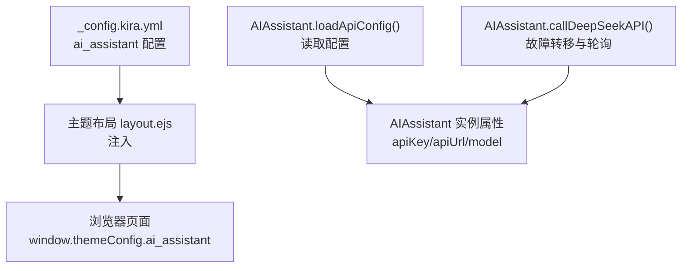
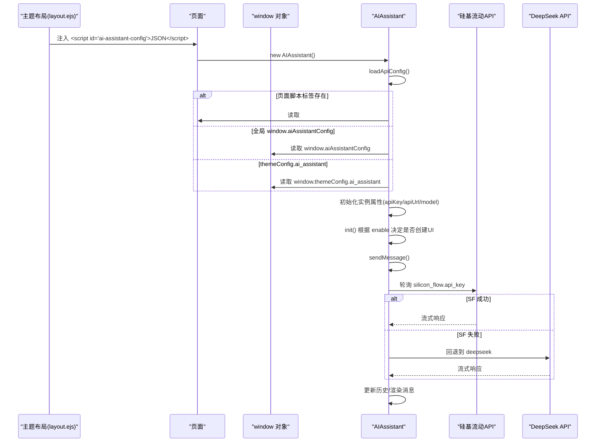
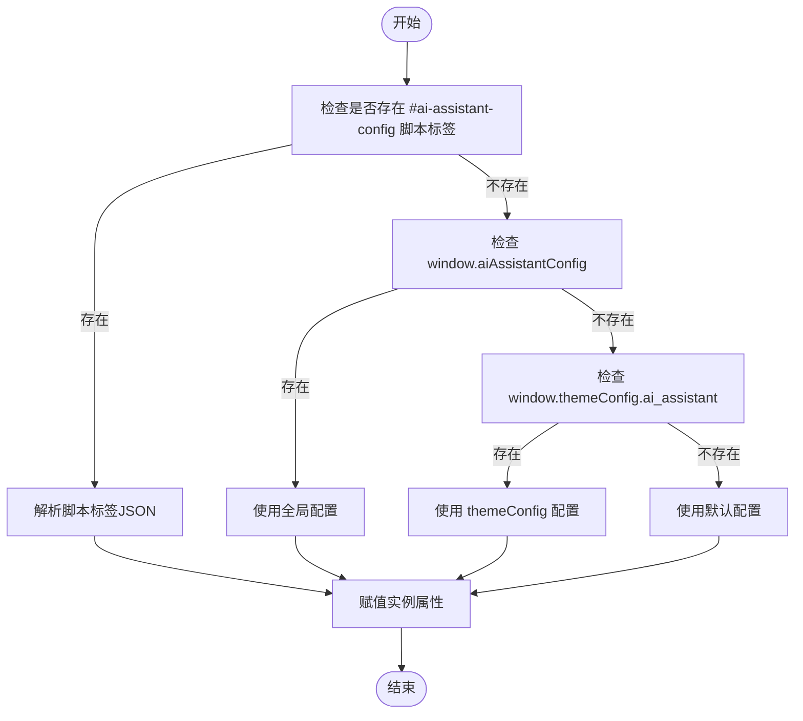
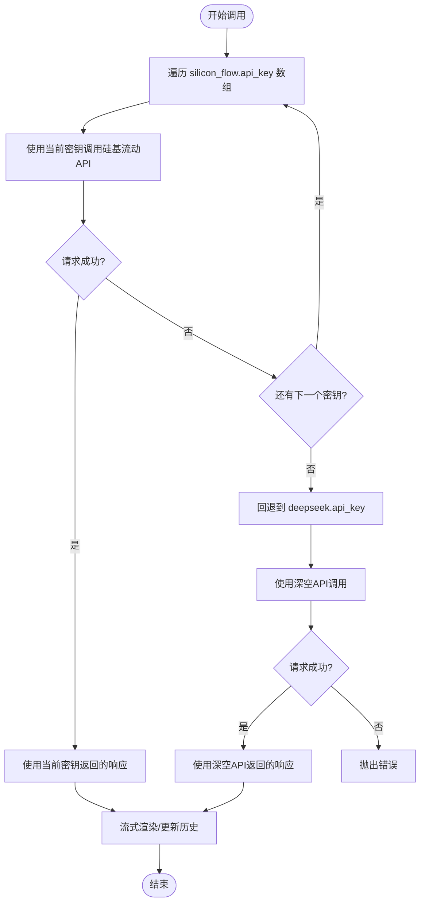
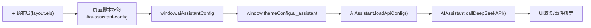

# 配置指南

<cite>
**本文引用的文件**
- [_config.kira.yml](file://_config.kira.yml)
- [ai-assistant.js](file://source/js/ai-assistant.js)
- [ai-assistant.styl](file://source/css/ai-assistant.styl)
- [layout.ejs（kira主题）](file://node_modules/hexo-theme-kira/layout/layout.ejs)
- [layout.ejs（自定义主题）](file://themes/kira-custom/layout/layout.ejs)
- [.env](file://.env)
</cite>

## 目录
1. [简介](#简介)
2. [项目结构](#项目结构)
3. [核心组件](#核心组件)
4. [架构总览](#架构总览)
5. [详细组件分析](#详细组件分析)
6. [依赖关系分析](#依赖关系分析)
7. [性能考量](#性能考量)
8. [故障排查指南](#故障排查指南)
9. [结论](#结论)
10. [附录](#附录)

## 简介
本指南聚焦于“AI助手”功能的配置方法，系统性解析 _config.kira.yml 中 ai_assistant 配置项的结构与参数含义，说明 enable 开关如何控制功能启用；深入解释 silicon_flow 与 deepseek 两个 API 配置对象的作用，以及 api_key 支持多密钥轮询的数组格式、model 参数对模型选择的影响；阐述配置加载机制，说明 AIAssistant 类如何通过 loadApiConfig 方法从页面脚本标签、全局 window 对象或 themeConfig 中读取配置；提供配置示例，展示如何设置硅基流动与 DeepSeek 的 API 密钥及模型参数；说明配置的优先级顺序与故障转移策略；结合源码解释 apiKey、apiUrl、model 等实例属性如何根据配置动态赋值；最后给出安全配置建议，包括环境变量隔离与密钥管理最佳实践。

## 项目结构
AI助手功能涉及以下关键文件：
- 配置文件：_config.kira.yml 提供默认的 ai_assistant 配置
- 前端脚本：source/js/ai-assistant.js 实现 AI 助手逻辑与配置加载
- 样式文件：source/css/ai-assistant.styl 定义 UI 样式
- 主题模板：node_modules/hexo-theme-kira/layout/layout.ejs 与 themes/kira-custom/layout/layout.ejs 注入配置脚本标签
- 环境变量：.env 用于部署与服务器配置（与 AI 助手配置无直接耦合）

图表来源
- [_config.kira.yml](file://_config.kira.yml#L138-L150)
- [layout.ejs（kira主题）](file://node_modules/hexo-theme-kira/layout/layout.ejs#L41-L45)
- [layout.ejs（自定义主题）](file://themes/kira-custom/layout/layout.ejs#L41-L45)
- [ai-assistant.js](file://source/js/ai-assistant.js#L30-L67)
- [ai-assistant.js](file://source/js/ai-assistant.js#L535-L618)

章节来源
- [ai-assistant.js](file://source/js/ai-assistant.js#L30-L67)
- [layout.ejs（kira主题）](file://node_modules/hexo-theme-kira/layout/layout.ejs#L41-L45)
- [layout.ejs（自定义主题）](file://themes/kira-custom/layout/layout.ejs#L41-L45)
- [_config.kira.yml](file://_config.kira.yml#L138-L150)

## 核心组件
- 配置项结构与参数
  - enable：布尔开关，控制是否启用 AI 助手 UI 与交互
  - silicon_flow：主用 API 配置对象
    - api_key：字符串或数组（多密钥轮询）
    - model：字符串，指定使用的模型标识
  - deepseek：备用 API 配置对象
    - api_key：字符串或数组（多密钥轮询）
    - model：字符串，指定使用的模型标识
- 配置加载机制
  - 页面脚本标签优先：页面内存在 id 为 ai-assistant-config 的 script 标签时，优先从其 JSON 内容读取配置
  - 其次读取全局 window.aiAssistantConfig
  - 最后读取 window.themeConfig.ai_assistant
  - 若均未找到，则使用默认行为（构造函数中默认使用硅基流动配置）
- 故障转移策略
  - 调用流程：优先按顺序尝试 silicon_flow 的多个 api_key，全部失败后再回退到 deepseek
  - 在调用前动态更新实例属性：apiKey、apiUrl、model

章节来源
- [_config.kira.yml](file://_config.kira.yml#L138-L150)
- [ai-assistant.js](file://source/js/ai-assistant.js#L30-L67)
- [ai-assistant.js](file://source/js/ai-assistant.js#L535-L618)

## 架构总览
AI 助手的配置与运行流程如下：

图表来源
- [layout.ejs（kira主题）](file://node_modules/hexo-theme-kira/layout/layout.ejs#L41-L45)
- [layout.ejs（自定义主题）](file://themes/kira-custom/layout/layout.ejs#L41-L45)
- [ai-assistant.js](file://source/js/ai-assistant.js#L30-L67)
- [ai-assistant.js](file://source/js/ai-assistant.js#L535-L618)

## 详细组件分析

### 配置项结构与参数详解
- enable
  - 作用：控制是否渲染并启用 AI 助手 UI 与交互
  - 位置：页面脚本标签中的顶层字段
- silicon_flow
  - api_key：支持单个字符串或数组（多密钥轮询）。调用时会按序尝试每个密钥，直到成功或耗尽
  - model：指定模型标识，影响请求体中的 model 字段
- deepseek
  - api_key：支持单个字符串或数组（多密钥轮询）。作为故障转移目标
  - model：指定模型标识，影响请求体中的 model 字段

章节来源
- [_config.kira.yml](file://_config.kira.yml#L138-L150)
- [ai-assistant.js](file://source/js/ai-assistant.js#L535-L618)

### 配置加载机制与优先级
- 优先级顺序（从高到低）
  1) 页面脚本标签：id 为 ai-assistant-config 的 script 标签
  2) 全局变量：window.aiAssistantConfig
  3) 主题配置：window.themeConfig.ai_assistant
- 加载逻辑要点
  - loadApiConfig 会依次尝试上述来源，若解析失败则记录错误并继续尝试下一种方式
  - 若三种来源均未找到，则不会覆盖默认值，构造函数中默认使用硅基流动配置

图表来源
- [ai-assistant.js](file://source/js/ai-assistant.js#L30-L67)

章节来源
- [ai-assistant.js](file://source/js/ai-assistant.js#L30-L67)

### 故障转移与多密钥轮询
- 轮询策略
  - 对 silicon_flow.api_key：按顺序逐一尝试，任一成功即停止
  - 若全部失败：回退到 deepseek.api_key
- 实例属性动态赋值
  - 调用前将 this.apiKey、this.apiUrl、this.model 动态切换为当前目标 API 的配置
- 流式响应处理
  - 通过流式接口逐步接收并渲染响应，首 token 到达时隐藏加载状态并插入消息节点

图表来源
- [ai-assistant.js](file://source/js/ai-assistant.js#L535-L618)

章节来源
- [ai-assistant.js](file://source/js/ai-assistant.js#L535-L618)

### 配置示例与最佳实践
- 示例结构（来源于 _config.kira.yml）
  - enable：true/false
  - silicon_flow.api_key：字符串或数组（多密钥轮询）
  - silicon_flow.model：模型标识字符串
  - deepseek.api_key：字符串或数组（多密钥轮询）
  - deepseek.model：模型标识字符串
- 配置注入方式
  - 主题自动注入：主题布局会在页面头部注入一个 id 为 ai-assistant-config 的 script 标签，内容为 theme.ai_assistant 的 JSON
  - 自定义注入：可在页面中手动添加同名脚本标签以覆盖默认配置
- 安全建议
  - 不要在公开仓库中提交真实密钥，建议通过环境变量或构建期注入
  - 使用数组形式的 api_key 实现密钥轮询，便于故障转移与额度分摊
  - 严格控制访问权限，避免泄露密钥

章节来源
- [_config.kira.yml](file://_config.kira.yml#L138-L150)
- [layout.ejs（kira主题）](file://node_modules/hexo-theme-kira/layout/layout.ejs#L41-L45)
- [layout.ejs（自定义主题）](file://themes/kira-custom/layout/layout.ejs#L41-L45)

### UI 与交互
- UI 初始化与事件绑定
  - init() 根据 enable 决定是否创建聊天窗口、绑定事件、加载历史
- 交互细节
  - 支持拖拽、吸附、移动端适配、清空历史、复制代码块等
- 样式与主题色
  - 样式文件使用主题色变量，保证与站点风格一致

章节来源
- [ai-assistant.js](file://source/js/ai-assistant.js#L72-L87)
- [ai-assistant.js](file://source/js/ai-assistant.js#L153-L249)
- [ai-assistant.styl](file://source/css/ai-assistant.styl#L1-L120)

## 依赖关系分析
- 配置来源依赖
  - 主题布局依赖 theme.ai_assistant 提供配置
  - 页面脚本标签可覆盖主题配置
  - 全局 window 对象可作为兜底配置来源
- 运行时依赖
  - AIAssistant 依赖 fetch 流式接口进行实时响应
  - 依赖 showdown 进行 Markdown 渲染
- 样式依赖
  - 样式文件与主题色变量联动，保证视觉一致性

图表来源
- [layout.ejs（kira主题）](file://node_modules/hexo-theme-kira/layout/layout.ejs#L41-L45)
- [layout.ejs（自定义主题）](file://themes/kira-custom/layout/layout.ejs#L41-L45)
- [ai-assistant.js](file://source/js/ai-assistant.js#L30-L67)
- [ai-assistant.js](file://source/js/ai-assistant.js#L535-L618)

章节来源
- [ai-assistant.js](file://source/js/ai-assistant.js#L30-L67)
- [ai-assistant.js](file://source/js/ai-assistant.js#L535-L618)
- [layout.ejs（kira主题）](file://node_modules/hexo-theme-kira/layout/layout.ejs#L41-L45)
- [layout.ejs（自定义主题）](file://themes/kira-custom/layout/layout.ejs#L41-L45)

## 性能考量
- 多密钥轮询与故障转移
  - 轮询策略可提升可用性，但会增加请求次数；建议合理设置密钥数量与顺序
- 流式响应
  - 使用流式接口可降低首字延迟，改善用户体验
- UI 事件与动画
  - 拖拽、吸附、移动端适配等交互需注意性能，避免频繁重排
- 存储与历史
  - 历史记录存储在本地，建议控制历史长度，避免占用过多空间

[本节为通用指导，不直接分析具体文件]

## 故障排查指南
- 配置未生效
  - 检查页面是否包含 id 为 ai-assistant-config 的脚本标签
  - 确认 JSON 格式正确且 enable 为 true
  - 检查 window.aiAssistantConfig 或 window.themeConfig.ai_assistant 是否被覆盖
- API 调用失败
  - 查看控制台日志，确认是否触发了故障转移
  - 检查 silicon_flow.api_key 与 deepseek.api_key 是否有效
- 模型参数无效
  - 确认 model 字段与实际可用模型匹配
- UI 不显示
  - 确认 enable 为 true，且 init() 已执行
  - 检查样式文件是否正确引入

章节来源
- [ai-assistant.js](file://source/js/ai-assistant.js#L30-L67)
- [ai-assistant.js](file://source/js/ai-assistant.js#L535-L618)
- [ai-assistant.js](file://source/js/ai-assistant.js#L72-L87)

## 结论
AI 助手的配置体系以 _config.kira.yml 为默认来源，通过主题布局注入到页面脚本标签，最终由 AIAssistant 类在运行时加载。其核心在于：
- enable 控制功能启用
- silicon_flow 为主用 API，deepseek 为备用
- api_key 支持数组轮询，实现故障转移
- 实例属性在调用前动态赋值，确保请求与配置一致
配合合理的安全策略与性能优化，可稳定地为用户提供高质量的 AI 对话体验。

[本节为总结性内容，不直接分析具体文件]

## 附录
- 配置示例参考
  - 参考 _config.kira.yml 中 ai_assistant 的结构与字段
- 环境变量
  - .env 用于服务器与部署相关配置，与 AI 助手配置无直接耦合

章节来源
- [_config.kira.yml](file://_config.kira.yml#L138-L150)
- [.env](file://.env#L1-L14)