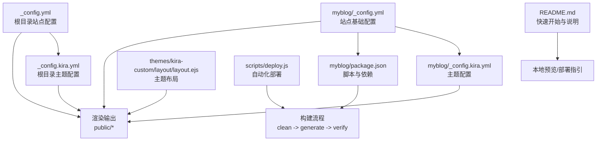
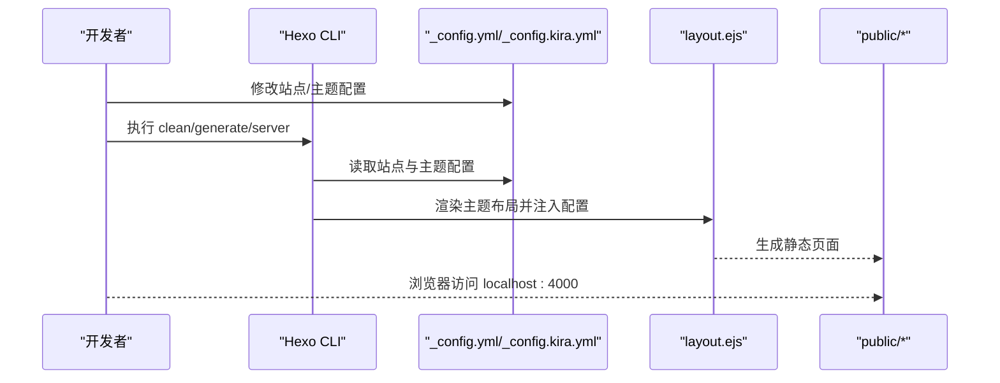
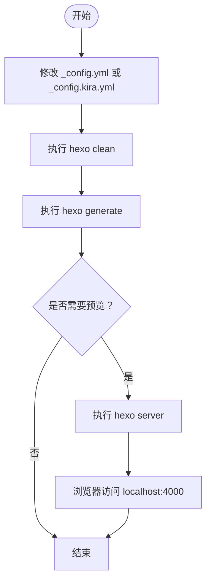
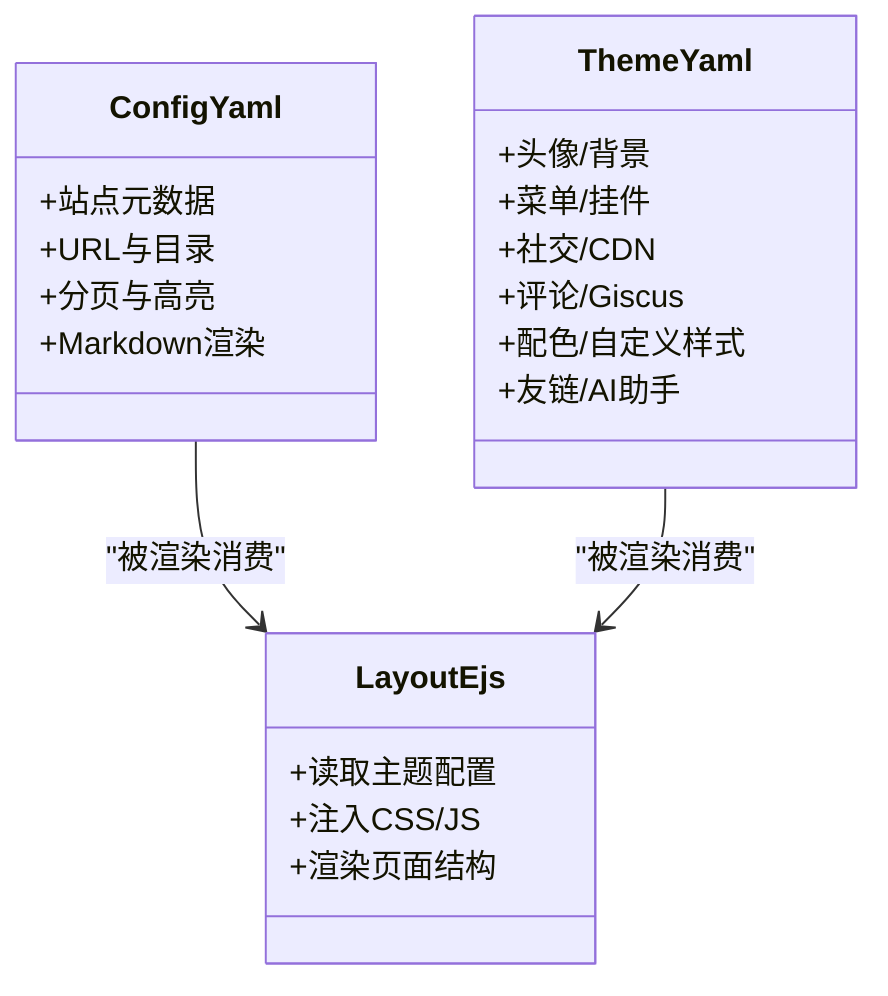
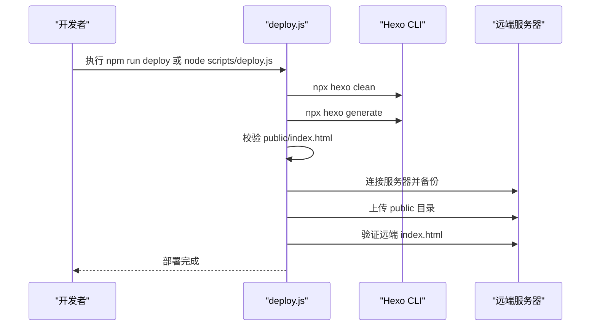
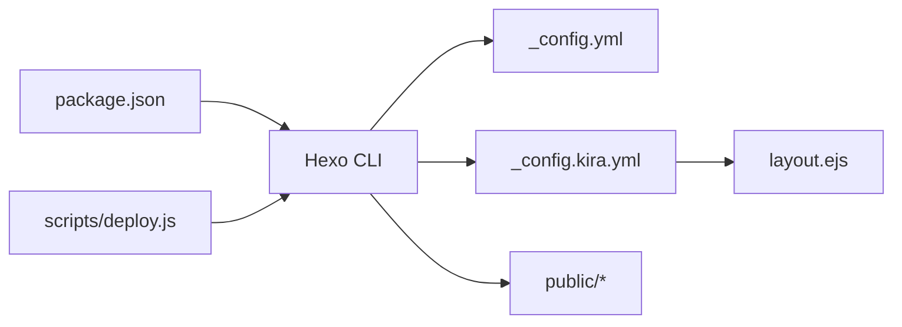

# 主题配置工作流

<cite>
**本文引用的文件**
- [myblog/_config.yml](file://myblog/_config.yml)
- [myblog/_config.kira.yml](file://myblog/_config.kira.yml)
- [myblog/package.json](file://myblog/package.json)
- [_config.yml](file://_config.yml)
- [_config.kira.yml](file://_config.kira.yml)
- [themes/kira-custom/layout/layout.ejs](file://themes/kira-custom/layout/layout.ejs)
- [scripts/deploy.js](file://scripts/deploy.js)
- [README.md](file://README.md)
- [myblog/source/_posts/hello-world.md](file://myblog/source/_posts/hello-world.md)
</cite>

## 目录
1. [引言](#引言)
2. [项目结构](#项目结构)
3. [核心组件](#核心组件)
4. [架构总览](#架构总览)
5. [详细组件分析](#详细组件分析)
6. [依赖关系分析](#依赖关系分析)
7. [性能考虑](#性能考虑)
8. [故障排查指南](#故障排查指南)
9. [结论](#结论)
10. [附录](#附录)

## 引言
本指南面向需要从零到一完成主题配置与预览的用户，覆盖从环境准备、配置文件修改、命令行工作流到部署验证的全流程。重点说明修改 _config.yml 或 _config.kira.yml 后必须执行的命令序列（如 hexo clean && hexo generate && hexo server），解释 package.json 中脚本（如 dev、build）与主题配置的关系，并提供常见问题排查方案与 YAML 语法注意事项。

## 项目结构
该项目采用“多站点 + 主题自定义”的组织方式：
- 根目录包含通用源文件与主题自定义布局
- myblog 子目录为 Hexo 主站点，包含站点配置、主题配置与依赖
- themes/kira-custom 提供自定义主题布局文件，用于覆盖 hexo-theme-kira 的默认布局
- scripts 提供自动化部署脚本

图表来源
- [myblog/_config.yml](file://myblog/_config.yml#L1-L109)
- [myblog/_config.kira.yml](file://myblog/_config.kira.yml#L1-L137)
- [myblog/package.json](file://myblog/package.json#L1-L27)
- [_config.yml](file://_config.yml#L1-L116)
- [_config.kira.yml](file://_config.kira.yml#L1-L150)
- [themes/kira-custom/layout/layout.ejs](file://themes/kira-custom/layout/layout.ejs#L1-L67)
- [scripts/deploy.js](file://scripts/deploy.js#L62-L85)
- [README.md](file://README.md#L68-L77)

章节来源
- [README.md](file://README.md#L15-L37)
- [README.md](file://README.md#L68-L77)

## 核心组件
- 站点基础配置（_config.yml）
  - 控制站点元数据、URL、目录、分页、高亮、Markdown 渲染等
  - 在 myblog 与根目录各有一个，后者为最终生效的站点配置
- 主题配置（_config.kira.yml）
  - 控制头像、背景、菜单、挂件、社交、CDN、评论、配色、自定义样式、友链、AI 助手等
- 包脚本（package.json）
  - 提供 build、clean、deploy、server 等常用命令的快捷入口
- 主题布局（layout.ejs）
  - 读取主题配置并注入到页面，如 favicon、背景、自定义样式、评论组件等
- 自动化部署（deploy.js）
  - 统一执行 clean、generate、校验与上传，保障部署一致性

章节来源
- [myblog/_config.yml](file://myblog/_config.yml#L1-L109)
- [_config.yml](file://_config.yml#L1-L116)
- [myblog/_config.kira.yml](file://myblog/_config.kira.yml#L1-L137)
- [_config.kira.yml](file://_config.kira.yml#L1-L150)
- [myblog/package.json](file://myblog/package.json#L1-L27)
- [themes/kira-custom/layout/layout.ejs](file://themes/kira-custom/layout/layout.ejs#L1-L67)
- [scripts/deploy.js](file://scripts/deploy.js#L62-L85)

## 架构总览
主题配置工作流由“配置 -> 渲染 -> 预览/部署”三段式组成。配置文件通过 Hexo 渲染引擎读取，主题布局文件消费主题配置，最终输出静态页面。

图表来源
- [myblog/_config.yml](file://myblog/_config.yml#L1-L109)
- [myblog/_config.kira.yml](file://myblog/_config.kira.yml#L1-L137)
- [themes/kira-custom/layout/layout.ejs](file://themes/kira-custom/layout/layout.ejs#L1-L67)
- [scripts/deploy.js](file://scripts/deploy.js#L62-L85)

## 详细组件分析

### 配置文件与命令工作流
- 修改 _config.yml 或 _config.kira.yml 后，必须按顺序执行：
  - hexo clean：清理缓存与生成目录，避免旧产物干扰
  - hexo generate：根据最新配置重新渲染静态页面
  - hexo server：启动本地服务预览效果
- package.json 中的脚本提供了便捷入口：
  - build：hexo generate
  - clean：hexo clean
  - server：hexo server
  - deploy：hexo deploy（结合部署配置使用）

图表来源
- [myblog/_config.yml](file://myblog/_config.yml#L1-L109)
- [myblog/_config.kira.yml](file://myblog/_config.kira.yml#L1-L137)
- [myblog/package.json](file://myblog/package.json#L1-L27)
- [myblog/source/_posts/hello-world.md](file://myblog/source/_posts/hello-world.md#L1-L39)

章节来源
- [myblog/source/_posts/hello-world.md](file://myblog/source/_posts/hello-world.md#L1-L39)
- [myblog/package.json](file://myblog/package.json#L1-L27)

### 主题配置与布局消费
主题布局文件会读取 _config.kira.yml 中的关键字段，如：
- favicon、background、customStyles、social、menu、widgets、评论配置、配色、AI 助手等
- 这些配置通过模板变量注入到页面头部与主体结构中

图表来源
- [myblog/_config.kira.yml](file://myblog/_config.kira.yml#L1-L137)
- [_config.kira.yml](file://_config.kira.yml#L1-L150)
- [themes/kira-custom/layout/layout.ejs](file://themes/kira-custom/layout/layout.ejs#L1-L67)

章节来源
- [themes/kira-custom/layout/layout.ejs](file://themes/kira-custom/layout/layout.ejs#L1-L67)
- [_config.kira.yml](file://_config.kira.yml#L1-L150)

### 自动化部署与构建流程
自动化部署脚本统一执行构建与验证，确保部署质量：
- 构建阶段：clean -> generate -> 校验 public/index.html 是否存在
- 上传阶段：通过 SSH 将 public 目录上传至远端路径
- 验证阶段：检查远端 index.html 是否存在且非空

图表来源
- [scripts/deploy.js](file://scripts/deploy.js#L62-L85)
- [scripts/deploy.js](file://scripts/deploy.js#L161-L189)
- [scripts/deploy.js](file://scripts/deploy.js#L191-L208)

章节来源
- [scripts/deploy.js](file://scripts/deploy.js#L62-L85)
- [scripts/deploy.js](file://scripts/deploy.js#L161-L189)
- [scripts/deploy.js](file://scripts/deploy.js#L191-L208)

### 开发预览与脚本关系
- package.json 中的脚本与主题配置密切相关：
  - build：调用 hexo generate，受 _config.yml 与 _config.kira.yml 影响
  - server：启动本地服务，预览最新生成的静态页面
  - clean：清理缓存，避免旧配置残留
  - deploy：结合部署配置使用，通常在构建成功后再执行
- 建议在开发过程中使用脚本组合，如先 clean 再 build，再 server 查看效果

章节来源
- [myblog/package.json](file://myblog/package.json#L1-L27)
- [README.md](file://README.md#L68-L77)

## 依赖关系分析
- 配置文件依赖关系
  - 站点配置（_config.yml）决定站点行为与输出目录
  - 主题配置（_config.kira.yml）决定主题外观与功能开关
  - 布局文件（layout.ejs）消费主题配置并生成页面
- 工具链依赖关系
  - package.json 提供脚本入口
  - scripts/deploy.js 统一构建与部署流程

图表来源
- [myblog/package.json](file://myblog/package.json#L1-L27)
- [myblog/_config.yml](file://myblog/_config.yml#L1-L109)
- [myblog/_config.kira.yml](file://myblog/_config.kira.yml#L1-L137)
- [themes/kira-custom/layout/layout.ejs](file://themes/kira-custom/layout/layout.ejs#L1-L67)
- [scripts/deploy.js](file://scripts/deploy.js#L62-L85)

章节来源
- [myblog/package.json](file://myblog/package.json#L1-L27)
- [myblog/_config.yml](file://myblog/_config.yml#L1-L109)
- [myblog/_config.kira.yml](file://myblog/_config.kira.yml#L1-L137)
- [themes/kira-custom/layout/layout.ejs](file://themes/kira-custom/layout/layout.ejs#L1-L67)
- [scripts/deploy.js](file://scripts/deploy.js#L62-L85)

## 性能考虑
- 清理缓存：每次修改配置后先执行 clean，避免旧缓存影响
- 仅在必要时重启 server，减少不必要的 IO
- 高亮与渲染：合理设置高亮与 Markdown 渲染选项，避免过度处理导致生成缓慢
- 部署优化：自动化脚本已包含校验与备份，建议保持默认流程

## 故障排查指南
- 配置不生效
  - 确认修改的是正确的 _config.yml 与 _config.kira.yml（根目录与 myblog 目录均存在）
  - 先执行 hexo clean，再 hexo generate，最后 hexo server
  - 检查布局文件是否正确读取主题配置（如 favicon、背景、自定义样式）
- 页面样式错乱
  - 检查 customStyles 是否正确配置，确认路径有效
  - 确认 CDN 配置可用（如评论组件、图标库）
- 功能未启用
  - 评论系统：确认 giscus 或 gitalk 的启用开关与参数配置
  - 社交/菜单：确认 menu 与 social 字段配置正确
  - AI 助手：确认 ai_assistant.enable 与 API 配置
- YAML 语法错误
  - 严格遵循缩进规则，避免混合空格与制表符
  - 使用 YAML/JSON 校验工具进行验证
- 部署失败
  - 检查 scripts/deploy.js 的服务器配置与权限
  - 确保构建产物 public/index.html 存在并通过验证

章节来源
- [themes/kira-custom/layout/layout.ejs](file://themes/kira-custom/layout/layout.ejs#L1-L67)
- [_config.kira.yml](file://_config.kira.yml#L1-L150)
- [scripts/deploy.js](file://scripts/deploy.js#L191-L208)

## 结论
通过规范的配置工作流（clean -> generate -> server），并配合 package.json 脚本与自动化部署脚本，可以稳定地完成主题配置的修改与验证。建议始终先清理缓存再生成，确保配置正确加载；同时重视 YAML 语法与配置字段的准确性，以降低排错成本。

## 附录
- 快速开始与本地预览
  - 参考 README 中的本地预览步骤与环境要求
- 常用命令参考
  - 参考文章中的命令示例与 package.json 脚本

章节来源
- [README.md](file://README.md#L68-L77)
- [myblog/source/_posts/hello-world.md](file://myblog/source/_posts/hello-world.md#L1-L39)