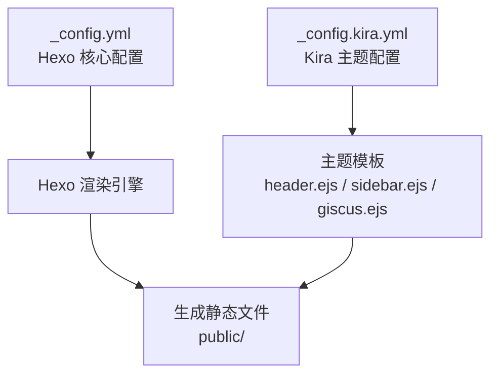
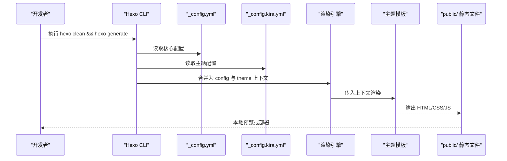
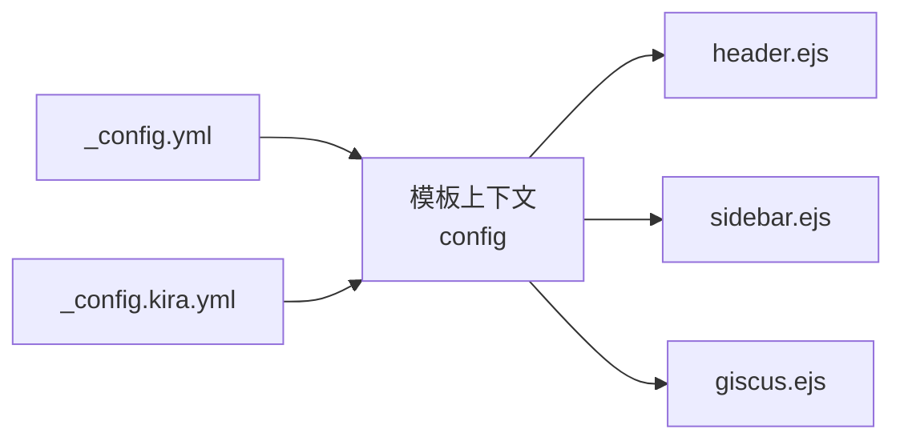

# 基础主题配置

<cite>
**本文引用的文件**
- [_config.yml](file://_config.yml)
- [_config.kira.yml](file://_config.kira.yml)
- [README.md](file://README.md)
- [package.json](file://package.json)
- [deploy.js](file://scripts/deploy.js)
- [header.ejs](file://node_modules/hexo-theme-kira/layout/components/header.ejs)
- [sidebar.ejs](file://node_modules/hexo-theme-kira/layout/components/sidebar.ejs)
- [giscus.ejs](file://node_modules/hexo-theme-kira/layout/components/comments/giscus.ejs)
</cite>

## 目录
1. [简介](#简介)
2. [项目结构](#项目结构)
3. [核心组件](#核心组件)
4. [架构总览](#架构总览)
5. [详细组件分析](#详细组件分析)
6. [依赖关系分析](#依赖关系分析)
7. [性能考虑](#性能考虑)
8. [故障排查指南](#故障排查指南)
9. [结论](#结论)
10. [附录](#附录)

## 简介
本文件面向 Hexo 博客使用者，系统梳理基础主题配置，重点说明两处关键配置文件的协同工作机制：
- Hexo 核心配置文件：_config.yml，用于控制站点元信息、全局行为（分页、代码高亮、Markdown 渲染器等）。
- 主题专用配置文件：_config.kira.yml，用于定义视觉元素（头像、背景、favicon、菜单结构、社交链接、配色方案）与功能开关（评论系统、复制代码块等）。

同时给出每个配置项的含义、可选值、默认值与实际应用示例，并解释配置修改后的生效方式（hexo clean && hexo generate）。

## 项目结构
本仓库包含 Hexo 根配置与主题配置，以及主题模板文件，便于理解配置项如何在模板中被使用。

图表来源
- [_config.yml](file://_config.yml#L1-L116)
- [_config.kira.yml](file://_config.kira.yml#L1-L150)
- [header.ejs](file://node_modules/hexo-theme-kira/layout/components/header.ejs#L1-L15)
- [sidebar.ejs](file://node_modules/hexo-theme-kira/layout/components/sidebar.ejs#L1-L65)
- [giscus.ejs](file://node_modules/hexo-theme-kira/layout/components/comments/giscus.ejs#L1-L39)

章节来源
- [README.md](file://README.md#L1-L193)
- [package.json](file://package.json#L1-L38)

## 核心组件
本节聚焦两类配置文件及其职责边界与协同方式。

- Hexo 核心配置（_config.yml）
  - 控制站点元信息：title、subtitle、description、keywords、author、language、timezone 等。
  - 控制 URL 与链接美化：url、permalink、permalink_defaults、pretty_urls。
  - 控制目录与渲染：source_dir、public_dir、tag_dir、archive_dir、category_dir、code_dir、i18n_dir、skip_render。
  - 控制写作与渲染器：new_post_name、default_layout、titlecase、external_link、filename_case、render_drafts、post_asset_folder、relative_link、future、syntax_highlighter、highlight、prismjs。
  - 控制首页分页：index_generator.path、index_generator.per_page、index_generator.order_by。
  - 控制日期时间格式与更新策略：date_format、time_format、updated_option。
  - 控制分页：per_page、pagination_dir。
  - 控制扩展与主题：theme。
  - 控制部署：deploy。
  - 控制内联图片：inline_image。
  - 控制 Markdown 渲染器：marked。

- 主题专用配置（_config.kira.yml）
  - 视觉元素：avatar、background、favicon、beian、widgets、maxTagcloud、sidebar。
  - 菜单结构：menu（键名为菜单项名称，值为数组，包含路径与图标）。
  - 社交链接：social（键名为社交平台名，值为数组，包含链接、图标、颜色等）。
  - 配色方案：color（first 到 seventh，分别对应 r、g、b）。
  - 评论系统：gitalk、giscus（active、repo、repoID、category、categoryID、mapping、term、theme、lang 等）。
  - 其他功能：copyright、copyTip、copyableCodeblock、customStyles、friends、ai_assistant。

章节来源
- [_config.yml](file://_config.yml#L1-L116)
- [_config.kira.yml](file://_config.kira.yml#L1-L150)

## 架构总览
Hexo 在生成阶段会读取 _config.yml 与 _config.kira.yml，将两者合并为模板可用的数据上下文（config 与 theme），随后由主题模板（如 header.ejs、sidebar.ejs、giscus.ejs）消费这些数据，最终输出静态 HTML。

图表来源
- [_config.yml](file://_config.yml#L1-L116)
- [_config.kira.yml](file://_config.kira.yml#L1-L150)
- [header.ejs](file://node_modules/hexo-theme-kira/layout/components/header.ejs#L1-L15)
- [sidebar.ejs](file://node_modules/hexo-theme-kira/layout/components/sidebar.ejs#L1-L65)
- [giscus.ejs](file://node_modules/hexo-theme-kira/layout/components/comments/giscus.ejs#L1-L39)
- [deploy.js](file://scripts/deploy.js#L62-L85)

## 详细组件分析

### Hexo 核心配置（_config.yml）

- 站点元信息
  - title：网站标题。默认值为空字符串；示例值见文件注释。
  - subtitle：网站副标题。默认值为空字符串。
  - description：网站描述。默认值为空字符串。
  - keywords：网站关键字。默认值为“博客”。
  - author：作者名。默认值为“Misaka12648”。
  - language：网站语言。默认值为“zh-CN”。
  - timezone：时区。默认值为空字符串。
  - 含义：影响页面 meta 信息与国际化显示。
  - 示例：参考文件中的注释与示例值。

- URL 与链接美化
  - url：站点地址。示例值为“https://misaka12648.xyz”。
  - permalink：文章永久链接格式。示例值为“:year/:month/:day/:title/”。
  - permalink_defaults：文章链接默认值（未指定字段时的默认值）。
  - pretty_urls：美化链接选项
    - trailing_index：是否在首页添加尾部斜杠（默认 true）。
    - trailing_html：是否在首页添加尾部 .html（默认 true）。
  - 含义：决定文章链接结构与 SEO 友好性。
  - 示例：参考文件中的注释与示例值。

- 目录与渲染
  - source_dir：源文件目录。默认“source”。
  - public_dir：输出文件目录。默认“public”。
  - tag_dir、archive_dir、category_dir：标签、归档、分类目录。默认“tags”、“archives”、“categories”。
  - code_dir：代码片段目录。默认“downloads/code”。
  - i18n_dir：i18n 文件目录。默认“:lang”。
  - skip_render：跳过渲染的文件列表。
  - 含义：控制站点目录结构与渲染范围。
  - 示例：参考文件中的注释与示例值。

- 写作与渲染器
  - new_post_name：新文章默认文件名。默认“:title.md”。
  - default_layout：默认布局。默认“post”。
  - titlecase：是否将标题转换为标题格式。默认 false。
  - external_link：外部链接
    - enable：是否启用（默认 true）。
    - field：应用范围（默认“site”）。
    - exclude：排除字段。
  - filename_case：文件名大小写规则。默认 0。
  - render_drafts：是否渲染草稿。默认 false。
  - post_asset_folder：是否启用资源文件夹。默认 true。
  - relative_link：相对链接。默认 true。
  - future：是否显示未来文章。默认 true。
  - syntax_highlighter：语法高亮器。默认“highlight.js”。
  - highlight：highlight.js 配置
    - line_number：是否显示行号（默认 true）。
    - auto_detect：是否自动检测语言（默认 false）。
    - tab_replace：制表符替换（默认空字符串）。
    - wrap：是否包裹（默认 true）。
    - hljs：是否启用 hljs（默认 true）。
  - prismjs：prismjs 配置
    - preprocess：是否预处理（默认 true）。
    - line_number：是否显示行号（默认 true）。
    - tab_replace：制表符替换（默认空字符串）。
  - 含义：控制文章生成、渲染与代码高亮行为。
  - 示例：参考文件中的注释与示例值。

- 首页分页与排序
  - index_generator：首页生成器
    - path：首页路径（默认空字符串）。
    - per_page：每页文章数（默认 10；设为 0 可禁用分页）。
    - order_by：排序规则（默认按日期降序）。
  - 含义：控制首页展示数量与排序。
  - 示例：参考文件中的注释与示例值。

- 日期时间格式与更新策略
  - date_format：日期格式。默认“YYYY-MM-DD”。
  - time_format：时间格式。默认“HH:mm:ss”。
  - updated_option：更新策略（支持 'mtime'、'date'、'empty'）。默认“mtime”。
  - 含义：控制文章更新时间显示与策略。
  - 示例：参考文件中的注释与示例值。

- 分页
  - per_page：分页每页文章数（默认 10；设为 0 可禁用分页）。
  - pagination_dir：分页目录名。默认“page”。
  - 含义：控制分页行为。
  - 示例：参考文件中的注释与示例值。

- 扩展与主题
  - theme：主题名称。默认“kira”。
  - 含义：指定使用的主题。
  - 示例：参考文件中的注释与示例值。

- 部署
  - deploy：部署配置（type 等）。默认空。
  - 含义：控制部署方式（可通过 hexo deploy 或自定义脚本）。
  - 示例：参考文件中的注释与示例值。

- 内联图片
  - inline_image.enabled：是否开启内联图片（默认 true）。
  - inline_image.compress：是否压缩图片（默认 false）。
  - inline_image.remote：是否开启远程图片（默认 false）。
  - inline_image.limit：图片大小限制（单位 KB，默认 2048）。
  - 含义：控制文章内图片处理策略。
  - 示例：参考文件中的注释与示例值。

- Markdown 渲染器
  - marked.breaks：是否启用 GitHub 样式的换行符（默认 true）。
  - marked.gfm：是否启用 GitHub 样式的 Markdown（默认 true）。
  - marked.pedantic：是否启用 pedantic 模式（默认 false）。
  - 含义：控制 Markdown 渲染风格。
  - 示例：参考文件中的注释与示例值。

章节来源
- [_config.yml](file://_config.yml#L1-L116)

### 主题专用配置（_config.kira.yml）

- 视觉元素
  - avatar：头像路径。默认“/img/头像.jpg”。模板中用于头部与侧边栏头像。
  - background：背景与文章默认头图
    - path：背景图片路径。默认“/img/codeBackground.png”。
    - width、height：背景尺寸。默认 1280×720。
  - favicon：网站图标
    - href：图标路径。默认“/img/favicon.jpg”。
    - type：图标类型（如 image/png、image/vnd.microsoft.icon、image/x-icon、image/gif）。默认“image/jpg”。
  - beian：备案号（选填）。模板中用于侧边栏版权区域。
  - widgets：侧边栏挂件列表。默认包含“social”、“category”、“tagcloud”、“archive”。
  - maxTagcloud：标签云显示的标签数量（0 表示不限制）。默认 0。
  - sidebar：自定义侧边栏尾部内容（默认空字符串）。
  - customStyles：自定义样式模块（默认包含“style”、“custom”）。
  - 含义：控制站点外观与侧边栏组件。
  - 示例：参考文件中的注释与示例值。

- 菜单结构（menu）
  - 键名为菜单项名称（如“回到首页”、“文章归档”、“关于本人”、“我的朋友”）。
  - 值为数组，包含两个元素：
    - 第一个元素为链接路径（如“/”、“/archives.html”、“/about.html”、“/friends.html”）。
    - 第二个元素为图标类名（如“icon-home”、“icon-container”、“icon-user”、“icon-team”）。
  - 含义：控制导航菜单项与图标。
  - 示例：参考文件中的注释与示例值。

- 社交链接（social）
  - 键名为社交平台名（如“QQ”、“GitHub”、“Gitee”）。
  - 值为数组，包含四个元素：
    - 第一个元素为链接地址。
    - 第二个元素为图标类名。
    - 第三个元素为主题色（rgb(...)）。
    - 第四个元素为浅色背景（rgba(...)）。
  - 含义：控制侧边栏社交挂件的链接与配色。
  - 示例：参考文件中的注释与示例值。

- 配色方案（color）
  - first（同时作为主题色）、second、third、fourth、fifth、sixth、seventh。
  - 每个颜色包含 r、g、b 三个数值（0-255）。
  - 含义：控制主题色彩体系。
  - 示例：参考文件中的注释与示例值。

- 评论系统
  - gitalk：Gitalk 评论系统
    - active：是否启用（默认 false）。
    - admin、owner、repo、clientID、clientSecret、title 等。
  - giscus：Giscus 评论系统
    - active：是否启用（默认 true）。
    - repo、repoID、category、categoryID、mapping、theme、lang 等。
  - 含义：控制评论系统的启用与参数。
  - 示例：参考文件中的注释与示例值。

- 其他功能
  - copyright：自定义版权文案（默认 CC 协议声明）。
  - copyTip：复制版权提示文案（%url 会被替换为当前页面 URL；设为 false 可禁用）。
  - copyableCodeblock：是否启用可复制的代码块（默认 true）。
  - friends：友链配置（默认空数组）。
  - ai_assistant：AI 助手配置（enable、silicon_flow、deepseek 等）。
  - 含义：控制版权提示、复制行为、友链与 AI 功能。
  - 示例：参考文件中的注释与示例值。

章节来源
- [_config.kira.yml](file://_config.kira.yml#L1-L150)

### 配置在模板中的使用

- 头部与头像
  - 模板通过“<%= theme.avatar %>”读取头像路径，用于头部与侧边栏头像显示。
  - 模板通过“<%= config.title %>”读取站点标题。
  - 参考路径：[header.ejs](file://node_modules/hexo-theme-kira/layout/components/header.ejs#L1-L15)

- 菜单与社交
  - 模板遍历“theme.menu”，根据键名与数组元素生成菜单项与图标。
  - 模板通过“theme.widgets”加载挂件（如 social、category、tagcloud、archive）。
  - 参考路径：[sidebar.ejs](file://node_modules/hexo-theme-kira/layout/components/sidebar.ejs#L1-L65)

- 评论系统
  - 模板根据“theme.giscus.active”判断是否渲染 Giscus 评论区，并注入相关属性（repo、repoID、category、categoryID、mapping、theme、lang 等）。
  - 参考路径：[giscus.ejs](file://node_modules/hexo-theme-kira/layout/components/comments/giscus.ejs#L1-L39)

章节来源
- [header.ejs](file://node_modules/hexo-theme-kira/layout/components/header.ejs#L1-L15)
- [sidebar.ejs](file://node_modules/hexo-theme-kira/layout/components/sidebar.ejs#L1-L65)
- [giscus.ejs](file://node_modules/hexo-theme-kira/layout/components/comments/giscus.ejs#L1-L39)

## 依赖关系分析
- Hexo 核心配置（_config.yml）与主题配置（_config.kira.yml）共同构成模板上下文：
  - config：来自 _config.yml 的站点元信息与全局行为。
  - theme：来自 _config.kira.yml 的视觉与功能配置。
- 模板通过 EJS 语法读取 config 与 theme，实现“配置即界面”。

图表来源
- [_config.yml](file://_config.yml#L1-L116)
- [_config.kira.yml](file://_config.kira.yml#L1-L150)
- [header.ejs](file://node_modules/hexo-theme-kira/layout/components/header.ejs#L1-L15)
- [sidebar.ejs](file://node_modules/hexo-theme-kira/layout/components/sidebar.ejs#L1-L65)
- [giscus.ejs](file://node_modules/hexo-theme-kira/layout/components/comments/giscus.ejs#L1-L39)

章节来源
- [_config.yml](file://_config.yml#L1-L116)
- [_config.kira.yml](file://_config.kira.yml#L1-L150)
- [header.ejs](file://node_modules/hexo-theme-kira/layout/components/header.ejs#L1-L15)
- [sidebar.ejs](file://node_modules/hexo-theme-kira/layout/components/sidebar.ejs#L1-L65)
- [giscus.ejs](file://node_modules/hexo-theme-kira/layout/components/comments/giscus.ejs#L1-L39)

## 性能考虑
- 分页与首页生成
  - 合理设置 index_generator.per_page 与 per_page，避免首页与分页页面过大导致生成时间增长。
- 代码高亮
  - highlight.line_number 与 prismjs.line_number 开启会增加 DOM 结构复杂度，建议在生产环境按需开启。
- Markdown 渲染
  - marked.gfm 与 breaks 已默认启用，确保渲染一致性；如需更严格的解析，可调整 pedantic。
- 内联图片
  - inline_image.enabled=true 时，注意图片体积与压缩策略，避免生成过大的静态资源。

[本节为通用指导，不涉及具体文件分析]

## 故障排查指南
- 配置修改后未生效
  - 确认执行了清理与重新生成命令：hexo clean && hexo generate。
  - 若使用自动化脚本，确认脚本中已包含上述步骤。
  - 参考路径：[deploy.js](file://scripts/deploy.js#L62-L85)

- 评论系统未显示
  - 检查 _config.kira.yml 中 giscus.active 是否为 true，以及 repo、repoID、category、categoryID、mapping、theme、lang 等参数是否正确。
  - 参考路径：[giscus.ejs](file://node_modules/hexo-theme-kira/layout/components/comments/giscus.ejs#L1-L39)

- 菜单或社交图标不显示
  - 检查 _config.kira.yml 中 menu 与 social 的键名、路径与图标类名是否正确。
  - 参考路径：[sidebar.ejs](file://node_modules/hexo-theme-kira/layout/components/sidebar.ejs#L1-L65)

- 头像或背景未显示
  - 检查 _config.kira.yml 中 avatar、background.path 等路径是否正确且可访问。
  - 参考路径：[header.ejs](file://node_modules/hexo-theme-kira/layout/components/header.ejs#L1-L15)

章节来源
- [deploy.js](file://scripts/deploy.js#L62-L85)
- [giscus.ejs](file://node_modules/hexo-theme-kira/layout/components/comments/giscus.ejs#L1-L39)
- [sidebar.ejs](file://node_modules/hexo-theme-kira/layout/components/sidebar.ejs#L1-L65)
- [header.ejs](file://node_modules/hexo-theme-kira/layout/components/header.ejs#L1-L15)

## 结论
- _config.yml 与 _config.kira.yml 分工明确：前者负责站点元信息与全局行为，后者负责主题外观与功能开关。
- 模板通过 EJS 语法读取 config 与 theme，实现“配置即界面”的灵活定制。
- 修改配置后务必执行 hexo clean && hexo generate 或使用自动化脚本完成构建与部署。

[本节为总结性内容，不涉及具体文件分析]

## 附录

### 配置项一览与示例路径
- 站点元信息与 URL
  - title、subtitle、description、keywords、author、language、timezone、url、permalink、permalink_defaults、pretty_urls
  - 示例路径：[_config.yml](file://_config.yml#L1-L116)

- 目录与渲染
  - source_dir、public_dir、tag_dir、archive_dir、category_dir、code_dir、i18n_dir、skip_render、new_post_name、default_layout、titlecase、external_link、filename_case、render_drafts、post_asset_folder、relative_link、future、syntax_highlighter、highlight、prismjs
  - 示例路径：[_config.yml](file://_config.yml#L1-L116)

- 首页分页与排序
  - index_generator.path、index_generator.per_page、index_generator.order_by
  - 示例路径：[_config.yml](file://_config.yml#L1-L116)

- 日期时间与更新策略
  - date_format、time_format、updated_option
  - 示例路径：[_config.yml](file://_config.yml#L1-L116)

- 分页
  - per_page、pagination_dir
  - 示例路径：[_config.yml](file://_config.yml#L1-L116)

- 扩展与主题
  - theme
  - 示例路径：[_config.yml](file://_config.yml#L1-L116)

- 部署
  - deploy
  - 示例路径：[_config.yml](file://_config.yml#L1-L116)

- 内联图片
  - inline_image.enabled、inline_image.compress、inline_image.remote、inline_image.limit
  - 示例路径：[_config.yml](file://_config.yml#L1-L116)

- Markdown 渲染器
  - marked.breaks、marked.gfm、marked.pedantic
  - 示例路径：[_config.yml](file://_config.yml#L1-L116)

- 视觉元素与功能
  - avatar、background、favicon、beian、widgets、maxTagcloud、sidebar、customStyles、menu、social、color、giscus、gitalk、copyright、copyTip、copyableCodeblock、friends、ai_assistant
  - 示例路径：[_config.kira.yml](file://_config.kira.yml#L1-L150)

### 生效方式说明
- 本地预览与生成
  - 执行 hexo clean && hexo generate 后，静态文件生成至 public/ 目录，可在本地浏览器访问。
  - 参考路径：[README.md](file://README.md#L67-L77)，[deploy.js](file://scripts/deploy.js#L62-L85)

- 自动化部署脚本
  - 脚本内部已包含 hexo clean 与 hexo generate 步骤，完成后进行备份、上传与验证。
  - 参考路径：[deploy.js](file://scripts/deploy.js#L62-L85)