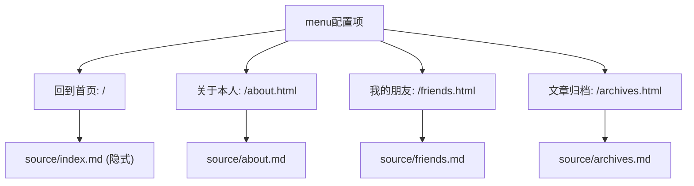
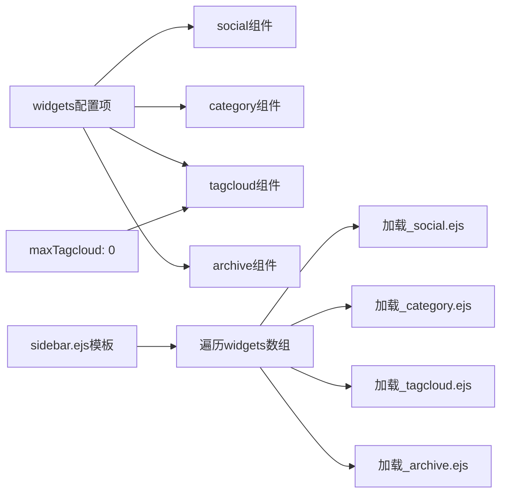

# 导航与社交配置

<cite>
**本文档引用的文件**   
- [_config.kira.yml](file://_config.kira.yml)
- [myblog/_config.kira.yml](file://myblog/_config.kira.yml)
- [source/about.md](file://source/about.md)
- [source/friends.md](file://source/friends.md)
- [source/archives.md](file://source/archives.md)
- [myblog/source/about.md](file://myblog/source/about.md)
- [myblog/source/friends.md](file://myblog/source/friends.md)
- [myblog/source/archive.md](file://myblog/source/archive.md)
- [node_modules/hexo-theme-kira/layout/components/sidebar.ejs](file://node_modules/hexo-theme-kira/layout/components/sidebar.ejs)
- [node_modules/hexo-theme-kira/layout/_widget/social.ejs](file://node_modules/hexo-theme-kira/layout/_widget/social.ejs)
- [node_modules/hexo-theme-kira/layout/_widget/tagcloud.ejs](file://node_modules/hexo-theme-kira/layout/_widget/tagcloud.ejs)
- [node_modules/hexo-theme-kira/layout/_widget/archive.ejs](file://node_modules/hexo-theme-kira/layout/_widget/archive.ejs)
- [themes/kira-custom/layout/layout.ejs](file://themes/kira-custom/layout/layout.ejs)
</cite>

## 目录
1. [menu菜单配置](#menu菜单配置)
2. [social社交链接配置](#social社交链接配置)
3. [widgets侧边栏组件配置](#widgets侧边栏组件配置)
4. [新增菜单项与社交图标操作流程](#新增菜单项与社交图标操作流程)

## menu菜单配置

`_config.kira.yml` 文件中的 `menu` 配置项用于定义博客导航菜单的结构。每个菜单项由中文名称作为键，其值为包含两个元素的数组：第一个元素是路由路径，第二个元素是图标类名。

菜单项的层级结构为一级扁平化设计，不支持嵌套子菜单。系统通过中文名称与路由路径的映射关系，实现页面跳转功能。例如，`回到首页` 对应根路径 `/`，点击后跳转至博客首页。

该配置与 `source` 目录下的页面文件存在直接的路由映射关系。例如，`关于本人` 菜单项映射到 `/about.html` 路径，对应 `source/about.md` 文件；`我的朋友` 映射到 `/friends.html`，对应 `source/friends.md` 文件；`文章归档` 映射到 `/archives.html`，对应 `source/archives.md` 文件。



**图示来源**
- [_config.kira.yml](file://_config.kira.yml#L22-L34)
- [source/about.md](file://source/about.md#L1-L3)
- [source/friends.md](file://source/friends.md#L1-L3)
- [source/archives.md](file://source/archives.md#L1-L5)
- [node_modules/hexo-theme-kira/layout/components/sidebar.ejs](file://node_modules/hexo-theme-kira/layout/components/sidebar.ejs#L16-L34)

**本节来源**
- [_config.kira.yml](file://_config.kira.yml#L22-L34)
- [source/about.md](file://source/about.md)
- [source/friends.md](file://source/friends.md)
- [source/archives.md](file://source/archives.md)

## social社交链接配置

`social` 配置项用于定义侧边栏中显示的社交平台链接，采用四元组结构进行配置，每个平台包含四个按顺序排列的元素：

1.  **URL**: 社交平台的链接地址，可以是标准的HTTP/HTTPS链接，也可以是特定应用的协议链接（如QQ的`tencent://`协议）。
2.  **图标类名**: 用于显示该平台图标的CSS类名，通常以 `icon-` 开头，如 `icon-QQ`、`icon-github`。
3.  **主色**: 图标的主色调，使用 `rgb()` 或 `rgba()` 格式的颜色值。
4.  **背景色**: 图标周围的背景色，使用 `rgba()` 格式以支持透明度。

以配置文件中的实例进行说明：
*   **QQ**: 链接使用 `tencent://` 协议直接唤起QQ客户端添加好友，图标类名为 `icon-QQ`，主色为蓝色 `rgb(49, 174, 255)`，背景色为同色系浅色 `rgba(49, 174, 255, .1)`。
*   **GitHub**: 链接指向 `https://github.com/misaka12648`，图标类名为 `icon-github`，主色为黑色 `rgb(25, 23, 23)`，背景色为深灰色 `rgba(25, 23, 23, .15)`。

这些配置项在主题的 `social.ejs` 模板中被循环读取，动态生成带有指定样式和链接的社交图标。

```mermaid
classDiagram
class SocialConfig {
+String url
+String iconClass
+String primaryColor
+String backgroundColor
}
class QQ : SocialConfig
class GitHub : SocialConfig
class Gitee : SocialConfig
SocialConfig <|-- QQ
SocialConfig <|-- GitHub
SocialConfig <|-- Gitee
QQ : url = "tencent : //AddContact/..."
QQ : iconClass = "icon-QQ"
QQ : primaryColor = "rgb(49, 174, 255)"
QQ : backgroundColor = "rgba(49, 174, 255, .1)"
GitHub : url = "https : //github.com/..."
GitHub : iconClass = "icon-github"
GitHub : primaryColor = "rgb(25, 23, 23)"
GitHub : backgroundColor = "rgba(25, 23, 23, .15)"
```

**图示来源**
- [_config.kira.yml](file://_config.kira.yml#L44-L64)
- [node_modules/hexo-theme-kira/layout/_widget/social.ejs](file://node_modules/hexo-theme-kira/layout/_widget/social.ejs#L3-L9)

**本节来源**
- [_config.kira.yml](file://_config.kira.yml#L44-L64)

## widgets侧边栏组件配置

`widgets` 配置项是一个数组，用于控制博客侧边栏（sidebar）中哪些组件（widgets）被显示。数组中的每一项对应一个可启用的侧边栏小部件。

根据配置文件，当前启用了以下四个组件：
*   `social`: 显示社交链接图标。
*   `category`: 显示文章分类列表。
*   `tagcloud`: 显示标签云。
*   `archive`: 显示文章归档列表。

该配置在 `sidebar.ejs` 模板中通过 `forEach` 循环遍历 `theme.widgets` 数组，并使用 `partial` 函数动态加载对应的 `_widget` 组件。例如，当遍历到 `social` 时，会加载并渲染 `_widget/social.ejs` 文件。

`maxTagcloud` 配置项与 `tagcloud` 组件相关，用于限制标签云中显示的标签数量。设置为 `0` 表示不限制，显示所有标签。



**图示来源**
- [_config.kira.yml](file://_config.kira.yml#L36-L42)
- [node_modules/hexo-theme-kira/layout/components/sidebar.ejs](file://node_modules/hexo-theme-kira/layout/components/sidebar.ejs#L37-L39)
- [node_modules/hexo-theme-kira/layout/_widget/tagcloud.ejs](file://node_modules/hexo-theme-kira/layout/_widget/tagcloud.ejs#L6-L7)

**本节来源**
- [_config.kira.yml](file://_config.kira.yml#L36-L42)

## 新增菜单项与社交图标操作流程

要向博客添加新的菜单项或社交图标，需遵循以下操作流程：

1.  **编辑配置文件**: 打开项目根目录下的 `_config.kira.yml` 文件。
2.  **添加菜单项**:
    *   在 `menu` 配置块下，添加新的键值对。
    *   键为菜单的中文名称（如 `联系我`）。
    *   值为一个包含两个元素的数组：第一个元素是目标页面的相对路径（如 `/contact.html`），第二个元素是图标的CSS类名（如 `icon-email`）。
3.  **添加社交图标**:
    *   在 `social` 配置块下，添加新的平台名称作为键（如 `Twitter`）。
    *   值为一个包含四个元素的数组：URL、图标类名、主色、背景色。
4.  **获取图标类名**:
    *   图标类名来源于主题内置的图标库或通过 `iconlib` 配置项引入的自定义图标库。
    *   可参考主题文档 `https://kira.host/hexo/config/icon.html` 获取可用的图标类名列表。
    *   若需使用自定义图标，可取消注释 `iconlib` 配置，并填入阿里图标库等服务生成的CSS链接。
5.  **创建对应页面** (仅菜单项):
    *   如果新菜单项指向一个新页面，需在 `source` 目录下创建对应的 `.md` 文件（如 `source/contact.md`），并在文件头部的Front-matter中指定 `title` 和 `layout`。
6.  **重新生成静态文件**:
    *   **这是最关键的一步**。修改配置文件后，必须重新运行 `hexo generate` (或 `npm run build`) 命令，将新的配置编译生成静态HTML文件。
    *   之后再执行 `hexo deploy` 命令将更新后的静态文件部署到服务器。

**重要提示**: 任何对 `_config.kira.yml` 的修改都不会实时生效，必须重新生成静态文件才能在博客中看到变化。

**本节来源**
- [_config.kira.yml](file://_config.kira.yml)
- [source/about.md](file://source/about.md)
- [themes/kira-custom/layout/layout.ejs](file://themes/kira-custom/layout/layout.ejs)
- [myblog/package.json](file://myblog/package.json#L5-L9)