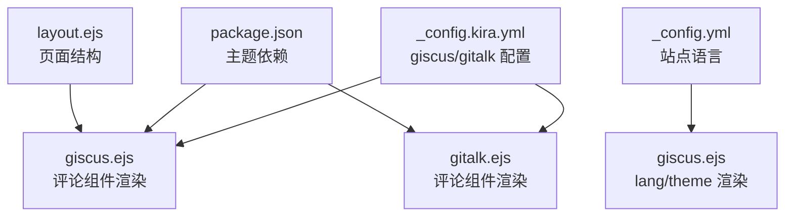
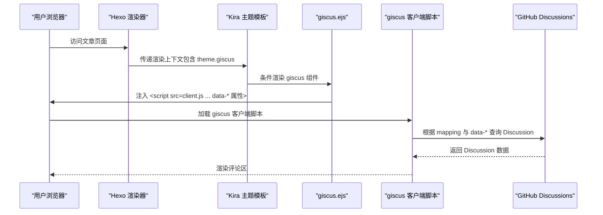
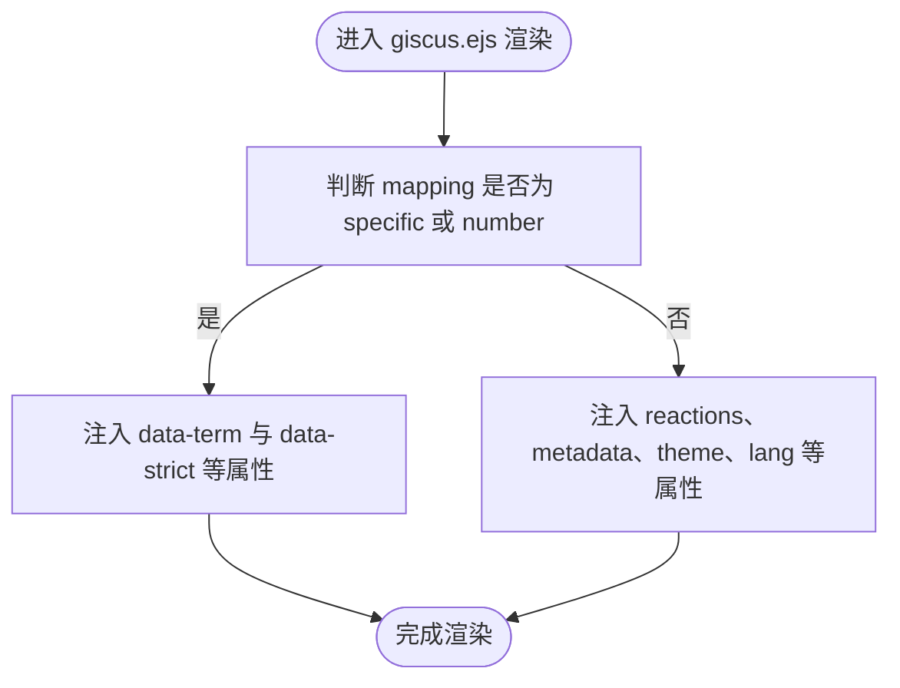
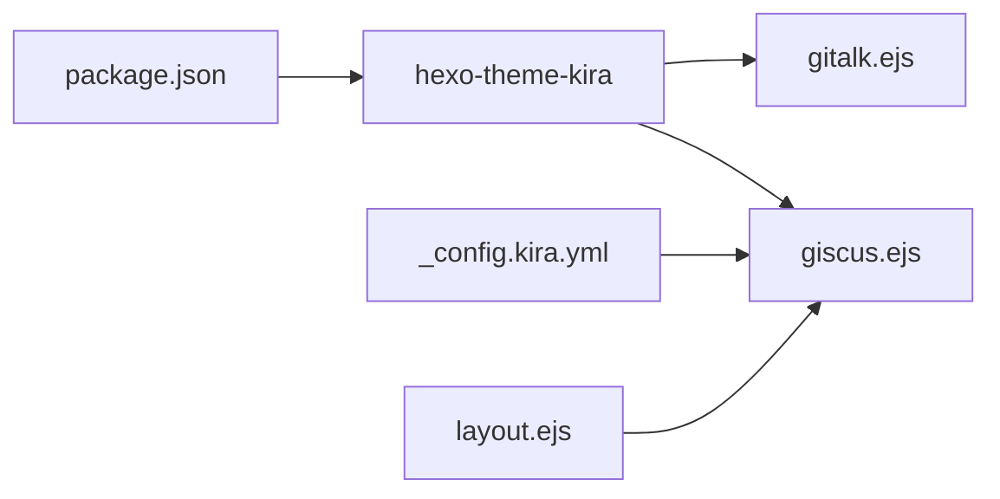

# 评论系统配置

<cite>
**本文引用的文件**
- [_config.kira.yml](file://_config.kira.yml)
- [giscus.ejs](file://node_modules/hexo-theme-kira/layout/components/comments/giscus.ejs)
- [gitalk.ejs](file://node_modules/hexo-theme-kira/layout/components/comments/gitalk.ejs)
- [package.json](file://package.json)
- [_config.yml](file://_config.yml)
- [layout.ejs](file://themes/kira-custom/layout/layout.ejs)
</cite>

## 目录
1. [简介](#简介)
2. [项目结构](#项目结构)
3. [核心组件](#核心组件)
4. [架构总览](#架构总览)
5. [详细组件分析](#详细组件分析)
6. [依赖关系分析](#依赖关系分析)
7. [性能考量](#性能考量)
8. [故障排查指南](#故障排查指南)
9. [结论](#结论)
10. [附录](#附录)

## 简介
本文件面向希望在基于 Kira 主题的 Hexo 博客中启用 giscus 评论系统的读者，围绕 _config.kira.yml 中 giscus 节点的关键字段（active、repo、repoID、category、categoryID、mapping、theme、lang）进行系统讲解。文档同时对比已禁用的 gitalk 配置项，阐明 giscus 的技术优势；提供启用评论功能的完整配置步骤与注意事项；并给出部署后评论不显示的检查清单与排障建议。最后说明 theme 与 lang 字段如何实现评论组件的中文化与主题同步。

## 项目结构
本项目采用 Hexo + Kira 主题的组合，评论系统由主题提供的 EJS 片段按配置渲染。关键位置如下：
- 配置文件：_config.kira.yml（giscus 与 gitalk 配置）
- 主题评论模板：node_modules/hexo-theme-kira/layout/components/comments/giscus.ejs、gitalk.ejs
- 依赖声明：package.json（包含 hexo-theme-kira）
- 站点基础配置：_config.yml（站点语言等）
- 自定义主题布局：themes/kira-custom/layout/layout.ejs（用于整体页面结构）

图表来源
- [_config.kira.yml](file://_config.kira.yml#L96-L117)
- [giscus.ejs](file://node_modules/hexo-theme-kira/layout/components/comments/giscus.ejs#L1-L39)
- [gitalk.ejs](file://node_modules/hexo-theme-kira/layout/components/comments/gitalk.ejs#L1-L18)
- [package.json](file://package.json#L16-L36)
- [_config.yml](file://_config.yml#L10-L12)
- [layout.ejs](file://themes/kira-custom/layout/layout.ejs#L1-L67)

章节来源
- file://_config.kira.yml#L96-L117
- file://node_modules/hexo-theme-kira/layout/components/comments/giscus.ejs#L1-L39
- file://node_modules/hexo-theme-kira/layout/components/comments/gitalk.ejs#L1-L18
- file://package.json#L16-L36
- file://_config.yml#L10-L12
- file://themes/kira-custom/layout/layout.ejs#L1-L67

## 核心组件
- giscus 配置节点（_config.kira.yml）
  - active：是否启用 giscus
  - repo：存放评论 Discussion 的仓库标识（用户名/仓库名）
  - repoID：仓库的 GitHub ID
  - category：讨论分类名称
  - categoryID：分类的 GitHub ID
  - mapping：评论绑定策略（pathname、url、title、og:title、specific、number）
  - theme：评论组件主题（如 light、dark、preferred_color_scheme）
  - lang：评论组件语言（如 zh-CN、en）
- gitalk 配置节点（_config.kira.yml）
  - active：是否启用 gitalk（当前为禁用）
  - 其余字段包括 owner、admin、repo、clientID、clientSecret、title 等
- 主题评论模板
  - giscus.ejs：根据配置渲染 giscus 评论组件
  - gitalk.ejs：根据配置渲染 gitalk 评论组件

章节来源
- file://_config.kira.yml#L96-L117
- file://node_modules/hexo-theme-kira/layout/components/comments/giscus.ejs#L1-L39
- file://node_modules/hexo-theme-kira/layout/components/comments/gitalk.ejs#L1-L18

## 架构总览
下图展示了评论系统在页面中的工作流：Hexo 渲染器读取 _config.kira.yml 中的 giscus 配置，主题模板根据配置输出 giscus 脚本与数据属性；giscus 客户端脚本向 GitHub Discussions 发起请求，完成评论的展示与交互。

图表来源
- [_config.kira.yml](file://_config.kira.yml#L96-L117)
- [giscus.ejs](file://node_modules/hexo-theme-kira/layout/components/comments/giscus.ejs#L1-L39)

## 详细组件分析

### giscus 配置字段详解
- active
  - 控制是否渲染 giscus 评论组件
  - 参考路径：file://_config.kira.yml#L108
- repo 与 repoID
  - repo：评论 Discussion 所在仓库（用户名/仓库名）
  - repoID：仓库的 GitHub ID（需在 giscus.app 平台生成）
  - 参考路径：file://_config.kira.yml#L109-L110
- category 与 categoryID
  - category：Discussion 所属分类名称
  - categoryID：分类的 GitHub ID（需在 giscus.app 平台生成）
  - 参考路径：file://_config.kira.yml#L111-L112
- mapping
  - 评论绑定策略，决定 giscus 如何将页面与 Discussion 关联
  - 取值范围：pathname、url、title、og:title、specific、number
  - 参考路径：file://_config.kira.yml#L113
- theme 与 lang
  - theme：评论组件主题（如 light、dark、preferred_color_scheme）
  - lang：评论组件语言（如 zh-CN、en）
  - 参考路径：file://_config.kira.yml#L115-L116
- cdn.giscus.js
  - giscus 客户端脚本的 CDN 地址
  - 参考路径：file://_config.kira.yml#L17-L18

章节来源
- file://_config.kira.yml#L17-L18
- file://_config.kira.yml#L96-L117

### giscus 绑定策略 mapping 对评论绑定的影响
- 不同 mapping 的行为差异
  - pathname：使用页面路径作为绑定键
  - url：使用完整 URL 作为绑定键
  - title：使用页面标题作为绑定键
  - og:title：使用 Open Graph 标题作为绑定键
  - specific：需要配合 term 字段指定具体术语
  - number：需要配合 term 字段指定 Discussion 编号
- 模板中的条件分支
  - 当 mapping 为 specific 或 number 时，模板会注入 term 与 strict 等属性
  - 其他 mapping 时，模板会注入 reactions、metadata、theme、lang 等属性
- 参考路径：
  - file://node_modules/hexo-theme-kira/layout/components/comments/giscus.ejs#L3-L19
  - file://node_modules/hexo-theme-kira/layout/components/comments/giscus.ejs#L21-L38

图表来源
- [giscus.ejs](file://node_modules/hexo-theme-kira/layout/components/comments/giscus.ejs#L1-L39)

章节来源
- file://node_modules/hexo-theme-kira/layout/components/comments/giscus.ejs#L1-L39

### 通过 giscus.app 生成 repoID 与 categoryID
- 在 giscus.app 平台选择仓库与分类，平台会返回对应的 repoID 与 categoryID
- 将返回的 ID 填入 _config.kira.yml 的 repoID 与 categoryID 字段
- 参考路径：file://_config.kira.yml#L109-L112

章节来源
- file://_config.kira.yml#L109-L112

### giscus 与 gitalk 的对比
- 已禁用的 gitalk 配置项
  - active：false
  - 其余字段包括 owner、admin、repo、clientID、clientSecret、title 等
  - 参考路径：file://_config.kira.yml#L97-L104
- giscus 的技术优势（基于模板与配置的实现特性）
  - 评论数据存储于 GitHub Discussions，无需额外数据库
  - 通过 mapping 与 term 实现灵活的页面绑定策略
  - 支持 reactions、metadata 等增强能力（当 mapping 非 specific/number 时）
  - 主题模板支持 preferred_color_scheme，可与系统主题联动
  - 参考路径：
    - file://node_modules/hexo-theme-kira/layout/components/comments/giscus.ejs#L1-L39
    - file://node_modules/hexo-theme-kira/layout/components/comments/gitalk.ejs#L1-L18

章节来源
- file://_config.kira.yml#L97-L104
- file://node_modules/hexo-theme-kira/layout/components/comments/giscus.ejs#L1-L39
- file://node_modules/hexo-theme-kira/layout/components/comments/gitalk.ejs#L1-L18

### 启用评论功能的完整配置示例
- 步骤一：在 giscus.app 上创建仓库与分类，获取 repoID 与 categoryID
- 步骤二：在 _config.kira.yml 中启用 giscus 并填写必要字段
  - active：true
  - repo：用户名/仓库名
  - repoID：仓库 ID
  - category：分类名称
  - categoryID：分类 ID
  - mapping：选择合适的绑定策略（如 pathname）
  - theme：light/dark/preferred_color_scheme
  - lang：zh-CN/en
- 步骤三：确认 CDN 地址可用
  - 参考路径：file://_config.kira.yml#L17-L18
- 步骤四：部署后检查页面是否渲染 giscus 组件
  - 参考路径：file://node_modules/hexo-theme-kira/layout/components/comments/giscus.ejs#L1-L39

章节来源
- file://_config.kira.yml#L17-L18
- file://_config.kira.yml#L96-L117
- file://node_modules/hexo-theme-kira/layout/components/comments/giscus.ejs#L1-L39

### theme 与 lang 字段如何实现中文化与主题同步
- lang 字段
  - 控制 giscus 组件的语言
  - 模板中 data-lang 会直接使用配置值
  - 参考路径：file://node_modules/hexo-theme-kira/layout/components/comments/giscus.ejs#L32
- theme 字段
  - 控制 giscus 组件的主题
  - 当 mapping 为 specific/number 时，模板使用 preferred_color_scheme
  - 其他 mapping 时，模板使用配置的 theme 值
  - 参考路径：file://node_modules/hexo-theme-kira/layout/components/comments/giscus.ejs#L15-L16
- 站点语言
  - _config.yml 中的 language 决定了站点语言，但 giscus 的 lang 由 giscus.lang 直接控制
  - 参考路径：file://_config.yml#L10-L12

章节来源
- file://node_modules/hexo-theme-kira/layout/components/comments/giscus.ejs#L15-L16
- file://node_modules/hexo-theme-kira/layout/components/comments/giscus.ejs#L32
- file://_config.yml#L10-L12

## 依赖关系分析
- 主题依赖
  - package.json 声明了 hexo-theme-kira，确保评论模板可用
  - 参考路径：file://package.json#L16-L36
- 配置依赖
  - giscus.ejs 依赖 _config.kira.yml 中的 giscus 节点与 cdn.giscus.js
  - 参考路径：file://node_modules/hexo-theme-kira/layout/components/comments/giscus.ejs#L1-L39
  - file://_config.kira.yml#L17-L18
- 页面结构依赖
  - layout.ejs 提供页面骨架，评论组件在文章页面中被包含
  - 参考路径：file://themes/kira-custom/layout/layout.ejs#L1-L67

图表来源
- [package.json](file://package.json#L16-L36)
- [giscus.ejs](file://node_modules/hexo-theme-kira/layout/components/comments/giscus.ejs#L1-L39)
- [gitalk.ejs](file://node_modules/hexo-theme-kira/layout/components/comments/gitalk.ejs#L1-L18)
- [_config.kira.yml](file://_config.kira.yml#L17-L18)
- [layout.ejs](file://themes/kira-custom/layout/layout.ejs#L1-L67)

章节来源
- file://package.json#L16-L36
- file://node_modules/hexo-theme-kira/layout/components/comments/giscus.ejs#L1-L39
- file://node_modules/hexo-theme-kira/layout/components/comments/gitalk.ejs#L1-L18
- file://_config.kira.yml#L17-L18
- file://themes/kira-custom/layout/layout.ejs#L1-L67

## 性能考量
- 脚本加载
  - giscus.ejs 使用 async 与 data-loading="lazy"，有助于减少阻塞
  - 参考路径：file://node_modules/hexo-theme-kira/layout/components/comments/giscus.ejs#L18-L20
- 绑定策略
  - 选择合适的 mapping 可避免不必要的 Discussion 创建或查询
  - 参考路径：file://node_modules/hexo-theme-kira/layout/components/comments/giscus.ejs#L3-L19
- 主题与语言
  - preferred_color_scheme 可减少主题切换时的闪烁
  - 参考路径：file://node_modules/hexo-theme-kira/layout/components/comments/giscus.ejs#L15-L16

章节来源
- file://node_modules/hexo-theme-kira/layout/components/comments/giscus.ejs#L15-L20

## 故障排查指南
- 评论不显示的常见原因与检查清单
  - GitHub Personal Access Token 权限
    - giscus 使用 GitHub Discussions，通常不需要 PAT；若涉及自定义集成，请确保权限正确
  - 跨域访问设置
    - 确认 giscus 客户端脚本可正常加载，且域名与 referer 符合 GitHub 要求
  - giscus 脚本 CDN 加载状态
    - 检查 _config.kira.yml 中 cdn.giscus.js 是否可达
    - 参考路径：file://_config.kira.yml#L17-L18
  - mapping 与 term 配置
    - 若 mapping 为 specific/number，需确保 term 正确
    - 参考路径：file://node_modules/hexo-theme-kira/layout/components/comments/giscus.ejs#L3-L19
  - repoID 与 categoryID
    - 确认已在 giscus.app 获取并填写
    - 参考路径：file://_config.kira.yml#L109-L112
  - theme 与 lang
    - 确认 theme 与 lang 设置符合预期
    - 参考路径：file://node_modules/hexo-theme-kira/layout/components/comments/giscus.ejs#L32
- 页面结构核验
  - 确认文章页面包含评论组件渲染逻辑
  - 参考路径：file://themes/kira-custom/layout/layout.ejs#L1-L67

章节来源
- file://_config.kira.yml#L17-L18
- file://node_modules/hexo-theme-kira/layout/components/comments/giscus.ejs#L3-L19
- file://node_modules/hexo-theme-kira/layout/components/comments/giscus.ejs#L32
- file://_config.kira.yml#L109-L112
- file://themes/kira-custom/layout/layout.ejs#L1-L67

## 结论
通过在 _config.kira.yml 中正确配置 giscus 的关键字段，并结合 giscus.ejs 的模板渲染逻辑，即可在 Hexo + Kira 主题的博客中启用基于 GitHub Discussions 的评论系统。相较已禁用的 gitalk，giscus 在数据存储、绑定策略与主题语言方面具备更灵活的实现方式。部署后如遇评论不显示问题，可依据本文提供的检查清单逐一排查。

## 附录
- 参考路径汇总
  - giscus 配置字段：file://_config.kira.yml#L96-L117
  - giscus 模板渲染：file://node_modules/hexo-theme-kira/layout/components/comments/giscus.ejs#L1-L39
  - gitalk 模板渲染：file://node_modules/hexo-theme-kira/layout/components/comments/gitalk.ejs#L1-L18
  - 主题依赖声明：file://package.json#L16-L36
  - 站点语言配置：file://_config.yml#L10-L12
  - 页面布局结构：file://themes/kira-custom/layout/layout.ejs#L1-L67