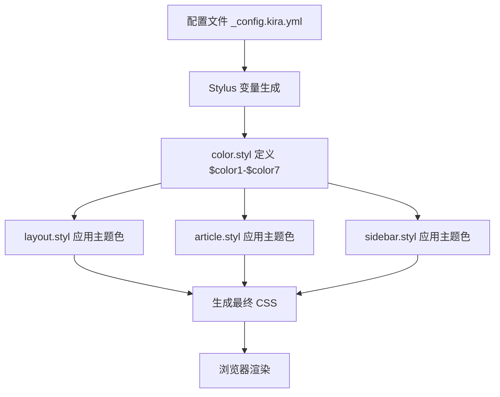
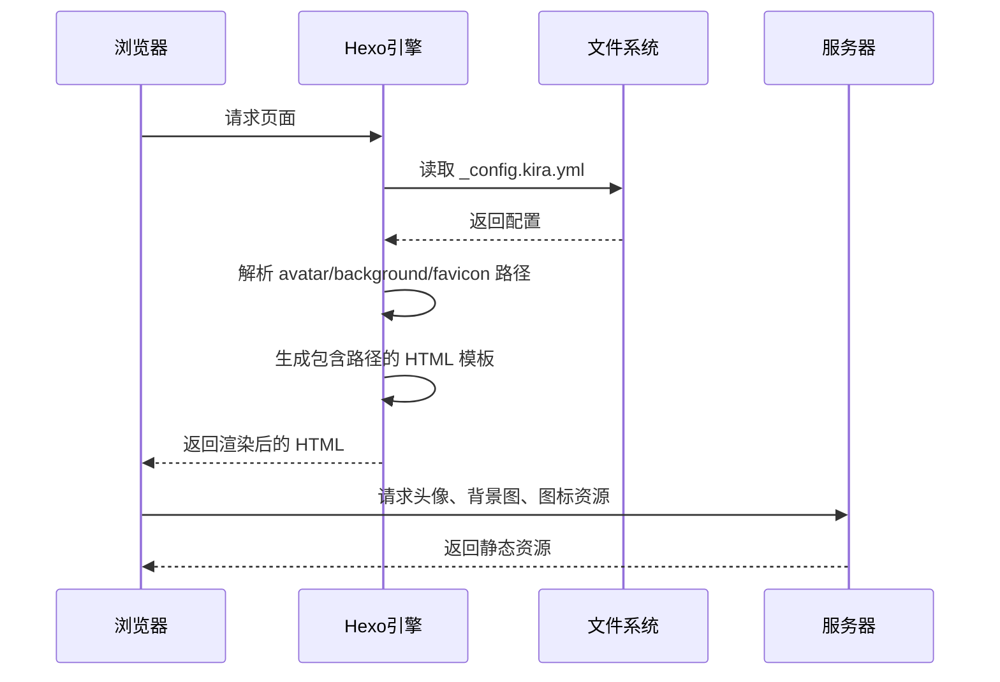

# 配色与视觉配置

<cite>
**本文档引用文件**  
- [_config.kira.yml](file://_config.kira.yml)
- [_config.yml](file://_config.yml)
- [layout.ejs](file://themes/kira-custom/layout/layout.ejs)
- [header.ejs](file://node_modules/hexo-theme-kira/layout/components/header.ejs)
- [color.styl](file://node_modules/hexo-theme-kira/source/css/color.styl)
- [layout.styl](file://node_modules/hexo-theme-kira/source/css/layout.styl)
- [article.styl](file://node_modules/hexo-theme-kira/source/css/article.styl)
- [sidebar.styl](file://node_modules/hexo-theme-kira/source/css/sidebar.styl)
</cite>

## 目录
1. [简介](#简介)
2. [视觉元素配置详解](#视觉元素配置详解)
3. [配色方案应用逻辑](#配色方案应用逻辑)
4. [资源路径解析机制](#资源路径解析机制)
5. [主题风格切换实战](#主题风格切换实战)
6. [常见问题排查](#常见问题排查)

## 简介
本文档详细说明如何通过 `_config.kira.yml` 文件中的 `avatar`、`background`、`favicon` 和 `color` 字段配置博客的视觉元素。涵盖头像与图标路径设置、背景图适配策略、配色方案优先级应用等核心内容，并提供配置生效流程与问题排查指南。

## 视觉元素配置详解

### 头像（avatar）配置
`avatar` 字段用于设置网站 Logo，其值为头像图片的相对路径。路径以站点根目录为基准，通常放置在 `/img/` 目录下。

**路径设置要求**：
- 必须以 `/` 开头，表示从站点根目录开始解析
- 支持本地路径（如 `/img/头像.jpg`）和远程 URL（如 `https://example.com/avatar.jpg`）
- 图片格式建议使用 JPG 或 PNG

在模板中，头像通过 EJS 模板引擎渲染到页面头部：
```html
" alt="<%= config.author || config.title %>"/>
```

**Section sources**
- [_config.kira.yml](file://_config.kira.yml#L1)
- [header.ejs](file://node_modules/hexo-theme-kira/layout/components/header.ejs#L10-L13)

### 背景图（background）配置
`background` 字段定义博客的背景图及文章默认头图，包含 `path`、`width` 和 `height` 三个子字段。

**字段说明**：
- `path`：背景图路径，格式要求同 `avatar`
- `width`：背景图原始宽度（像素），用于响应式适配计算
- `height`：背景图原始高度（像素）

背景图通过 CSS 样式应用到页面：
```css
.kira-background {
    background-image: url('<%= theme.background.path %>');
    background-size: cover;
    opacity: 0.2;
}
```

**显示适配策略**：
1. 使用 `background-size: cover` 确保背景图覆盖整个视口
2. 通过 `opacity: 0.2` 降低背景图透明度，避免干扰内容阅读
3. 固定定位（`position: fixed`）确保滚动时背景图保持静止

**Section sources**
- [_config.kira.yml](file://_config.kira.yml#L2-L5)
- [layout.ejs](file://themes/kira-custom/layout/layout.ejs#L48-L51)
- [layout.styl](file://node_modules/hexo-theme-kira/source/css/layout.styl#L45-L54)

### 网站图标（favicon）配置
`favicon` 字段用于设置浏览器标签页图标，包含 `href` 和 `type` 两个子字段。

**字段说明**：
- `href`：图标文件路径，格式要求同 `avatar`
- `type`：MIME 类型，常见值包括 `image/png`、`image/x-icon`、`image/jpg` 等

在 HTML 头部通过 link 标签引入：
```html
<link rel="shortcut icon" href="<%= theme.favicon.href %>" type="<%= theme.favicon.type %>"/>
```

**Section sources**
- [_config.kira.yml](file://_config.kira.yml#L6-L8)
- [layout.ejs](file://themes/kira-custom/layout/layout.ejs#L30-L34)

## 配色方案应用逻辑

### 配色字段结构
`color` 字段定义了从 `first` 到 `seventh` 的七种颜色，每种颜色由 `r`、`g`、`b` 三个分量组成，构成 RGB 颜色值。

```yaml
color:
    first:
        r: 49
        g: 174
        b: 255
    second:
        r: 255
        g: 78
        b: 106
    # ... 其他颜色
```

### 优先级应用逻辑
颜色按 `first` 到 `seventh` 的顺序具有优先级，`first` 作为主题色在多个 UI 组件中体现：

1. **导航与交互元素**：
   - 链接文字颜色（`article.styl`）
   - 按钮背景色（`article.styl`）
   - 选中状态高亮（`layout.styl`）

2. **装饰性元素**：
   - 列表项目符号（`article.styl`）
   - 标题下划线动画（`article.styl`）
   - 代码块背景（`article.styl`）

3. **组件标识**：
   - 侧边栏小部件标题（`sidebar.styl`）
   - 分类/标签计数圆点（`sidebar.styl`）
   - 版权信息链接（`sidebar.styl`）

### CSS 变量生成机制
Stylus 预处理器通过 `hexo-config()` 函数读取配置并生成 CSS 变量：

```stylus
$color1 = rgb(hexo-config('color.first.r'), hexo-config('color.first.g'), hexo-config('color.first.b'))
```

这些变量随后在样式表中被引用，实现主题色的全局应用。



**Diagram sources**
- [_config.kira.yml](file://_config.kira.yml#L66-L94)
- [color.styl](file://node_modules/hexo-theme-kira/source/css/color.styl#L2-L8)
- [layout.styl](file://node_modules/hexo-theme-kira/source/css/layout.styl#L17)
- [article.styl](file://node_modules/hexo-theme-kira/source/css/article.styl#L47)
- [sidebar.styl](file://node_modules/hexo-theme-kira/source/css/sidebar.styl#L130)

## 资源路径解析机制

### URL 基础配置
`_config.yml` 中的 `url` 字段定义了站点的基础 URL，用于资源路径解析：

```yaml
url: https://misaka12648.xyz
```

该配置影响：
- 静态资源的绝对路径生成
- RSS 订阅链接
- SEO 元数据中的 canonical URL

### 路径解析规则
1. **相对路径**：以 `/` 开头的路径（如 `/img/logo.jpg`）会与 `url` 拼接
2. **绝对路径**：以 `http://` 或 `https://` 开头的路径直接使用
3. **主题内资源**：通过 `<%- css() %>` 和 `<%- js() %>` 辅助函数引用

### 资源加载流程


**Diagram sources**
- [_config.yml](file://_config.yml#L16)
- [_config.kira.yml](file://_config.kira.yml#L1)
- [layout.ejs](file://themes/kira-custom/layout/layout.ejs)

## 主题风格切换实战

### 修改配色方案步骤
1. 编辑 `_config.kira.yml` 文件中的 `color` 字段
2. 调整 `first` 到 `seventh` 颜色的 RGB 值
3. 保存文件并执行重建命令

**示例：切换为暖色调主题**
```yaml
color:
    first:
        r: 255
        g: 99
        b: 71
    second:
        r: 255
        g: 140
        b: 0
    third:
        r: 255
        g: 215
        b: 0
    # ... 其他颜色调整
```

### 配置生效流程
修改配置后必须执行以下命令使更改生效：

```bash
hexo clean && hexo generate
```

**命令说明**：
- `hexo clean`：清除 `public/` 目录下的缓存文件
- `hexo generate`：重新生成静态文件

**重要提示**：不执行 `clean` 可能导致旧样式缓存未被清除，造成样式未更新的假象。

**Section sources**
- [_config.kira.yml](file://_config.kira.yml#L66-L94)

## 常见问题排查

### 图片不显示
**可能原因及解决方案**：

1. **路径错误**
   - 检查路径是否以 `/` 开头
   - 确认图片文件实际存在于指定路径
   - 验证文件名和扩展名大小写是否正确

2. **文件不存在**
   - 确保 `source/img/` 目录下存在对应图片
   - 检查文件权限是否可读

3. **缓存问题**
   - 执行 `hexo clean` 清除缓存
   - 重启 Hexo 服务器

### 颜色未生效
**可能原因及解决方案**：

1. **配置格式错误**
   - 检查 YAML 缩进是否正确
   - 确认 RGB 值为 0-255 的整数

2. **缓存未清除**
   - 必须执行 `hexo clean && hexo generate`
   - 不要仅使用 `hexo generate`

3. **浏览器缓存**
   - 强制刷新页面（Ctrl+F5）
   - 清除浏览器缓存

4. **CSS 优先级冲突**
   - 检查是否有其他样式覆盖主题色
   - 查看开发者工具中的样式计算

### 背景图显示异常
**适配问题解决方案**：

1. **尺寸比例失衡**
   - 确保 `width` 和 `height` 字段与实际图片尺寸一致
   - 推荐使用 16:9 的宽高比（如 1280×720）

2. **透明度问题**
   - 调整 `layout.styl` 中的 `opacity` 值
   - 建议保持在 0.1-0.3 之间

3. **加载性能**
   - 优化背景图文件大小
   - 考虑使用 WebP 格式替代 JPG/PNG

**Section sources**
- [_config.kira.yml](file://_config.kira.yml)
- [layout.styl](file://node_modules/hexo-theme-kira/source/css/layout.styl#L46)