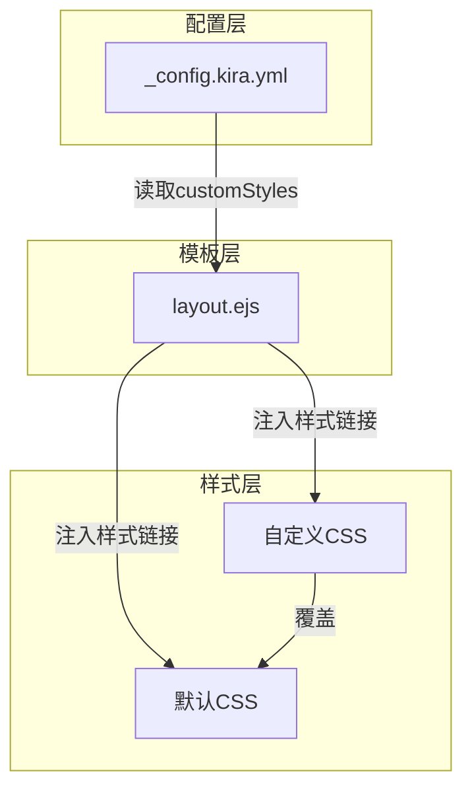
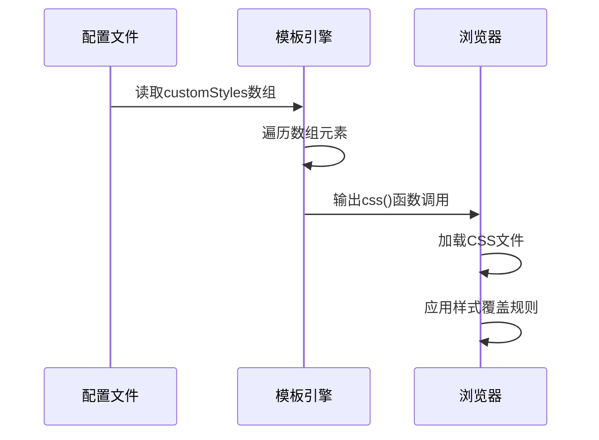
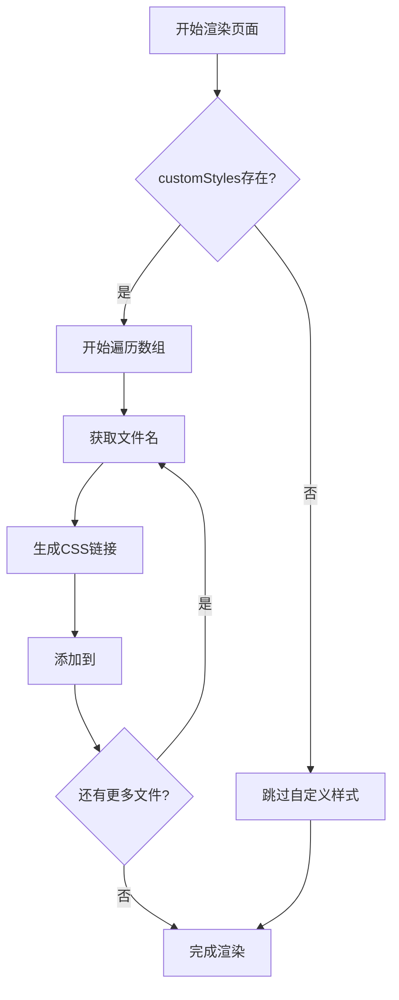
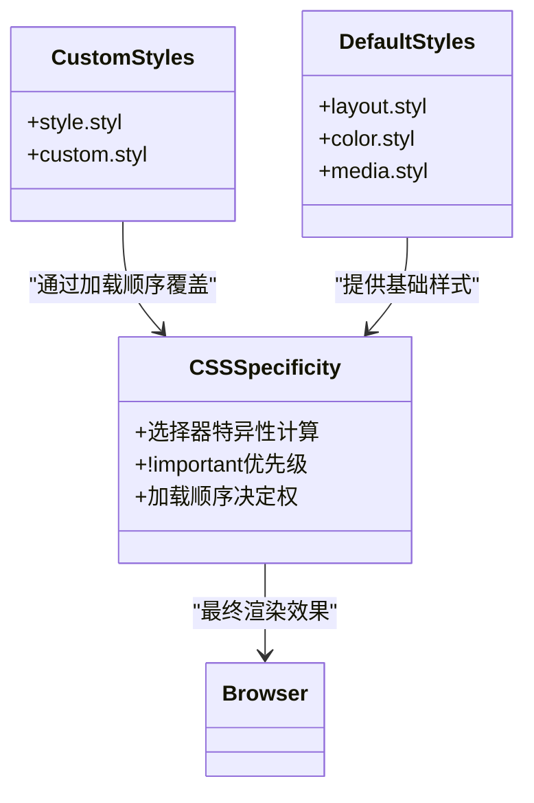
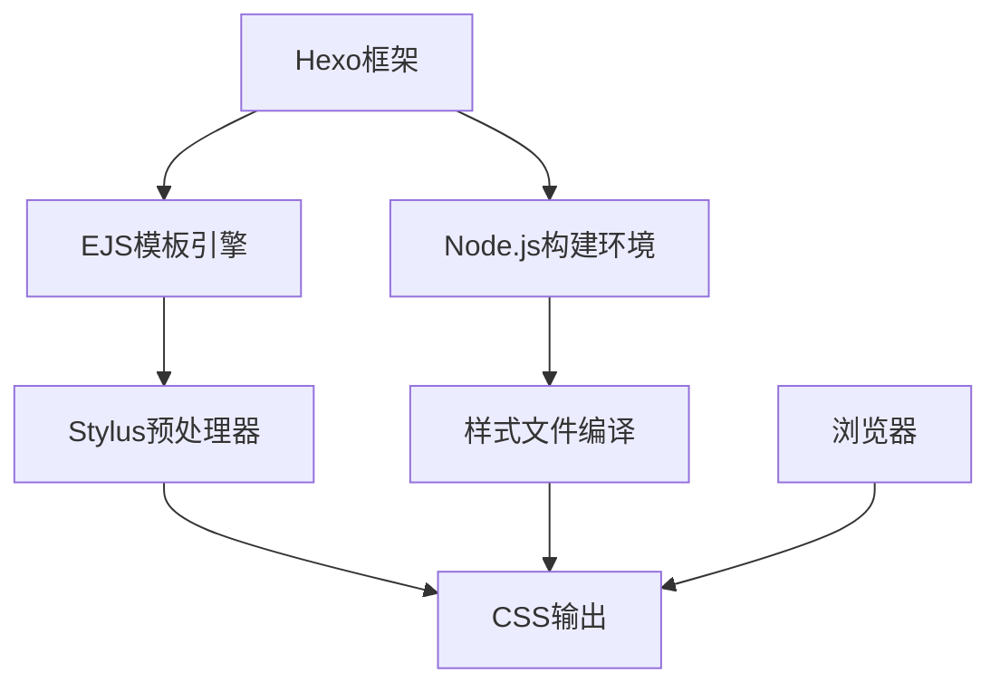

# 样式覆盖机制

<cite>
**本文档引用的文件**
- [_config.kira.yml](file://_config.kira.yml)
- [layout.ejs](file://themes/kira-custom/layout/layout.ejs)
- [github-markdown.css](file://source/css/github-markdown.css)
- [ai-assistant.styl](file://source/css/ai-assistant.styl)
</cite>

## 目录
1. [简介](#简介)
2. [项目结构](#项目结构)
3. [核心组件](#核心组件)
4. [架构概述](#架构概述)
5. [详细组件分析](#详细组件分析)
6. [依赖分析](#依赖分析)
7. [性能考虑](#性能考虑)
8. [故障排除指南](#故障排除指南)
9. [结论](#结论)
10. [附录](#附录)（如有必要）

## 简介
本文档系统阐述了通过 `_config.kira.yml` 配置文件中的 `customStyles` 字段实现自定义 CSS 样式注入的完整流程。重点解释了 `customStyles` 数组如何映射到 `source/css` 目录下的样式文件（如 style.css、custom.css），并指导用户创建和维护自定义 CSS 规则以覆盖主题默认样式。文档还说明了 CSS 优先级机制、选择器特异性控制以及响应式设计适配策略，并提供实用代码片段展示如何修改配色方案、调整组件间距、重写动画效果或实现暗色模式切换，同时强调避免破坏原有布局的注意事项及调试技巧。

## 项目结构
本博客项目采用 Hexo 静态网站生成器架构，通过配置文件与主题模板分离的方式实现高度可定制化。核心样式系统由主题默认样式与用户自定义样式两部分组成，通过配置驱动的方式动态加载。

**图示来源**
- [_config.kira.yml](file://_config.kira.yml#L124-L128)
- [layout.ejs](file://themes/kira-custom/layout/layout.ejs#L36-L40)

**本节来源**
- [_config.kira.yml](file://_config.kira.yml#L1-L150)
- [layout.ejs](file://themes/kira-custom/layout/layout.ejs#L1-L67)

## 核心组件
`customStyles` 配置项是实现样式覆盖的核心机制。该字段位于 `_config.kira.yml` 文件中，定义了一个字符串数组，每个元素对应 `source/css` 目录下的一个 CSS 或 Stylus 文件（无需扩展名）。当网站构建时，这些文件会被自动编译并注入到页面头部，其加载顺序决定了 CSS 优先级——后加载的样式会覆盖先前的定义。

**本节来源**
- [_config.kira.yml](file://_config.kira.yml#L124-L128)

## 架构概述
整个样式注入流程遵循"配置驱动-模板渲染-样式覆盖"的模式。首先在 `_config.kira.yml` 中声明需要加载的自定义样式文件名，然后在 EJS 模板引擎中通过条件判断和循环语句动态生成对应的 `<link>` 标签，最终在浏览器中形成层叠样式表的优先级关系。

**图示来源**
- [_config.kira.yml](file://_config.kira.yml#L124-L128)
- [layout.ejs](file://themes/kira-custom/layout/layout.ejs#L36-L40)

## 详细组件分析
### 自定义样式注入机制分析
`customStyles` 字段的实现依赖于 EJS 模板引擎的动态渲染能力。在 `layout.ejs` 文件中，通过 `theme.customStyles` 判断配置是否存在，若存在则使用 `forEach` 循环遍历数组中的每个样式文件名，并调用 `css()` 辅助函数生成对应的样式表链接。

#### 对于模板组件：

**图示来源**
- [layout.ejs](file://themes/kira-custom/layout/layout.ejs#L36-L40)

#### 对于样式覆盖逻辑：

**图示来源**
- [_config.kira.yml](file://_config.kira.yml#L124-L128)
- [layout.ejs](file://themes/kira-custom/layout/layout.ejs#L36-L40)

**本节来源**
- [_config.kira.yml](file://_config.kira.yml#L124-L128)
- [layout.ejs](file://themes/kira-custom/layout/layout.ejs#L36-L40)

### 实际样式文件分析
项目中已存在的自定义样式文件包括 `ai-assistant.styl` 和 `github-markdown.css`，分别用于 AI 助手组件的样式定制和 Markdown 内容的渲染优化。这些文件展示了不同类型的样式覆盖应用场景。

#### 对于响应式设计适配：

**图示来源**
- [github-markdown.css](file://source/css/github-markdown.css#L13-L68)

**本节来源**
- [github-markdown.css](file://source/css/github-markdown.css#L1-L1229)
- [ai-assistant.styl](file://source/css/ai-assistant.styl#L1-L1229)

## 依赖分析
样式系统依赖于多个关键技术栈组件：Hexo 框架提供基础架构，EJS 模板引擎实现动态渲染，Stylus 预处理器支持高级 CSS 特性，而整个流程由 Node.js 构建环境驱动。

**图示来源**
- [package.json](file://package.json#L1-L38)
- [layout.ejs](file://themes/kira-custom/layout/layout.ejs#L1-L67)

**本节来源**
- [package.json](file://package.json#L1-L38)
- [_config.kira.yml](file://_config.kira.yml#L1-L150)

## 性能考虑
虽然自定义样式提供了强大的定制能力，但过多的 CSS 文件会导致页面加载性能下降。建议将多个小的自定义样式合并为单个文件，以减少 HTTP 请求次数。同时应注意避免使用过于复杂的选择器，以免影响页面渲染性能。

## 故障排除指南
当自定义样式未生效时，应首先检查 `_config.kira.yml` 中的 `customStyles` 数组是否正确配置，确保文件名与 `source/css` 目录下的实际文件匹配。其次可通过浏览器开发者工具检查网络请求，确认 CSS 文件是否成功加载。最后需注意 CSS 优先级问题，必要时可使用 `!important` 或调整选择器特异性来确保样式覆盖效果。

**本节来源**
- [_config.kira.yml](file://_config.kira.yml#L124-L128)
- [layout.ejs](file://themes/kira-custom/layout/layout.ejs#L36-L40)

## 结论
通过 `_config.kira.yml` 中的 `customStyles` 字段实现的自定义 CSS 注入机制，为博客主题提供了灵活而强大的样式定制能力。该机制基于配置驱动的设计理念，结合模板引擎的动态渲染功能，实现了简单易用的样式覆盖方案。用户只需在配置文件中声明需要加载的样式文件，即可轻松实现对主题默认样式的个性化修改，同时保持了系统的可维护性和扩展性。