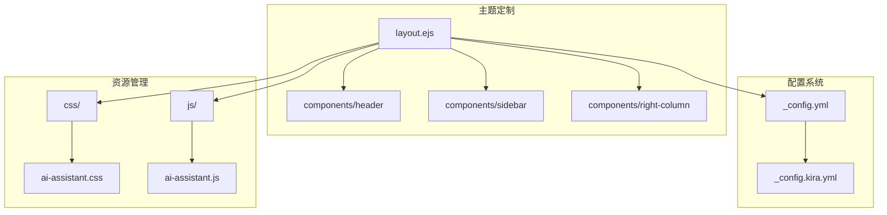
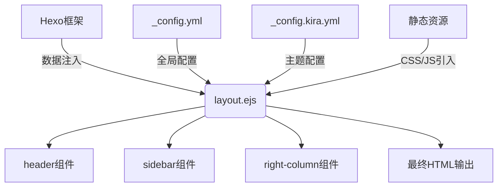
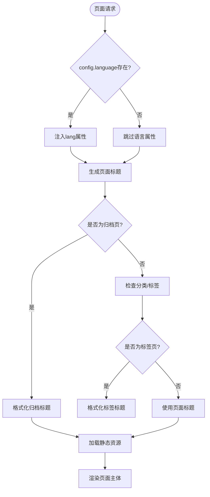
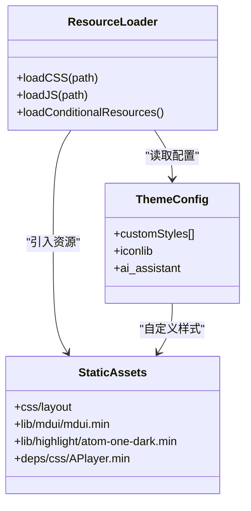
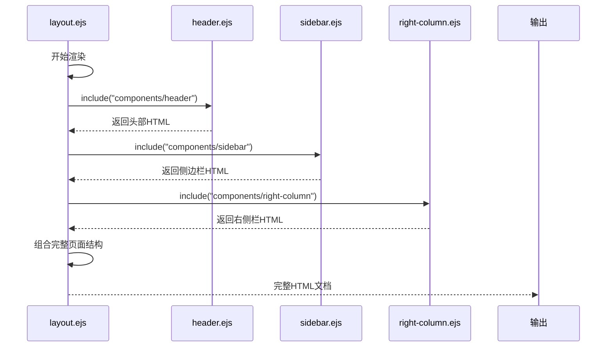
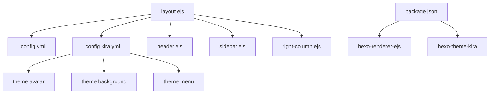

# 模板文件定制

<cite>
**本文档中引用的文件**   
- [layout.ejs](file://themes/kira-custom/layout/layout.ejs)
- [_config.yml](file://_config.yml)
- [_config.kira.yml](file://_config.kira.yml)
- [header.ejs](file://node_modules/hexo-theme-kira/layout/components/header.ejs)
- [sidebar.ejs](file://node_modules/hexo-theme-kira/layout/components/sidebar.ejs)
- [right-column.ejs](file://node_modules/hexo-theme-kira/layout/components/right-column.ejs)
</cite>

## 目录
1. [简介](#简介)
2. [项目结构](#项目结构)
3. [核心组件](#核心组件)
4. [架构概览](#架构概览)
5. [详细组件分析](#详细组件分析)
6. [依赖分析](#依赖分析)
7. [性能考虑](#性能考虑)
8. [故障排除指南](#故障排除指南)
9. [结论](#结论)

## 简介
本文档深入讲解如何通过编辑 `themes/kira-custom/layout/layout.ejs` 文件实现 Hexo 博客页面结构的深度定制。详细说明 EJS 模板引擎在布局文件中的具体应用，包括 HTML 结构组织、条件渲染逻辑（如语言设置、归档标题生成）、静态资源引入机制（CSS/JS）以及组件嵌入方式（header、sidebar 等）。指导开发者如何安全地修改文档头部元信息、调整布局容器结构、插入第三方脚本或重构内容区域布局。提供实际代码示例，展示如何添加自定义 DOM 节点、集成新功能模块或优化渲染性能，并说明修改后的本地预览与构建发布流程。

## 项目结构
本项目为基于 Hexo 的静态博客系统，采用模块化主题设计。核心模板文件位于 `themes/kira-custom/layout/` 目录下，其中 `layout.ejs` 是全局布局主文件，负责定义所有页面的通用结构和资源加载。项目通过 `_config.yml` 和 `_config.kira.yml` 实现双重配置管理，前者为 Hexo 核心配置，后者为 Kira 主题专属配置。

**Diagram sources**
- [layout.ejs](file://themes/kira-custom/layout/layout.ejs#L1-L67)
- [_config.yml](file://_config.yml#L1-L116)
- [_config.kira.yml](file://_config.kira.yml#L1-L137)

**Section sources**
- [layout.ejs](file://themes/kira-custom/layout/layout.ejs#L1-L67)
- [_config.yml](file://_config.yml#L1-L116)

## 核心组件
`layout.ejs` 文件作为整个博客系统的布局骨架，实现了多维度的动态渲染能力。该文件通过 EJS 模板语法实现了语言属性注入、动态标题生成、条件资源加载等核心功能。文件结构清晰地分离了 `<head>` 元信息区与 `<body>` 内容区，前者负责 SEO 优化和资源预加载，后者通过 `include` 指令组合式构建页面主体。

**Section sources**
- [layout.ejs](file://themes/kira-custom/layout/layout.ejs#L1-L67)

## 架构概览
系统采用分层架构设计，`layout.ejs` 处于视图层的核心位置，向上承接 Hexo 渲染引擎的数据注入，向下协调各个 UI 组件的集成。整体架构呈现典型的 MVC 模式特征，其中配置文件作为模型层，EJS 模板作为视图层，Hexo 框架本身承担控制器角色。

**Diagram sources**
- [layout.ejs](file://themes/kira-custom/layout/layout.ejs#L1-L67)
- [_config.yml](file://_config.yml#L1-L116)
- [_config.kira.yml](file://_config.kira.yml#L1-L137)

## 详细组件分析
### 布局主文件分析
`layout.ejs` 文件通过 EJS 模板语法实现了高度灵活的页面结构定制。文件开头的 HTML 标签即通过 `<% if (config.language) { %>` 条件判断动态注入语言属性，确保国际化支持。`<head>` 区域集中管理所有元信息和静态资源，采用 `<%- css() %>` 和 `<%- js() %>` 辅助函数实现样式表和脚本的智能引入。

#### 条件渲染逻辑

**Diagram sources**
- [layout.ejs](file://themes/kira-custom/layout/layout.ejs#L2-L13)

#### 静态资源管理

**Diagram sources**
- [layout.ejs](file://themes/kira-custom/layout/layout.ejs#L8-L45)
- [_config.kira.yml](file://_config.kira.yml#L124-L127)

#### 组件嵌入机制

**Diagram sources**
- [layout.ejs](file://themes/kira-custom/layout/layout.ejs#L52-L61)
- [header.ejs](file://node_modules/hexo-theme-kira/layout/components/header.ejs#L1-L15)
- [sidebar.ejs](file://node_modules/hexo-theme-kira/layout/components/sidebar.ejs#L1-L65)
- [right-column.ejs](file://node_modules/hexo-theme-kira/layout/components/right-column.ejs#L1-L8)

**Section sources**
- [layout.ejs](file://themes/kira-custom/layout/layout.ejs#L1-L67)
- [header.ejs](file://node_modules/hexo-theme-kira/layout/components/header.ejs#L1-L15)
- [sidebar.ejs](file://node_modules/hexo-theme-kira/layout/components/sidebar.ejs#L1-L65)

## 依赖分析
项目依赖关系清晰，`layout.ejs` 作为核心模板文件，直接依赖于主题配置文件和多个 UI 组件。通过 `package.json` 可知，项目使用 `hexo-renderer-ejs` 作为模板引擎，确保 EJS 语法的正确解析。主题继承机制允许在 `kira-custom` 中覆盖原始 `kira` 主题的文件，实现无侵入式定制。

**Diagram sources**
- [layout.ejs](file://themes/kira-custom/layout/layout.ejs#L1-L67)
- [_config.yml](file://_config.yml#L1-L116)
- [_config.kira.yml](file://_config.kira.yml#L1-L137)
- [package.json](file://package.json#L1-L38)

**Section sources**
- [layout.ejs](file://themes/kira-custom/layout/layout.ejs#L1-L67)
- [_config.yml](file://_config.yml#L1-L116)
- [package.json](file://package.json#L1-L38)

## 性能考虑
`layout.ejs` 文件在性能优化方面采取了多项措施。通过懒加载（lazysizes）减少初始页面加载时间，代码高亮（highlight）和音频播放器（APlayer）等非关键资源采用异步加载策略。静态资源引入遵循最小化原则，仅在必要时加载第三方库，如通过 `theme.iconlib` 配置实现图标库的按需引入。

## 故障排除指南
当修改 `layout.ejs` 文件后出现渲染异常时，应首先检查 EJS 语法是否正确，特别是条件语句的开闭标签匹配。若页面样式错乱，需确认 CSS 文件路径是否正确，可通过浏览器开发者工具检查资源加载情况。对于 JavaScript 错误，应验证脚本引入顺序和依赖关系，确保 DOM 元素在脚本执行前已存在。

**Section sources**
- [layout.ejs](file://themes/kira-custom/layout/layout.ejs#L1-L67)
- [package.json](file://package.json#L1-L38)

## 结论
通过对 `layout.ejs` 文件的深度定制，开发者可以完全掌控博客的页面结构和渲染行为。EJS 模板引擎提供了强大的动态渲染能力，结合 Hexo 的配置系统，实现了高度灵活的主题定制方案。建议在修改时遵循渐进式原则，每次只进行少量改动并及时预览效果，确保系统的稳定性和可维护性。