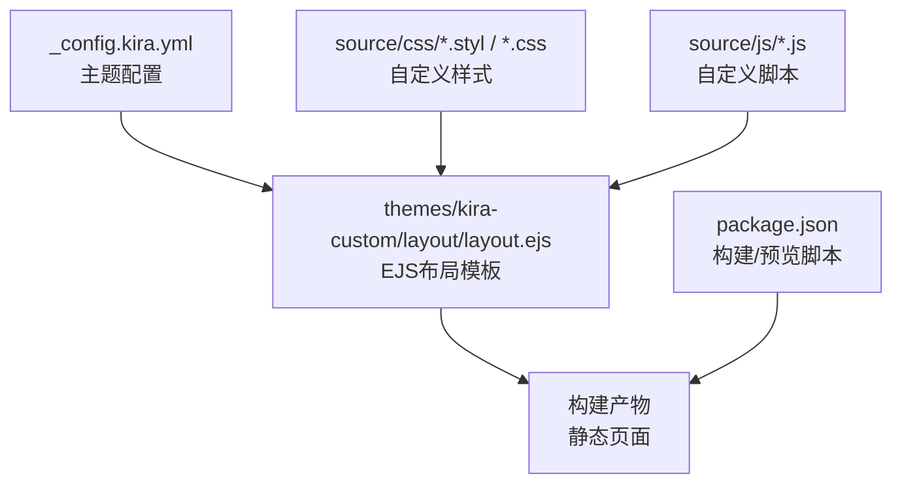
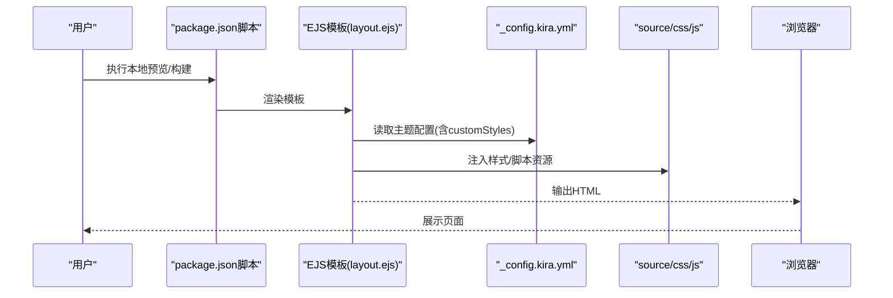
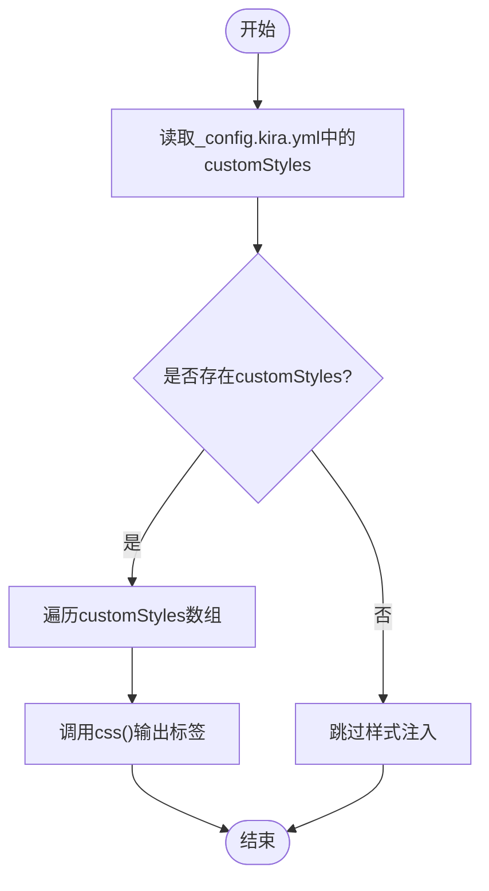
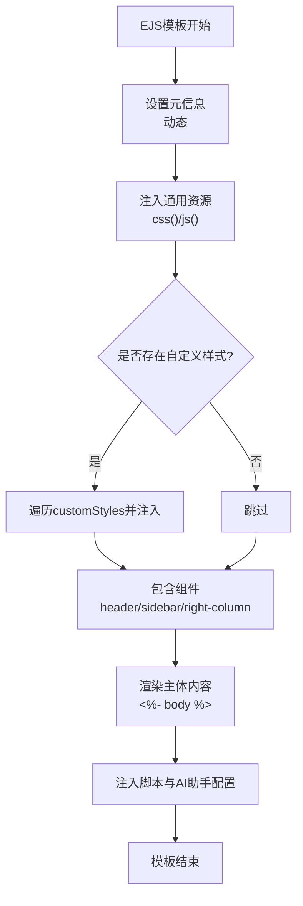
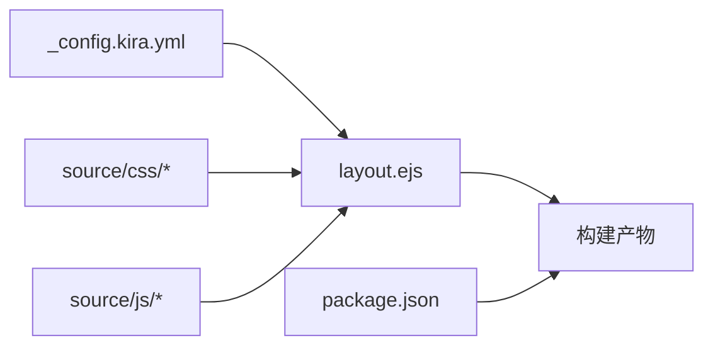

# 高级主题定制

<cite>
**本文引用的文件**
- [_config.kira.yml](file://_config.kira.yml)
- [layout.ejs](file://themes/kira-custom/layout/layout.ejs)
- [github-markdown.css](file://source/css/github-markdown.css)
- [ai-assistant.styl](file://source/css/ai-assistant.styl)
- [ai-assistant.js](file://source/js/ai-assistant.js)
- [package.json](file://package.json)
- [README.md](file://README.md)
</cite>

## 目录
1. [简介](#简介)
2. [项目结构](#项目结构)
3. [核心组件](#核心组件)
4. [架构总览](#架构总览)
5. [详细组件分析](#详细组件分析)
6. [依赖关系分析](#依赖关系分析)
7. [性能考量](#性能考量)
8. [故障排查指南](#故障排查指南)
9. [结论](#结论)
10. [附录](#附录)

## 简介
本篇文档聚焦“高级主题定制”，围绕以下目标展开：
- 如何通过_config.kira.yml中的customStyles字段引入自定义样式文件
- 如何直接编辑themes/kira-custom/layout/layout.ejs模板文件来修改页面结构布局
- EJS模板语法在layout.ejs中的应用，包括如何调整HTML结构、插入自定义脚本或修改组件渲染逻辑
- 在source/css目录下创建并维护自定义CSS/样式规则以覆盖默认样式，实现精细化外观控制
- 提供实际代码片段示例，展示如何添加新功能区域或重构现有UI组件
- 说明模板和样式修改后的本地预览与构建流程

## 项目结构
本项目采用Hexo + Kira主题的组合，主题定制主要集中在：
- 主题布局模板：themes/kira-custom/layout/layout.ejs
- 主题配置：_config.kira.yml
- 自定义样式：source/css 下的样式文件
- 自定义脚本：source/js 下的脚本文件
- 构建与预览：package.json中的脚本命令

图表来源
- [_config.kira.yml](file://_config.kira.yml#L121-L128)
- [layout.ejs](file://themes/kira-custom/layout/layout.ejs#L1-L66)
- [package.json](file://package.json#L1-L20)

章节来源
- [README.md](file://README.md#L1-L120)
- [package.json](file://package.json#L1-L20)

## 核心组件
- 主题配置与样式注入
  - 通过_config.kira.yml的customStyles数组，将样式资源名注入到模板中，最终由模板内的css()辅助函数输出<link>标签。
- EJS布局模板
  - 负责拼接HTML骨架、注入资源、包含组件、渲染页面主体内容。
- 自定义样式与脚本
  - source/css与source/js目录用于存放自定义样式与脚本，配合模板进行覆盖与增强。
- 构建与预览
  - 通过package.json中的脚本命令进行本地预览与构建。

章节来源
- [_config.kira.yml](file://_config.kira.yml#L121-L128)
- [layout.ejs](file://themes/kira-custom/layout/layout.ejs#L1-L66)
- [package.json](file://package.json#L1-L20)

## 架构总览
下图展示了从配置到页面渲染的关键流程：主题配置 -> EJS模板 -> 资源注入 -> 页面输出。

图表来源
- [layout.ejs](file://themes/kira-custom/layout/layout.ejs#L1-L66)
- [_config.kira.yml](file://_config.kira.yml#L121-L128)
- [package.json](file://package.json#L1-L20)

## 详细组件分析

### 1) 自定义样式注入：customStyles字段与模板集成
- 配置入口
  - 在_config.kira.yml中设置customStyles为样式资源名数组，例如["style", "custom"]。
- 模板集成点
  - 在layout.ejs中，当存在theme.customStyles时，遍历数组并通过css()辅助函数输出<link>标签，从而将自定义样式文件纳入页面。
- 样式文件组织建议
  - 将自定义样式放置于source/css目录，命名与customStyles中的资源名一致，便于模板正确解析与加载。
- 覆盖策略
  - 自定义样式应放在模板中其他样式之后，以确保对默认样式的覆盖生效；若涉及复杂覆盖，可考虑在自定义样式中提高选择器权重或使用更具体的选择器。

图表来源
- [_config.kira.yml](file://_config.kira.yml#L121-L128)
- [layout.ejs](file://themes/kira-custom/layout/layout.ejs#L36-L40)

章节来源
- [_config.kira.yml](file://_config.kira.yml#L121-L128)
- [layout.ejs](file://themes/kira-custom/layout/layout.ejs#L36-L40)

### 2) EJS模板语法与页面结构布局定制
- 基础语法要点
  - 输出表达式：<%= %>
  - 不转义输出：<%- %>
  - 控制结构：<% %>
- 常见用途
  - 动态标题与语言属性：根据页面类型动态设置<title>与<html lang>。
  - 条件注入：根据配置决定是否加载第三方库或自定义样式。
  - 资源注入：通过css()与js()辅助函数统一管理静态资源。
  - 组件包含：通过<%- include(...) %>插入头部、侧边栏、右侧栏等组件。
  - 主体内容：通过<%- body %>占位符渲染页面正文。
- 结构布局建议
  - 在<body>内合理安排.kira-background、header、sidebar、content、right-column等容器的位置与层级，确保布局稳定且易于扩展。
  - 若需新增功能区域，可在合适位置插入新的容器，并在source/css中为其编写样式，避免与现有组件冲突。

图表来源
- [layout.ejs](file://themes/kira-custom/layout/layout.ejs#L1-L66)

章节来源
- [layout.ejs](file://themes/kira-custom/layout/layout.ejs#L1-L66)

### 3) 自定义CSS规则与覆盖策略
- Markdown样式
  - 已提供github-markdown.css，采用CSS变量与媒体查询实现深浅色主题适配，适合直接覆盖或扩展。
- AI助手样式
  - ai-assistant.styl定义了悬浮球、聊天窗口、消息区域、输入区域等组件的样式，并包含响应式与暗色模式支持，可作为自定义样式的参考。
- 覆盖原则
  - 优先使用更具体的选择器或更高权重的声明，确保自定义样式能覆盖默认样式。
  - 对于Markdown渲染内容，可直接复用或扩展github-markdown.css中的类名，保证一致性。
  - 新增组件样式时，建议先在source/css中建立独立文件，再通过customStyles将其纳入模板。

章节来源
- [github-markdown.css](file://source/css/github-markdown.css#L1-L120)
- [ai-assistant.styl](file://source/css/ai-assistant.styl#L1-L120)

### 4) 自定义脚本与交互增强
- AI助手脚本
  - ai-assistant.js负责创建UI、绑定事件、处理API调用与流式输出、本地存储历史等，其初始化依赖页面中的配置脚本标签。
- 集成方式
  - 模板通过<script id="ai-assistant-config">注入主题配置，脚本读取配置并初始化功能。
  - 若需新增脚本，可参考该模式，在模板中插入<script>标签，并在source/js中编写逻辑，最后在模板中引入对应的JS文件。

章节来源
- [layout.ejs](file://themes/kira-custom/layout/layout.ejs#L42-L45)
- [ai-assistant.js](file://source/js/ai-assistant.js#L1-L120)

### 5) 添加新功能区域或重构现有UI组件
- 新增功能区域
  - 在layout.ejs中选择合适位置插入新容器，例如在.kira-body内部新增列或区块。
  - 在source/css中为新容器编写样式，并在_config.kira.yml的customStyles中注册新样式文件，确保模板注入。
- 重构现有组件
  - 通过增加选择器特异性或引入新的CSS变量，逐步替换默认组件的外观。
  - 对于交互行为，可在source/js中扩展或替换现有脚本逻辑，注意与模板中的配置脚本保持一致。

章节来源
- [layout.ejs](file://themes/kira-custom/layout/layout.ejs#L47-L66)
- [ai-assistant.styl](file://source/css/ai-assistant.styl#L1-L120)

## 依赖关系分析
- 主题配置与模板的耦合
  - layout.ejs通过读取theme对象（来自_config.kira.yml）决定是否注入自定义样式与第三方资源。
- 构建工具链
  - package.json提供构建、清理、本地服务与部署脚本，确保修改能快速反馈到本地预览与最终构建产物。

图表来源
- [_config.kira.yml](file://_config.kira.yml#L121-L128)
- [layout.ejs](file://themes/kira-custom/layout/layout.ejs#L1-L66)
- [package.json](file://package.json#L1-L20)

章节来源
- [package.json](file://package.json#L1-L20)

## 性能考量
- 资源合并与按需加载
  - 将常用样式与脚本合并，减少HTTP请求数；对非首屏资源采用懒加载策略。
- 样式覆盖与选择器权重
  - 避免过度使用!important；通过提升选择器特异性或拆分样式文件降低冲突与重绘成本。
- 模板渲染开销
  - 控制模板中的条件分支与循环次数，确保在大量页面场景下仍保持较快渲染速度。

## 故障排查指南
- 主题布局修复
  - README中明确指出layout.ejs位于node_modules中，需要将自定义主题布局复制到hexo-theme-kira目录，否则修改不会生效。
- 本地预览与构建
  - 使用package.json中的脚本命令启动本地服务或生成静态文件，确认端口与路径无冲突。
- 自定义样式未生效
  - 检查customStyles数组中的资源名与source/css中的文件名是否一致；确认模板中css()辅助函数能正确解析路径。
- AI助手功能异常
  - 确认_config.kira.yml中ai_assistant配置已启用，并检查模板中<script id="ai-assistant-config">是否正确注入配置。

章节来源
- [README.md](file://README.md#L58-L77)
- [layout.ejs](file://themes/kira-custom/layout/layout.ejs#L42-L45)
- [_config.kira.yml](file://_config.kira.yml#L139-L150)

## 结论
通过_config.kira.yml的customStyles与themes/kira-custom/layout/layout.ejs的模板机制，可以实现对样式与页面结构的精细化定制。结合source/css与source/js的自定义资源，既能覆盖默认样式，又能增强交互体验。遵循资源注入顺序、选择器权重与模板语法的最佳实践，可确保定制效果稳定可靠，并在本地预览与构建流程中高效迭代。

## 附录
- 本地预览与构建流程
  - 使用package.json中的脚本命令启动本地服务或生成静态文件，确认修改即时生效。
- 主题布局修复步骤
  - 参考README中的说明，将自定义主题布局文件复制到hexo-theme-kira主题目录，避免因打包导致的布局失效。

章节来源
- [package.json](file://package.json#L1-L20)
- [README.md](file://README.md#L58-L77)