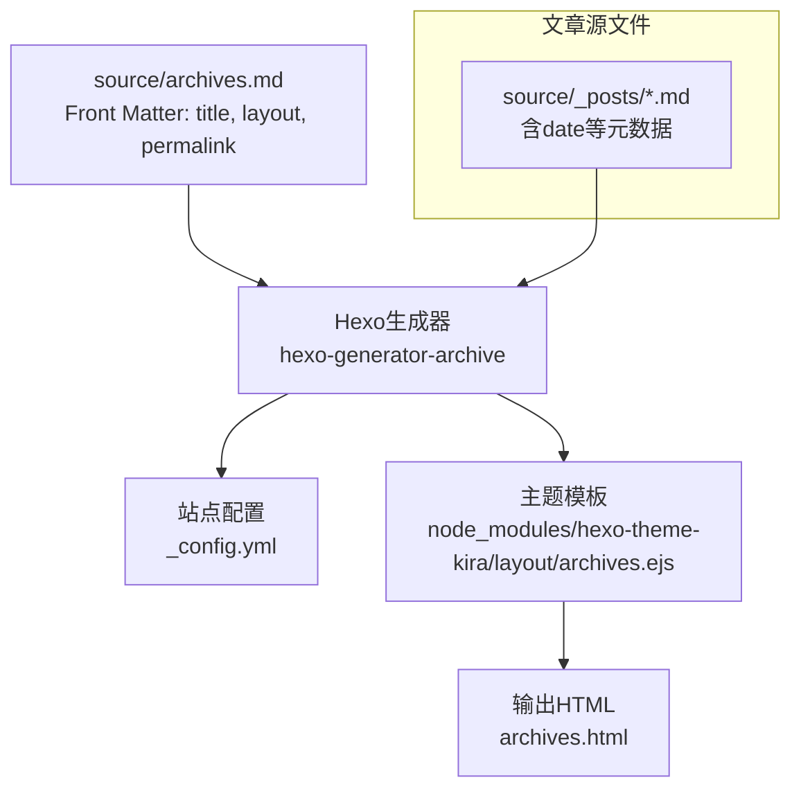
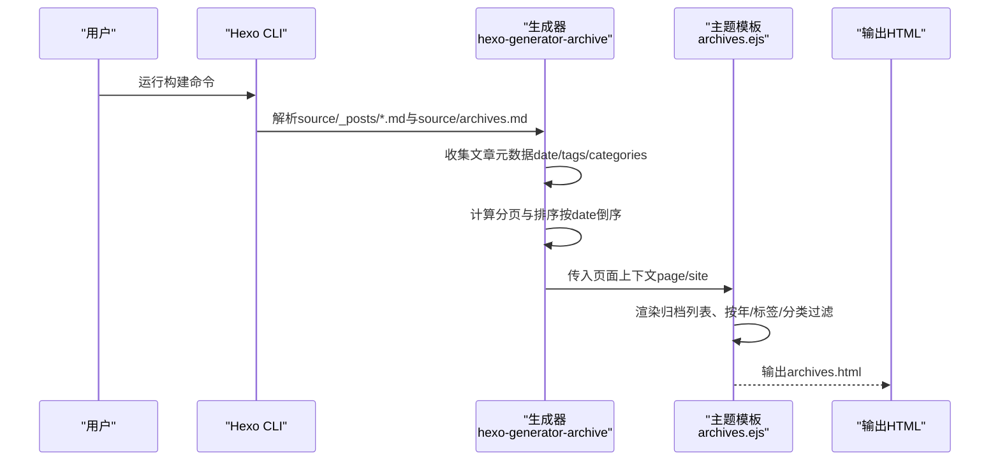
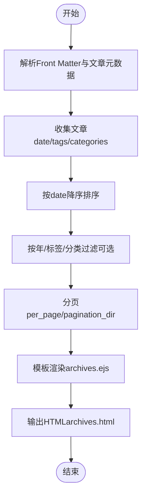
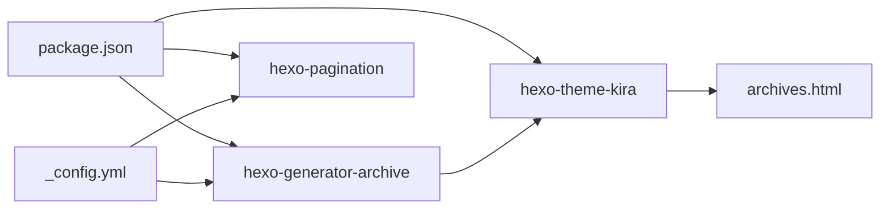

# 归档系统

<cite>
**本文引用的文件**
- [archives.md](file://source/archives.md)
- [_config.yml](file://_config.yml)
- [_config.kira.yml](file://_config.kira.yml)
- [package.json](file://package.json)
- [archives.ejs](file://node_modules/hexo-theme-kira/layout/archives.ejs)
- [archive.ejs](file://node_modules/hexo-theme-kira/layout/_widget/archive.ejs)
- [Git与GitLab的企业实战.md](file://source/_posts/Git与GitLab的企业实战.md)
- [React知识归纳（增补）.md](file://source/_posts/React知识归纳（增补）.md)
- [hello-world.md](file://source/_posts/hello-world.md)
</cite>

## 目录
1. [简介](#简介)
2. [项目结构](#项目结构)
3. [核心组件](#核心组件)
4. [架构总览](#架构总览)
5. [组件详解](#组件详解)
6. [依赖关系分析](#依赖关系分析)
7. [性能考量](#性能考量)
8. [故障排查指南](#故障排查指南)
9. [结论](#结论)
10. [附录](#附录)

## 简介
本文件面向Hexo博客使用者与维护者，系统阐述归档系统的工作机制与实践方法。重点覆盖：
- archives.md Front Matter如何触发归档页面生成
- 归档页面与文章元数据（尤其是date字段）的关联
- 默认行为：按时间倒序、分页、按标签/分类过滤
- 自定义样式与功能扩展（搜索、时间轴视图、SEO优化）
- 归档数据流：从Markdown解析到生成器处理再到模板渲染的完整链路

## 项目结构
本项目采用标准Hexo目录结构，归档页面由Front Matter驱动生成，模板由主题提供，归档数据来源于source/_posts目录下的文章。

图表来源
- [archives.md](file://source/archives.md#L1-L5)
- [_config.yml](file://_config.yml#L24-L30)
- [package.json](file://package.json#L16-L29)
- [archives.ejs](file://node_modules/hexo-theme-kira/layout/archives.ejs#L1-L49)

章节来源
- [archives.md](file://source/archives.md#L1-L5)
- [_config.yml](file://_config.yml#L24-L30)
- [package.json](file://package.json#L16-L29)

## 核心组件
- 归档页面入口：source/archives.md，通过Front Matter指定页面标题、布局与永久链接。
- 生成器：hexo-generator-archive，负责收集文章并生成归档页面。
- 主题模板：hexo-theme-kira的archives.ejs，负责渲染归档列表、按年份分组、按标签/分类过滤。
- 文章元数据：source/_posts/*.md中的date、tags、categories等，用于排序与过滤。
- 站点配置：_config.yml控制归档目录、分页、日期格式等。

章节来源
- [archives.md](file://source/archives.md#L1-L5)
- [package.json](file://package.json#L16-L29)
- [archives.ejs](file://node_modules/hexo-theme-kira/layout/archives.ejs#L1-L49)
- [_config.yml](file://_config.yml#L24-L30)

## 架构总览
归档页面的生成与渲染遵循“解析Front Matter → 生成器聚合 → 模板渲染”的标准流程。

图表来源
- [package.json](file://package.json#L16-L29)
- [archives.ejs](file://node_modules/hexo-theme-kira/layout/archives.ejs#L1-L49)
- [_config.yml](file://_config.yml#L60-L67)

## 组件详解

### archives.md Front Matter与归档页面生成
- Front Matter字段
  - title：页面标题
  - layout：布局名称，此处为archives，指示使用主题的归档模板
  - permalink：页面最终URL路径
- 触发机制
  - Hexo识别到Front Matter中layout为archives时，将调用对应生成器与模板进行渲染
  - 生成器会读取站点配置中的archive_dir（默认archives），并据此生成归档页面

章节来源
- [archives.md](file://source/archives.md#L1-L5)
- [_config.yml](file://_config.yml#L24-L30)

### 文章元数据与归档数据关联
- date字段
  - 作为排序主键，决定文章在归档中的时间顺序
  - 归档模板中对文章按date倒序排序
- tags与categories
  - 用于按标签/分类过滤与展示
  - 模板中可按标签筛选并按年份分组

章节来源
- [Git与GitLab的企业实战.md](file://source/_posts/Git与GitLab的企业实战.md#L1-L10)
- [React知识归纳（增补）.md](file://source/_posts/React知识归纳（增补）.md#L1-L10)
- [archives.ejs](file://node_modules/hexo-theme-kira/layout/archives.ejs#L1-L49)

### 归档页面默认行为
- 时间排序：按date字段降序排列
- 分页：由hexo-pagination插件与站点配置共同控制
- 过滤能力：支持按年份、标签、分类过滤
- 模板渲染：主题模板负责组织HTML结构与样式

章节来源
- [archives.ejs](file://node_modules/hexo-theme-kira/layout/archives.ejs#L1-L49)
- [_config.yml](file://_config.yml#L60-L67)

### 归档侧边栏组件
- 主题提供archive.ejs侧边栏部件，用于展示归档概览（如按年份列出）
- 通过list_archives辅助函数渲染归档链接

章节来源
- [archive.ejs](file://node_modules/hexo-theme-kira/layout/_widget/archive.ejs#L1-L11)
- [_config.kira.yml](file://_config.kira.yml#L22-L35)

### 归档数据流（从Markdown到HTML）

图表来源
- [archives.ejs](file://node_modules/hexo-theme-kira/layout/archives.ejs#L1-L49)
- [_config.yml](file://_config.yml#L60-L67)

## 依赖关系分析
- 生成器依赖
  - hexo-generator-archive：提供归档页面生成能力
  - hexo-pagination：提供分页支持
- 主题依赖
  - hexo-theme-kira：提供归档模板与侧边栏部件
- 站点配置
  - archive_dir：归档目录名
  - per_page：每页文章数
  - pagination_dir：分页目录名
  - date_format/time_format：日期显示格式

图表来源
- [package.json](file://package.json#L16-L29)
- [_config.yml](file://_config.yml#L24-L30)
- [_config.yml](file://_config.yml#L60-L67)

章节来源
- [package.json](file://package.json#L16-L29)
- [_config.yml](file://_config.yml#L24-L30)
- [_config.yml](file://_config.yml#L60-L67)

## 性能考量
- 文章数量与分页
  - 合理设置per_page，避免单页过大导致渲染与传输压力
- 排序与过滤
  - 模板中对文章进行排序与过滤，建议在文章数量较多时关注分页与缓存策略
- 模板渲染
  - 归档模板包含循环与条件判断，建议在主题层面优化渲染逻辑与静态资源加载

[本节为通用性能建议，不直接分析具体文件]

## 故障排查指南
- 归档页面未生成
  - 检查source/archives.md的Front Matter是否正确（layout为archives）
  - 确认已安装hexo-generator-archive
- 归档页面为空
  - 检查source/_posts目录下文章是否包含有效date字段
  - 确认文章Front Matter格式正确
- 排序异常
  - 确认文章date字段格式与站点date_format一致
- 分页不生效
  - 检查per_page与pagination_dir配置
- 侧边栏归档链接无效
  - 检查_config.kira.yml中的menu配置与archive部件是否启用

章节来源
- [archives.md](file://source/archives.md#L1-L5)
- [package.json](file://package.json#L16-L29)
- [_config.yml](file://_config.yml#L24-L30)
- [_config.yml](file://_config.yml#L60-L67)
- [_config.kira.yml](file://_config.kira.yml#L22-L35)

## 结论
本项目的归档系统通过archives.md的Front Matter触发生成器，结合主题模板与站点配置，实现了按时间倒序、分页、按标签/分类过滤的归档页面。通过合理配置与模板定制，可进一步增强搜索、时间轴视图与SEO表现。

[本节为总结性内容，不直接分析具体文件]

## 附录

### 自定义与扩展建议
- 集成搜索
  - 在归档模板中引入搜索框，结合站点搜索插件或前端搜索库
- 时间轴视图
  - 在archives.ejs中按年份分组后，进一步按月份细分，形成时间轴样式
- SEO优化
  - 在archives.md中补充描述与关键词，结合主题提供的SEO辅助函数
- 样式定制
  - 在主题样式中为归档页面添加专属类名与布局调整

[本节为概念性建议，不直接分析具体文件]