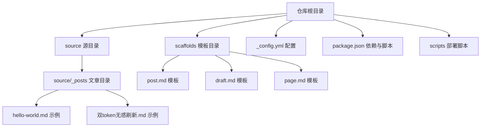
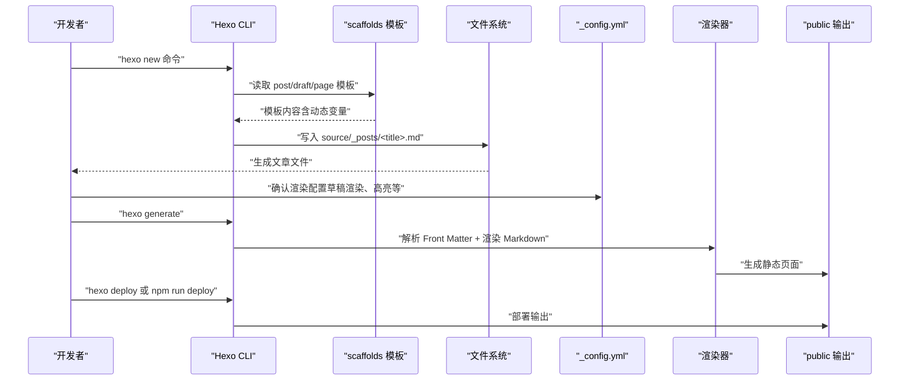
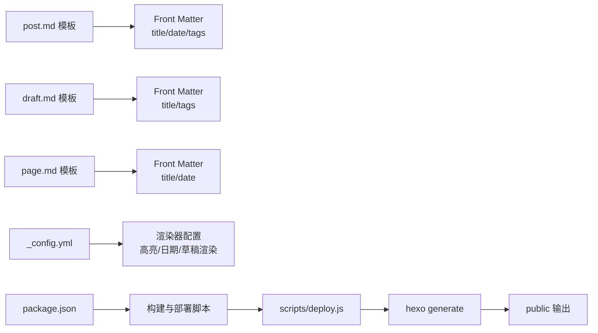

# 文章创作

<cite>
**本文引用的文件**
- [scaffolds/post.md](file://scaffolds/post.md)
- [scaffolds/draft.md](file://scaffolds/draft.md)
- [_config.yml](file://_config.yml)
- [package.json](file://package.json)
- [source/_posts/双token无感刷新.md](file://source/_posts/双token无感刷新.md)
- [myblog/source/_posts/hello-world.md](file://myblog/source/_posts/hello-world.md)
- [scripts/deploy.js](file://scripts/deploy.js)
</cite>

## 目录
1. [引言](#引言)
2. [项目结构](#项目结构)
3. [核心组件](#核心组件)
4. [架构总览](#架构总览)
5. [详细组件分析](#详细组件分析)
6. [依赖关系分析](#依赖关系分析)
7. [性能考量](#性能考量)
8. [故障排查指南](#故障排查指南)
9. [结论](#结论)
10. [附录](#附录)

## 引言
本文件围绕使用 Hexo 框架的 scaffolds 模板系统进行文章创作的完整流程展开，重点解释 Front Matter 元数据字段（如 title、date、tags、categories）的含义与作用，并结合实际模板内容说明动态变量（{{ title }}、{{ date }}）的替换机制；阐述如何通过 hexo new 命令基于模板创建新文章，以及草稿（draft）与正式发布文章的区别与管理方式；最后给出在 source/_posts 目录下组织 Markdown 文件的最佳实践，包括文件命名规范、内容结构、代码块高亮、图片引用等写作技巧，并以“双token无感刷新.md”为例展示完整的内容组织形式，说明 Markdown 语法与 Hexo 渲染器的兼容性注意事项。

## 项目结构
本仓库采用 Hexo 标准目录结构，其中 scaffolds 目录存放模板，source/_posts 目录存放文章源文件，根配置文件控制渲染行为与主题等。

图表来源
- [scaffolds/post.md](file://scaffolds/post.md#L1-L6)
- [scaffolds/draft.md](file://scaffolds/draft.md#L1-L5)
- [_config.yml](file://_config.yml#L35-L47)
- [package.json](file://package.json#L1-L38)
- [myblog/source/_posts/hello-world.md](file://myblog/source/_posts/hello-world.md#L1-L39)
- [source/_posts/双token无感刷新.md](file://source/_posts/双token无感刷新.md#L1-L120)

章节来源
- [scaffolds/post.md](file://scaffolds/post.md#L1-L6)
- [scaffolds/draft.md](file://scaffolds/draft.md#L1-L5)
- [_config.yml](file://_config.yml#L35-L47)
- [package.json](file://package.json#L1-L38)
- [myblog/source/_posts/hello-world.md](file://myblog/source/_posts/hello-world.md#L1-L39)
- [source/_posts/双token无感刷新.md](file://source/_posts/双token无感刷新.md#L1-L120)

## 核心组件
- scaffolds 模板系统：提供 post、draft、page 三类模板，用于 hexo new 命令生成新文章时的初始内容骨架。
- Front Matter 元数据：位于 Markdown 开头的 YAML 区域，包含 title、date、tags、categories 等字段，决定文章的标题、发布时间、标签、分类等元信息。
- 渲染配置：_config.yml 控制文章默认布局、草稿渲染开关、代码高亮、日期格式、分页等行为。
- 构建与部署：package.json 中的脚本配合 scripts/deploy.js 实现一键构建与部署。

章节来源
- [scaffolds/post.md](file://scaffolds/post.md#L1-L6)
- [scaffolds/draft.md](file://scaffolds/draft.md#L1-L5)
- [_config.yml](file://_config.yml#L35-L47)
- [package.json](file://package.json#L1-L38)
- [scripts/deploy.js](file://scripts/deploy.js#L62-L86)

## 架构总览
下图展示了从命令行到最终静态站点输出的整体流程，涵盖模板生成、Front Matter 解析、渲染与构建部署的关键环节。

图表来源
- [scaffolds/post.md](file://scaffolds/post.md#L1-L6)
- [scaffolds/draft.md](file://scaffolds/draft.md#L1-L5)
- [_config.yml](file://_config.yml#L35-L47)
- [scripts/deploy.js](file://scripts/deploy.js#L62-L86)

## 详细组件分析

### 模板与 Front Matter 字段语义
- post.md 模板
  - 作用：为正式文章提供基础元数据骨架，包含 title、date、tags。
  - 动态变量：{{ title }}、{{ date }} 由 Hexo 在生成时替换为实际值。
  - 适用场景：使用 hexo new 命令创建正式文章时的默认模板。
- draft.md 模板
  - 作用：为草稿提供基础元数据骨架，包含 title、tags（不含 date）。
  - 动态变量：{{ title }} 由 Hexo 替换；由于模板未包含 {{ date }}，草稿默认不包含日期字段。
  - 适用场景：草稿阶段暂不发布，便于本地预览与编辑。
- page.md 模板
  - 作用：为独立页面（如关于、归档）提供基础元数据骨架，包含 title、date。
  - 适用场景：使用 hexo new page 命令创建页面时的默认模板。

章节来源
- [scaffolds/post.md](file://scaffolds/post.md#L1-L6)
- [scaffolds/draft.md](file://scaffolds/draft.md#L1-L5)
- [scaffolds/page.md](file://scaffolds/page.md#L1-L5)

### Front Matter 字段详解
- title
  - 含义：文章标题，用于页面标题、导航与链接生成。
  - 作用：影响永久链接、页面标题、SEO 元信息等。
- date
  - 含义：文章发布时间，通常由模板中的 {{ date }} 动态变量填充。
  - 作用：影响文章排序、归档、RSS 等功能。
- tags
  - 含义：标签集合，用于文章分类与索引。
  - 作用：生成标签页、标签云、搜索过滤等。
- categories
  - 含义：分类集合，用于文章层级分类。
  - 作用：生成分类页、面包屑导航等。

章节来源
- [source/_posts/双token无感刷新.md](file://source/_posts/双token无感刷新.md#L1-L120)

### 动态变量替换机制
- 模板中的 {{ title }}、{{ date }} 是 Mustache 风格的占位符，Hexo 在生成时依据命令参数与配置进行替换。
- 生成规则：
  - title：来自 hexo new 命令传入的标题字符串。
  - date：来自当前系统时间，受 _config.yml 中日期格式与时区设置影响。
- 举例：post.md 模板包含 date 字段，因此生成的正式文章会带有日期；draft.md 模板不含 date 字段，草稿默认不包含日期。

章节来源
- [scaffolds/post.md](file://scaffolds/post.md#L1-L6)
- [scaffolds/draft.md](file://scaffolds/draft.md#L1-L5)
- [_config.yml](file://_config.yml#L77-L84)

### 基于模板创建新文章的流程
- 正式文章
  - 命令：hexo new "<文章标题>"
  - 行为：使用 post.md 模板生成 source/_posts/<title>.md，Front Matter 中包含 title、date、tags。
- 草稿文章
  - 命令：hexo new draft "<草稿标题>"
  - 行为：使用 draft.md 模板生成 source/_posts/<title>.md，Front Matter 中包含 title、tags（不含 date）。
- 页面
  - 命令：hexo new page "<页面标题>"
  - 行为：使用 page.md 模板生成 source/<title>.md，Front Matter 中包含 title、date。

章节来源
- [scaffolds/post.md](file://scaffolds/post.md#L1-L6)
- [scaffolds/draft.md](file://scaffolds/draft.md#L1-L5)
- [scaffolds/page.md](file://scaffolds/page.md#L1-L5)

### 草稿与正式发布的区别与管理
- 区别
  - 草稿：Front Matter 不包含 date 字段，通常不参与公开渲染；可通过 _config.yml 的 render_drafts 控制是否渲染草稿。
  - 正式文章：Front Matter 包含 date 字段，按默认布局渲染并参与归档与索引。
- 管理方式
  - 本地预览：在 _config.yml 中开启草稿渲染（render_drafts: true）以便本地预览草稿。
  - 发布流程：完成编辑后，将草稿移动到正式文章目录，补充必要元数据（如 date、tags、categories）并关闭草稿渲染。
  - 渲染开关：_config.yml 中 render_drafts: false 表示默认不渲染草稿；若需临时预览，可在本地临时开启。

章节来源
- [_config.yml](file://_config.yml#L35-L47)
- [scaffolds/draft.md](file://scaffolds/draft.md#L1-L5)
- [scaffolds/post.md](file://scaffolds/post.md#L1-L6)

### source/_posts 目录组织最佳实践
- 文件命名规范
  - 使用 _config.yml 中 new_post_name: :title.md 的默认命名，建议标题简洁明确，避免特殊字符。
  - 若需自定义命名，可调整 new_post_name 或在生成后重命名，但需同步更新 Front Matter 的 title 字段。
- 内容结构
  - Front Matter：包含 title、date、tags、categories 等必要字段，确保分类与标签正确。
  - 正文：遵循 Markdown 语法，使用标题层级、列表、表格、代码块等。
- 代码块高亮
  - _config.yml 中已启用高亮与行号显示，确保代码块语法正确，渲染器会自动识别语言并高亮。
- 图片引用
  - 若启用 post_asset_folder: true，则可在文章同名资源文件夹中放置图片，并通过相对路径引用，便于资源管理与版本控制。
- 示例参考
  - “双token无感刷新.md”展示了完整的 Front Matter 与正文结构，包含多级标题、代码块、表格与分隔线等。

章节来源
- [_config.yml](file://_config.yml#L35-L47)
- [source/_posts/双token无感刷新.md](file://source/_posts/双token无感刷新.md#L1-L120)

### Markdown 语法与 Hexo 渲染器兼容性
- 渲染器配置
  - 使用 hexo-renderer-marked，启用 GitHub 风格的换行与 GFM，确保与 GitHub Markdown 兼容。
  - 高亮与行号：highlight 与 prismjs 配置已开启，确保代码块高亮与行号显示。
- 兼容性建议
  - 使用标准 Markdown 语法，避免依赖特定平台的扩展。
  - 代码块语言声明需正确，以便渲染器识别高亮语言。
  - 图片与资源路径尽量使用相对路径，避免绝对路径导致部署后失效。

章节来源
- [_config.yml](file://_config.yml#L47-L58)
- [_config.yml](file://_config.yml#L113-L116)

### 完整内容组织示例：双token无感刷新.md
- Front Matter
  - title：双token无感刷新
  - date：2023-03-29 22:42:41
  - tags：包含“登录”、“双token”、“服务端”
  - categories：包含“前端开发”、“后端开发”
- 正文结构
  - 多级标题与段落，清晰分节。
  - 使用代码块展示 HTTP 响应头与 JavaScript 示例。
  - 使用表格总结安全特性与优势。
  - 使用分隔线划分不同主题段落。
- 渲染与高亮
  - 代码块高亮与行号显示正常。
  - 表格与标题层级符合 Markdown 语法。

章节来源
- [source/_posts/双token无感刷新.md](file://source/_posts/双token无感刷新.md#L1-L120)

### 命令行与构建部署流程
- 常用命令
  - hexo new "<标题>"：基于 post.md 模板创建文章。
  - hexo new draft "<标题>"：基于 draft.md 模板创建草稿。
  - hexo generate：生成静态站点。
  - hexo server：启动本地预览服务器。
  - hexo deploy 或 npm run deploy：部署站点。
- 构建脚本
  - scripts/deploy.js 通过 npx hexo clean 与 npx hexo generate 实现清理与生成流程，并校验 public 输出是否存在。

章节来源
- [scripts/deploy.js](file://scripts/deploy.js#L62-L86)
- [package.json](file://package.json#L1-L38)

## 依赖关系分析
- 模板依赖
  - post.md 依赖 {{ title }}、{{ date }} 动态变量。
  - draft.md 依赖 {{ title }}，不包含 {{ date }}。
  - page.md 依赖 {{ title }}、{{ date }}。
- 渲染依赖
  - _config.yml 控制渲染器、高亮、日期格式、草稿渲染开关等。
- 构建与部署依赖
  - package.json 中的脚本与 scripts/deploy.js 协作，确保构建与部署流程稳定。

图表来源
- [scaffolds/post.md](file://scaffolds/post.md#L1-L6)
- [scaffolds/draft.md](file://scaffolds/draft.md#L1-L5)
- [scaffolds/page.md](file://scaffolds/page.md#L1-L5)
- [_config.yml](file://_config.yml#L35-L47)
- [package.json](file://package.json#L1-L38)
- [scripts/deploy.js](file://scripts/deploy.js#L62-L86)

章节来源
- [scaffolds/post.md](file://scaffolds/post.md#L1-L6)
- [scaffolds/draft.md](file://scaffolds/draft.md#L1-L5)
- [scaffolds/page.md](file://scaffolds/page.md#L1-L5)
- [_config.yml](file://_config.yml#L35-L47)
- [package.json](file://package.json#L1-L38)
- [scripts/deploy.js](file://scripts/deploy.js#L62-L86)

## 性能考量
- 代码高亮与行号
  - 启用高亮与行号会增加渲染开销，建议在本地预览时开启，生产构建时保持默认配置。
- 草稿渲染
  - render_drafts: false 可减少渲染负担；若需预览草稿，可在本地临时开启。
- 资源文件夹
  - post_asset_folder: true 便于资源管理，但需注意资源体积与加载速度，建议压缩图片与精简资源。

章节来源
- [_config.yml](file://_config.yml#L35-L47)
- [_config.yml](file://_config.yml#L47-L58)

## 故障排查指南
- 生成文章后 Front Matter 缺失 date
  - 检查模板是否包含 {{ date }}；草稿模板不含 date，需手动补充或改用 post.md 模板。
- 草稿未显示
  - 检查 _config.yml 中 render_drafts 设置；若为 false，需临时改为 true 或发布为正式文章。
- 代码块未高亮
  - 检查 _config.yml 中高亮配置；确认代码块语言声明正确。
- 部署失败
  - 使用 scripts/deploy.js 的构建流程，确保 public/index.html 存在；若不存在，检查 hexo generate 是否报错。

章节来源
- [scaffolds/draft.md](file://scaffolds/draft.md#L1-L5)
- [_config.yml](file://_config.yml#L35-L47)
- [_config.yml](file://_config.yml#L47-L58)
- [scripts/deploy.js](file://scripts/deploy.js#L62-L86)

## 结论
通过 scaffolds 模板系统与 Front Matter 元数据，Hexo 能够高效地生成与管理文章内容。post.md 与 draft.md 模板分别服务于正式文章与草稿阶段，配合 _config.yml 的渲染配置，可实现从本地预览到线上部署的完整工作流。遵循本文的最佳实践，可确保文章结构清晰、渲染稳定、部署顺畅。

## 附录
- 常用命令速查
  - 新建文章：hexo new "<标题>"
  - 新建草稿：hexo new draft "<标题>"
  - 生成静态站点：hexo generate
  - 启动本地服务器：hexo server
  - 部署站点：hexo deploy 或 npm run deploy
- 参考示例
  - hello-world.md：官方示例，展示基本命令与结构。
  - 双token无感刷新.md：完整示例，包含 Front Matter、代码块、表格与分隔线。

章节来源
- [myblog/source/_posts/hello-world.md](file://myblog/source/_posts/hello-world.md#L1-L39)
- [source/_posts/双token无感刷新.md](file://source/_posts/双token无感刷新.md#L1-L120)