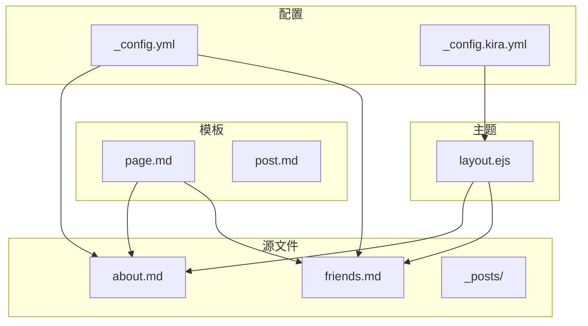
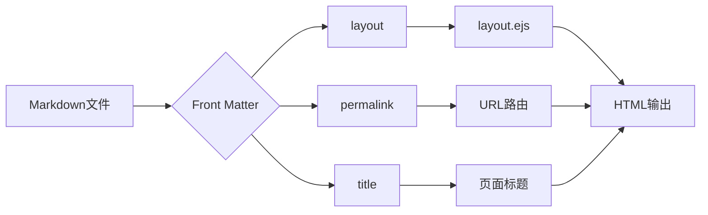
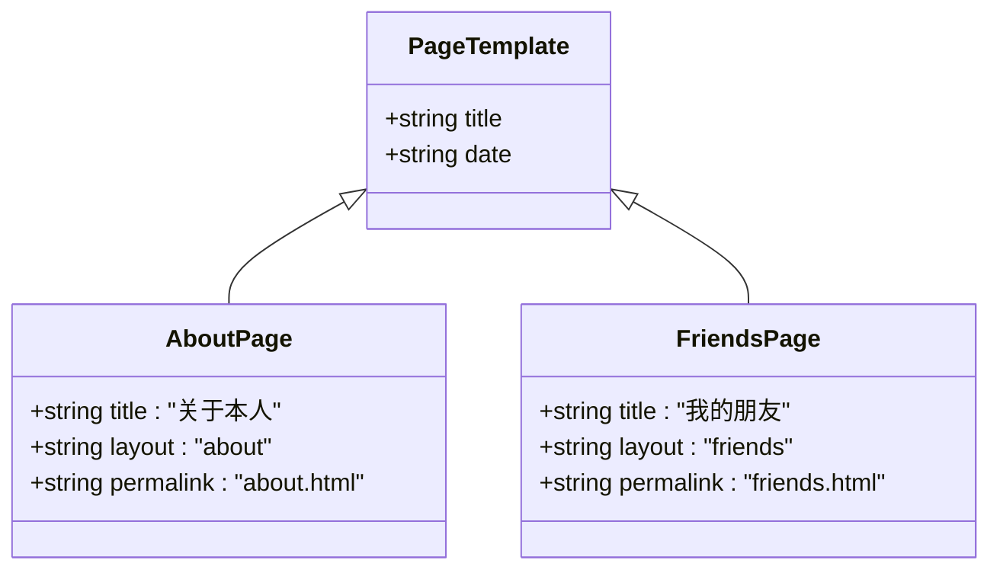
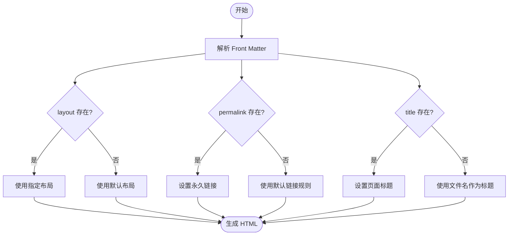
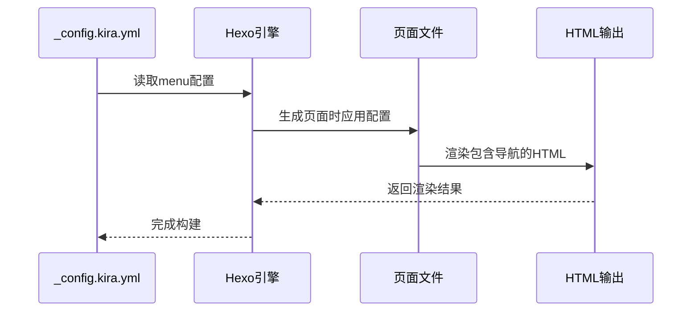
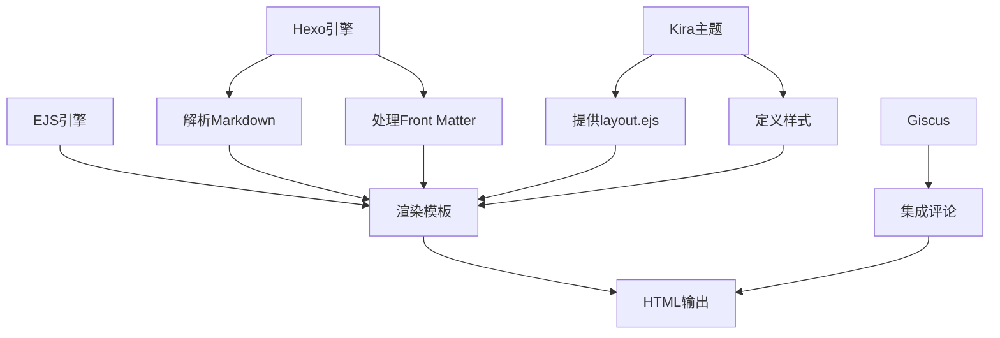

# 页面管理

<cite>
**本文档引用的文件**
- [page.md](file://scaffolds/page.md)
- [about.md](file://source/about.md)
- [friends.md](file://source/friends.md)
- [_config.yml](file://_config.yml)
- [_config.kira.yml](file://_config.kira.yml)
- [layout.ejs](file://themes/kira-custom/layout/layout.ejs)
- [README.md](file://README.md)
</cite>

## 目录
1. [简介](#简介)
2. [项目结构](#项目结构)
3. [核心组件](#核心组件)
4. [架构概述](#架构概述)
5. [详细组件分析](#详细组件分析)
6. [依赖分析](#依赖分析)
7. [性能考虑](#性能考虑)
8. [故障排除指南](#故障排除指南)
9. [结论](#结论)

## 简介
本文档详细介绍了基于 Hexo 框架的博客项目中独立页面的管理方法，重点阐述了如何使用 `page.md` 模板创建自定义页面。通过分析 `about.md` 和 `friends.md` 两个实际页面文件的 Front Matter 配置，解释了 `layout`、`permalink` 等关键字段的作用及其对页面渲染和路由的影响。文档还说明了如何通过修改 `source` 目录下的 Markdown 文件来更新“关于本人”和“我的朋友”等静态页面内容，并确保其与主题模板的正确集成。

## 项目结构
本项目采用典型的 Hexo 博客结构，主要分为源文件、配置文件、主题和脚本四个部分。核心页面文件位于 `source` 目录下，包括 `about.md` 和 `friends.md` 等自定义页面。模板文件存放在 `scaffolds` 目录中，用于生成新的页面或文章。主题配置通过 `_config.yml` 和 `_config.kira.yml` 两个文件进行管理，分别控制全局设置和 Kira 主题的特定功能。

**Diagram sources**
- [page.md](file://scaffolds/page.md)
- [about.md](file://source/about.md)
- [friends.md](file://source/friends.md)
- [_config.yml](file://_config.yml)
- [_config.kira.yml](file://_config.kira.yml)
- [layout.ejs](file://themes/kira-custom/layout/layout.ejs)

**Section sources**
- [README.md](file://README.md#L15-L37)

## 核心组件
本项目的核心组件包括页面模板、Front Matter 配置、主题布局和导航菜单。页面模板 `page.md` 提供了创建新页面的基础结构，包含标题和日期字段。Front Matter 配置在每个 Markdown 文件的开头定义了页面的元数据，如布局、永久链接和标题。主题布局文件 `layout.ejs` 控制了页面的整体结构和样式，而导航菜单则通过 `_config.kira.yml` 文件中的 `menu` 字段进行配置，实现了页面间的跳转。

**Section sources**
- [page.md](file://scaffolds/page.md#L1-L5)
- [about.md](file://source/about.md#L1-L8)
- [friends.md](file://source/friends.md#L1-L7)
- [_config.kira.yml](file://_config.kira.yml#L22-L34)

## 架构概述
整个页面管理系统基于 Hexo 的静态站点生成机制，通过 Markdown 文件和 EJS 模板引擎实现内容与表现的分离。用户在 `source` 目录下创建或编辑 Markdown 文件，这些文件通过 Front Matter 配置指定布局和路由规则。系统在构建时读取这些配置，结合主题提供的 EJS 模板生成最终的 HTML 页面。导航菜单的配置独立于页面内容，使得页面组织更加灵活。

**Diagram sources**
- [about.md](file://source/about.md#L1-L8)
- [friends.md](file://source/friends.md#L1-L7)
- [layout.ejs](file://themes/kira-custom/layout/layout.ejs#L1-L67)

## 详细组件分析

### 页面模板分析
`page.md` 模板是创建所有自定义页面的基础，它使用 YAML 格式的 Front Matter 定义了页面的基本属性。模板中包含 `title` 和 `date` 两个变量，分别对应页面标题和创建日期。当使用 `hexo new page` 命令时，Hexo 会自动替换这些变量为实际值。

**Diagram sources**
- [page.md](file://scaffolds/page.md#L1-L5)
- [about.md](file://source/about.md#L1-L8)
- [friends.md](file://source/friends.md#L1-L7)

### Front Matter 配置分析
Front Matter 是页面配置的核心，位于每个 Markdown 文件的开头，用三横线分隔。`layout` 字段指定了页面使用的布局模板，决定了页面的整体结构和样式；`permalink` 字段设置了页面的永久链接，影响 URL 的生成；`title` 字段定义了页面标题，既显示在页面上也用于 SEO。

**Diagram sources**
- [about.md](file://source/about.md#L1-L8)
- [friends.md](file://source/friends.md#L1-L7)
- [_config.yml](file://_config.yml#L36)

### 导航菜单配置分析
导航菜单的配置在 `_config.kira.yml` 文件中完成，通过 `menu` 字段定义了各个菜单项的名称、链接和图标。这种配置方式使得菜单项与页面文件解耦，可以独立调整。例如，“关于本人”菜单项指向 `/about.html`，而“我的朋友”菜单项指向 `/friends.html`，这些链接与页面的 `permalink` 配置保持一致。

**Diagram sources**
- [_config.kira.yml](file://_config.kira.yml#L22-L34)
- [about.md](file://source/about.md#L4)
- [friends.md](file://source/friends.md#L4)

**Section sources**
- [about.md](file://source/about.md#L1-L8)
- [friends.md](file://source/friends.md#L1-L7)
- [_config.kira.yml](file://_config.kira.yml#L22-L34)
- [layout.ejs](file://themes/kira-custom/layout/layout.ejs#L52)

## 依赖分析
页面管理系统依赖于多个组件协同工作。Hexo 核心引擎负责解析 Markdown 文件和 Front Matter 配置；Kira 主题提供布局模板和样式；EJS 模板引擎实现动态内容渲染；Giscus 评论系统增强用户互动。这些组件通过配置文件紧密连接，形成了一个完整的页面管理生态系统。

**Diagram sources**
- [_config.yml](file://_config.yml#L100)
- [_config.kira.yml](file://_config.kira.yml#L107-L117)
- [layout.ejs](file://themes/kira-custom/layout/layout.ejs#L42-L44)

## 性能考虑
由于这是一个静态站点，页面渲染在构建时完成，因此运行时性能非常高。所有页面都是预生成的 HTML 文件，可以直接由服务器提供服务，无需动态处理。这种架构不仅提高了访问速度，还增强了安全性。然而，在构建过程中需要考虑 Markdown 解析和模板渲染的效率，特别是在页面数量较多时。

## 故障排除指南
### 页面无法访问
检查 `permalink` 配置是否正确，确保没有拼写错误。确认文件位于 `source` 目录下，并且文件扩展名为 `.md`。运行 `hexo clean && hexo generate` 重新构建站点。

### 样式错乱
验证 `layout` 字段是否指向存在的布局模板。检查主题文件是否完整，特别是 `layout.ejs` 文件。确认 CSS 文件路径正确无误。

### 布局未生效
确保 Front Matter 中的 `layout` 字段与主题中定义的布局名称完全匹配。检查 `_config.yml` 中的 `default_layout` 设置是否覆盖了页面配置。

**Section sources**
- [about.md](file://source/about.md#L3)
- [friends.md](file://source/friends.md#L3)
- [_config.yml](file://_config.yml#L36)
- [layout.ejs](file://themes/kira-custom/layout/layout.ejs)

## 结论
本文档全面介绍了 Hexo 博客项目中的页面管理机制，从模板创建到配置分析，再到故障排除，为开发者提供了完整的指导。通过合理利用 Front Matter 配置和主题模板，可以轻松创建和管理各种自定义页面，实现灵活的内容组织和展示。