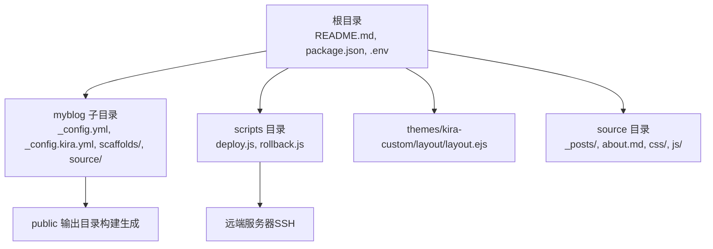
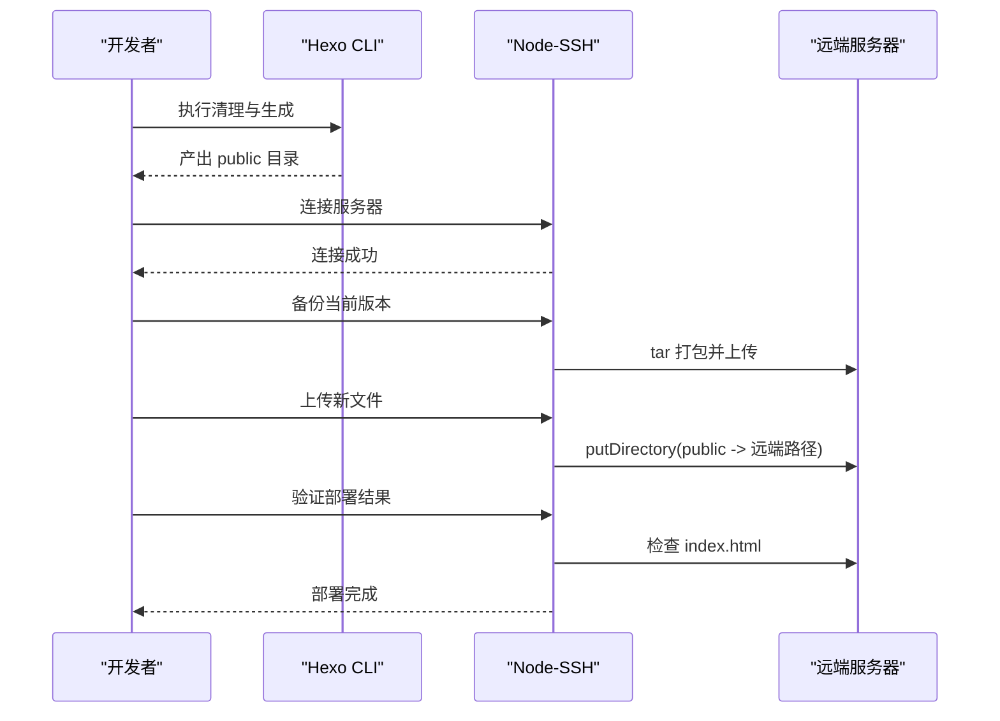
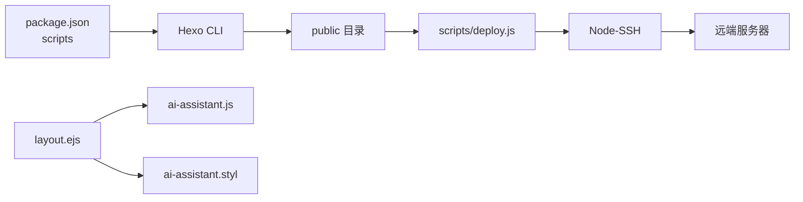

# 常见问题

<cite>
**本文引用的文件**
- [README.md](file://README.md)
- [package.json](file://package.json)
- [_config.yml](file://_config.yml)
- [myblog/_config.yml](file://myblog/_config.yml)
- [myblog/_config.kira.yml](file://myblog/_config.kira.yml)
- [scripts/deploy.js](file://scripts/deploy.js)
- [scripts/rollback.js](file://scripts/rollback.js)
- [source/js/ai-assistant.js](file://source/js/ai-assistant.js)
- [source/css/ai-assistant.styl](file://source/css/ai-assistant.styl)
- [themes/kira-custom/layout/layout.ejs](file://themes/kira-custom/layout/layout.ejs)
- [source/_posts/React知识归纳（增补）.md](file://source/_posts/React知识归纳（增补）.md)
- [source/about.md](file://source/about.md)
- [myblog/scaffolds/post.md](file://myblog/scaffolds/post.md)
</cite>

## 目录
1. [简介](#简介)
2. [项目结构](#项目结构)
3. [核心组件](#核心组件)
4. [架构总览](#架构总览)
5. [详细组件分析](#详细组件分析)
6. [依赖关系分析](#依赖关系分析)
7. [性能考量](#性能考量)
8. [故障排查指南](#故障排查指南)
9. [结论](#结论)
10. [附录](#附录)

## 简介
本FAQ面向使用本博客项目的用户，覆盖环境配置、构建与预览、部署与回滚、功能异常（AI助手、评论系统、样式）等常见问题，提供症状、根因与可操作的解决方案，并给出性能优化建议与最佳实践，帮助新手快速上手、老手高效定位问题。

## 项目结构
项目采用“根目录 + 主博客子目录”的双目录组织方式，便于主题与业务分离。核心要点：
- 根目录包含主题定制布局、公共资源与部署脚本
- myblog 子目录为 Hexo 主工程，包含主题配置、脚手架模板与源文件
- scripts 目录提供自动化部署与回滚脚本
- source 目录存放文章与静态资源，themes/kira-custom 提供自定义主题布局

**章节来源**
- file://README.md#L15-L37
- file://package.json#L1-L38

## 核心组件
- 构建与预览：基于 Hexo CLI，提供本地 server 与 generate 命令
- 主题与布局：Kira 主题，自定义 layout.ejs 注入 AI 助手配置与样式
- AI 助手：前端 JavaScript 模块，支持流式响应与多 API 密钥轮询
- 部署与回滚：Node-SSH 实现 SSH 连接、备份、上传与验证；支持回滚至上一个版本
- 评论系统：Giscus 集成，通过主题配置启用

**章节来源**
- file://README.md#L41-L77
- file://themes/kira-custom/layout/layout.ejs#L42-L45
- file://myblog/_config.kira.yml#L107-L117
- file://scripts/deploy.js#L210-L235
- file://scripts/rollback.js#L123-L139

## 架构总览
整体工作流从本地开发到远端部署，包含构建、备份、上传与验证环节。

**图表来源**
- [scripts/deploy.js](file://scripts/deploy.js#L210-L235)

**章节来源**
- file://scripts/deploy.js#L210-L235

## 详细组件分析

### 环境与依赖问题
- Node.js 版本不兼容
  - 症状：安装依赖时报错、构建失败、命令不可用
  - 根因：Node.js 版本低于最低要求
  - 解决：升级至满足要求的版本后重试
  - 参考：环境要求与安装步骤
    - file://README.md#L41-L57

- 依赖安装失败（npm/yarn）
  - 症状：安装 hexo 或主题依赖失败
  - 根因：网络/权限/缓存问题
  - 解决：更换镜像源、清理缓存、以管理员权限重试
  - 参考：安装命令与依赖清单
    - file://README.md#L47-L57
    - file://package.json#L16-L36

- 主题布局修复（node_modules 中的 layout.ejs）
  - 症状：自定义布局未生效
  - 根因：主题布局文件被封装在 node_modules 中，需手动复制
  - 解决：执行指定复制命令后重启服务
  - 参考：主题布局修复说明
    - file://README.md#L58-L66

**章节来源**
- file://README.md#L41-L66
- file://package.json#L16-L36

### 构建与预览问题
- hexo generate 失败
  - 症状：构建阶段报错，public 目录缺失
  - 根因：缺少必要插件、配置错误、Markdown 渲染异常
  - 解决：检查插件安装、确认主题配置、查看构建日志
  - 参考：构建脚本与配置
    - file://scripts/deploy.js#L62-L85
    - file://_config.yml#L97-L116
    - file://myblog/_config.yml#L97-L109

- 本地预览无法访问
  - 症状：启动 server 后无法访问 localhost:4000
  - 根因：端口占用、防火墙、路径错误
  - 解决：更换端口、检查防火墙、确认在 myblog 目录执行
  - 参考：本地预览说明
    - file://README.md#L67-L77

**章节来源**
- file://scripts/deploy.js#L62-L85
- file://_config.yml#L97-L116
- file://myblog/_config.yml#L97-L109
- file://README.md#L67-L77

### 部署与回滚问题
- SSH 连接拒绝
  - 症状：连接超时或认证失败
  - 根因：主机、端口、凭据或密钥配置错误
  - 解决：核对 .env 配置、确认密钥路径或密码、检查服务器状态
  - 参考：部署前配置与连接逻辑
    - file://README.md#L112-L122
    - file://scripts/deploy.js#L103-L125

- 文件传输中断或失败
  - 症状：上传阶段报错、远端目录为空
  - 根因：网络抖动、权限不足、过滤规则导致忽略文件
  - 解决：重试部署、检查远端目录权限、确认过滤规则
  - 参考：上传逻辑与过滤规则
    - file://scripts/deploy.js#L161-L189

- 部署后页面空白或 404
  - 症状：访问 index.html 为空或不存在
  - 根因：构建失败、上传未覆盖、远端路径错误
  - 解决：验证构建产物、检查远端路径、重新部署
  - 参考：部署验证逻辑
    - file://scripts/deploy.js#L191-L208

- 回滚失败或找不到备份
  - 症状：回滚脚本报错、无可用备份
  - 根因：远端无备份、权限不足、tar 命令失败
  - 解决：确认备份存在、检查权限、手动清理后重试
  - 参考：回滚逻辑
    - file://scripts/rollback.js#L59-L116

**章节来源**
- file://README.md#L112-L122
- file://scripts/deploy.js#L103-L125
- file://scripts/deploy.js#L161-L189
- file://scripts/deploy.js#L191-L208
- file://scripts/rollback.js#L59-L116

### AI 助手功能异常
- 无响应或长时间加载
  - 症状：点击发送后无回复、加载动画一直存在
  - 根因：API 密钥配置错误、网络异常、流式响应解析失败
  - 解决：检查配置注入、切换备用 API、查看网络状态
  - 参考：AI 助手初始化与 API 调用
    - file://themes/kira-custom/layout/layout.ejs#L42-L45
    - file://source/js/ai-assistant.js#L532-L618
    - file://source/js/ai-assistant.js#L620-L703

- 文本框无法输入或自动换行异常
  - 症状：输入框高度不变、回车无效
  - 根因：事件绑定或样式冲突
  - 解决：检查事件绑定、确认样式未覆盖输入行为
  - 参考：输入事件与自动调整
    - file://source/js/ai-assistant.js#L196-L207
    - file://source/js/ai-assistant.js#L795-L800

- 复制按钮不可用或复制失败
  - 症状：代码块无复制按钮或复制失败
  - 根因：DOM 未正确注入、剪贴板权限
  - 解决：确认复制按钮插入、检查浏览器权限
  - 参考：复制按钮逻辑
    - file://source/js/ai-assistant.js#L724-L753

- 移动端体验差
  - 症状：键盘弹出遮挡输入、聊天窗口位置异常
  - 根因：移动端焦点处理与吸附逻辑
  - 解决：使用内置移动端适配逻辑、避免自定义覆盖
  - 参考：移动端焦点与吸附
    - file://source/js/ai-assistant.js#L208-L248
    - file://source/js/ai-assistant.js#L435-L449

**章节来源**
- file://themes/kira-custom/layout/layout.ejs#L42-L45
- file://source/js/ai-assistant.js#L532-L618
- file://source/js/ai-assistant.js#L620-L703
- file://source/js/ai-assistant.js#L724-L753
- file://source/js/ai-assistant.js#L795-L800
- file://source/js/ai-assistant.js#L208-L248
- file://source/js/ai-assistant.js#L435-L449

### 页面样式与主题问题
- 样式错乱或主题色不一致
  - 症状：聊天窗口样式异常、滚动条不一致
  - 根因：Stylus 编译问题、主题变量未生效
  - 解决：确认 Stylus 渲染、检查主题配置
  - 参考：AI 助手样式与主题变量
    - file://source/css/ai-assistant.styl#L1-L60
    - file://myblog/_config.kira.yml#L66-L95

- 响应式布局在小屏设备异常
  - 症状：悬浮球过大、聊天窗口溢出
  - 根因：媒体查询或单位换算
  - 解决：检查媒体查询与单位、避免自定义覆盖
  - 参考：响应式样式
    - file://source/css/ai-assistant.styl#L298-L340

**章节来源**
- file://source/css/ai-assistant.styl#L1-L60
- file://source/css/ai-assistant.styl#L298-L340
- file://myblog/_config.kira.yml#L66-L95

### 评论系统（Giscus）问题
- 评论区不显示
  - 症状：页面无评论区
  - 根因：未启用或配置错误
  - 解决：启用 giscus 并填写仓库、分类等配置
  - 参考：主题配置
    - file://myblog/_config.kira.yml#L107-L117

**章节来源**
- file://myblog/_config.kira.yml#L107-L117

### 写作与发布问题
- 新文章未生成或草稿未发布
  - 症状：文章未出现在归档或首页
  - 根因：未渲染草稿、未发布
  - 解决：使用 new/draft/new post/new draft/publish
  - 参考：写作指南
    - file://README.md#L80-L107

- 文章模板字段缺失
  - 症状：文章未识别标签或日期
  - 解决：使用 scaffolds/post.md 模板
  - 参考：模板
    - file://myblog/scaffolds/post.md#L1-L6

**章节来源**
- file://README.md#L80-L107
- file://myblog/scaffolds/post.md#L1-L6

## 依赖关系分析
- 构建链路：package.json 中的 scripts 调用 Hexo CLI，生成 public 目录
- 部署链路：scripts/deploy.js 通过 Node-SSH 连接服务器，执行备份、上传与验证
- 主题链路：themes/kira-custom/layout/layout.ejs 注入 AI 助手配置与样式，source/js/ai-assistant.js 与 source/css/ai-assistant.styl 协同实现 UI

**图表来源**
- [package.json](file://package.json#L5-L12)
- [scripts/deploy.js](file://scripts/deploy.js#L210-L235)
- [themes/kira-custom/layout/layout.ejs](file://themes/kira-custom/layout/layout.ejs#L42-L45)

**章节来源**
- file://package.json#L5-L12
- file://scripts/deploy.js#L210-L235
- file://themes/kira-custom/layout/layout.ejs#L42-L45

## 性能考量
- 减少页面加载时间
  - 使用 CDN 加速静态资源（如主题与第三方库）
  - 合理配置缓存策略（浏览器缓存、服务端缓存）
  - 控制图片体积与格式（优先 WebP/AVIF），开启懒加载
  - 优化构建产物（清理未使用依赖、减少插件）

- 优化 Markdown 渲染效率
  - 合理使用代码高亮与行号，避免过度渲染
  - 控制文章长度与图片数量，减少 DOM 节点
  - 使用主题提供的 skip_render 选项跳过不需要渲染的文件

- 部署性能
  - 上传并发与过滤规则已内置，确保网络稳定与权限正确
  - 部署前清理缓存，避免冗余文件影响传输

[本节为通用指导，无需特定文件引用]

## 故障排查指南
- 环境与依赖
  - 使用 Node.js 版本满足要求
  - 依赖安装失败时清理缓存并重试
  - 主题布局修复必须执行复制命令

- 构建与预览
  - 确认在 myblog 目录执行命令
  - 若构建失败，检查插件与主题配置

- 部署与回滚
  - 核对 .env 配置（主机、用户、密码/私钥、远端路径）
  - 上传失败时检查远端目录权限与过滤规则
  - 验证失败时检查 index.html 是否存在且非空

- AI 助手
  - 确认配置注入与 API 密钥有效
  - 流式响应异常时切换备用 API
  - 移动端问题优先检查焦点与吸附逻辑

- 样式与主题
  - 检查 Stylus 编译与主题变量
  - 避免自定义覆盖响应式样式

**章节来源**
- file://README.md#L41-L77
- file://README.md#L112-L122
- file://scripts/deploy.js#L210-L235
- file://scripts/rollback.js#L123-L139
- file://themes/kira-custom/layout/layout.ejs#L42-L45
- file://source/js/ai-assistant.js#L532-L618
- file://source/css/ai-assistant.styl#L298-L340

## 结论
本 FAQ 覆盖了从环境准备到构建、部署、回滚、功能调试与性能优化的全流程问题。建议在日常维护中：
- 定期备份与版本控制
- 严格配置文件管理（.env、主题配置）
- 关注安全更新与依赖升级
- 通过回滚脚本保障回退能力

[本节为总结，无需特定文件引用]

## 附录
- 快速开始与写作指南
  - file://README.md#L39-L107
- 主题配置参考
  - file://myblog/_config.kira.yml#L1-L137
- 示例文章与页面
  - file://source/_posts/React知识归纳（增补）.md#L1-L20
  - file://source/about.md#L1-L8