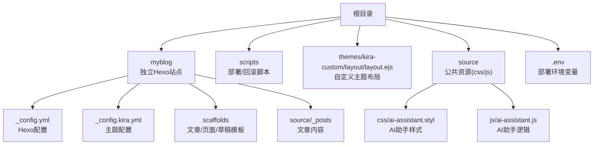
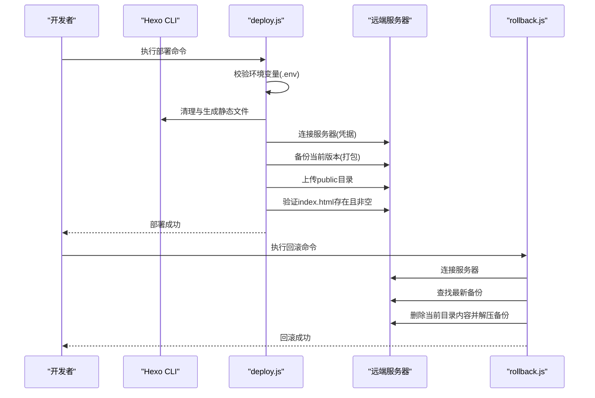
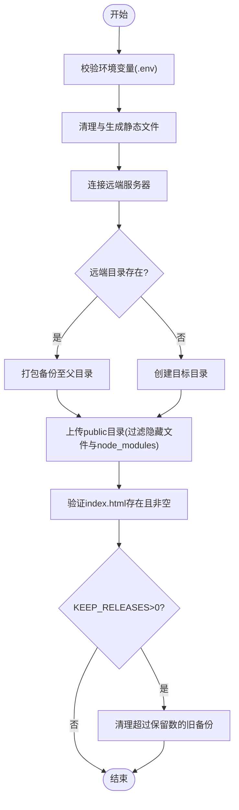
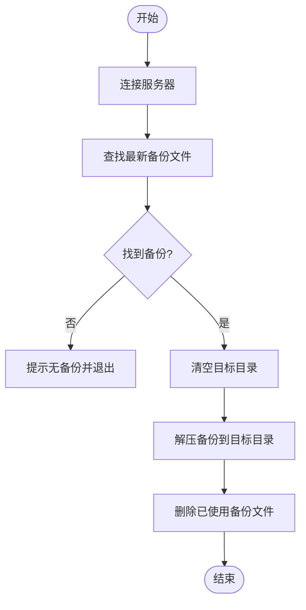
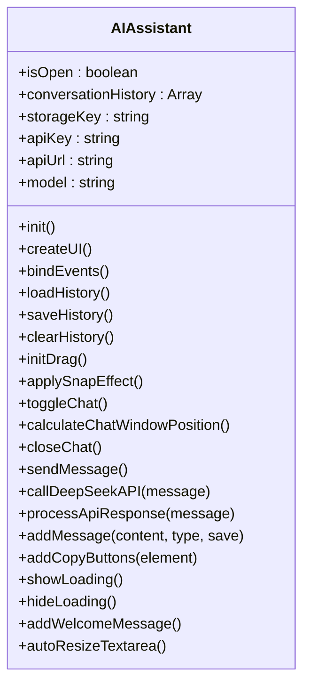
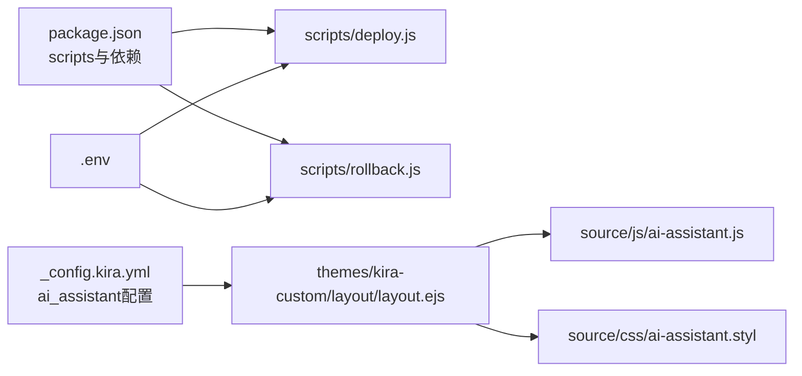

# 开发指南

<cite>
**本文引用的文件**
- [README.md](file://README.md)
- [package.json](file://package.json)
- [_config.yml](file://_config.yml)
- [_config.kira.yml](file://_config.kira.yml)
- [myblog/_config.kira.yml](file://myblog/_config.kira.yml)
- [.env](file://.env)
- [scripts/deploy.js](file://scripts/deploy.js)
- [scripts/rollback.js](file://scripts/rollback.js)
- [source/js/ai-assistant.js](file://source/js/ai-assistant.js)
- [source/css/ai-assistant.styl](file://source/css/ai-assistant.styl)
- [themes/kira-custom/layout/layout.ejs](file://themes/kira-custom/layout/layout.ejs)
- [scaffolds/post.md](file://scaffolds/post.md)
- [myblog/scaffolds/post.md](file://myblog/scaffolds/post.md)
</cite>

## 目录
1. [引言](#引言)
2. [项目结构](#项目结构)
3. [核心组件](#核心组件)
4. [架构总览](#架构总览)
5. [详细组件分析](#详细组件分析)
6. [依赖关系分析](#依赖关系分析)
7. [性能考量](#性能考量)
8. [故障排查指南](#故障排查指南)
9. [结论](#结论)
10. [附录](#附录)

## 引言
本指南面向希望深入扩展与维护本项目的开发者，覆盖目录结构解析、扩展开发方法（新增功能模块、自定义Hexo插件、扩展现有JS功能）、调试技巧（本地测试AI助手交互、模拟部署流程）、以及代码贡献流程（分支管理、代码风格、提交规范）。特别强调在修改核心脚本（如部署脚本）时的注意事项，以避免破坏自动化流程。

## 项目结构
项目采用“双Hexo站点”+“根目录资源”的组织方式：
- 根目录包含主题定制、脚本、公共资源与配置
- myblog 目录为独立的Hexo站点，包含其自身的配置、主题与脚手架
- themes/kira-custom 为自定义主题布局，用于覆盖主题的布局文件
- scripts 提供部署与回滚自动化脚本
- source 与 myblog/source 分别存放公共与站点特定的源文件（文章、样式、脚本等）

图表来源
- [README.md](file://README.md#L15-L37)
- [themes/kira-custom/layout/layout.ejs](file://themes/kira-custom/layout/layout.ejs#L1-L67)
- [scripts/deploy.js](file://scripts/deploy.js#L1-L235)
- [source/js/ai-assistant.js](file://source/js/ai-assistant.js#L1-L828)
- [source/css/ai-assistant.styl](file://source/css/ai-assistant.styl#L1-L383)

章节来源
- [README.md](file://README.md#L15-L37)

## 核心组件
- 部署与回滚脚本：scripts/deploy.js 与 scripts/rollback.js，负责构建、备份、上传与验证部署，以及回滚到最近一次备份
- AI助手：source/js/ai-assistant.js 与 source/css/ai-assistant.styl，提供流式对话、拖拽吸附、复制代码块等能力；通过主题布局注入配置
- 主题布局：themes/kira-custom/layout/layout.ejs，注入AI助手配置脚本与样式/脚本资源
- 脚手架模板：scaffolds 与 myblog/scaffolds，统一文章/页面/草稿模板
- 配置体系：_config.yml（Hexo基础配置）、_config.kira.yml（主题配置，含AI助手开关与API参数）、myblog/_config.kira.yml（myblog站点的主题配置）

章节来源
- [scripts/deploy.js](file://scripts/deploy.js#L1-L235)
- [scripts/rollback.js](file://scripts/rollback.js#L1-L140)
- [source/js/ai-assistant.js](file://source/js/ai-assistant.js#L1-L828)
- [source/css/ai-assistant.styl](file://source/css/ai-assistant.styl#L1-L383)
- [themes/kira-custom/layout/layout.ejs](file://themes/kira-custom/layout/layout.ejs#L1-L67)
- [scaffolds/post.md](file://scaffolds/post.md#L1-L6)
- [myblog/scaffolds/post.md](file://myblog/scaffolds/post.md#L1-L6)
- [_config.yml](file://_config.yml#L1-L116)
- [_config.kira.yml](file://_config.kira.yml#L138-L150)
- [myblog/_config.kira.yml](file://myblog/_config.kira.yml#L1-L137)

## 架构总览
整体工作流由“本地构建 + 远程部署/回滚”构成，AI助手在浏览器端通过主题布局注入配置后运行。

图表来源
- [scripts/deploy.js](file://scripts/deploy.js#L1-L235)
- [scripts/rollback.js](file://scripts/rollback.js#L1-L140)
- [.env](file://.env#L1-L14)

## 详细组件分析

### 部署脚本（deploy.js）
- 功能要点
  - 环境校验：检查服务器主机、用户名、目标路径、凭据（密码或私钥）
  - 构建：调用 Hexo 清理与生成，校验 public/index.html 存在
  - 连接：使用 SSH 连接远端
  - 备份：若远端目录存在则打包备份至父目录，否则创建目录
  - 上传：将本地 public 目录上传至远端目标路径，过滤隐藏文件与 node_modules
  - 验证：检查远端 index.html 非空
  - 清理：按 KEEP_RELEASES 保留数量清理旧备份
- 关键注意
  - 依赖 .env 中的 SERVER_HOST、SERVER_USER、REMOTE_DEST_PATH、KEEP_RELEASES 等
  - 上传时过滤 node_modules，避免污染远端
  - 验证阶段失败不会自动回滚，可在脚本中补充回滚逻辑

图表来源
- [scripts/deploy.js](file://scripts/deploy.js#L1-L235)
- [.env](file://.env#L1-L14)

章节来源
- [scripts/deploy.js](file://scripts/deploy.js#L1-L235)
- [.env](file://.env#L1-L14)

### 回滚脚本（rollback.js）
- 功能要点
  - 连接服务器
  - 查找最新备份（按时间排序）
  - 清空目标目录并解压备份
  - 成功后删除已使用的备份文件
- 关键注意
  - 若远端目录不存在，脚本会提示找不到备份并退出
  - 解压采用覆盖策略，但为安全起见先清空目录，避免残留新版本新增文件

图表来源
- [scripts/rollback.js](file://scripts/rollback.js#L1-L140)

章节来源
- [scripts/rollback.js](file://scripts/rollback.js#L1-L140)

### AI助手（ai-assistant.js 与 ai-assistant.styl）
- 功能要点
  - 配置加载：从页面脚本标签、全局变量或主题配置中读取AI助手开关与API参数
  - UI：悬浮球、聊天窗口、输入框、发送/清空/关闭按钮
  - 交互：拖拽吸附、移动端适配、自动滚动、复制代码块
  - 对话：优先使用硅基流动API，失败时回退到DeepSeek API；支持流式输出
  - 历史：本地存储对话历史，支持清空与欢迎语
- 关键注意
  - API配置来自主题配置（_config.kira.yml），需正确填写密钥与模型
  - 浏览器端Markdown渲染依赖showdown库
  - 样式通过Stylus编写，支持暗色模式与响应式

图表来源
- [source/js/ai-assistant.js](file://source/js/ai-assistant.js#L1-L828)
- [source/css/ai-assistant.styl](file://source/css/ai-assistant.styl#L1-L383)
- [themes/kira-custom/layout/layout.ejs](file://themes/kira-custom/layout/layout.ejs#L1-L67)
- [_config.kira.yml](file://_config.kira.yml#L138-L150)

章节来源
- [source/js/ai-assistant.js](file://source/js/ai-assistant.js#L1-L828)
- [source/css/ai-assistant.styl](file://source/css/ai-assistant.styl#L1-L383)
- [themes/kira-custom/layout/layout.ejs](file://themes/kira-custom/layout/layout.ejs#L1-L67)
- [_config.kira.yml](file://_config.kira.yml#L138-L150)

### 主题布局（layout.ejs）
- 注入点
  - 在<head>中注入AI助手配置脚本标签，内容来自主题配置
  - 引入AI助手样式与Markdown样式
  - 在<body>末尾引入showdown与ai-assistant.js
- 作用
  - 将主题配置传递给前端JS，使AI助手按主题配置启用与调用API

章节来源
- [themes/kira-custom/layout/layout.ejs](file://themes/kira-custom/layout/layout.ejs#L1-L67)
- [_config.kira.yml](file://_config.kira.yml#L138-L150)

### 脚手架模板（scaffolds 与 myblog/scaffolds）
- 用途
  - 通过 Hexo 新建文章/页面/草稿时使用统一模板，便于规范化元数据
- 扩展建议
  - 可在模板中增加默认标签、分类、摘要字段，以提升内容管理一致性

章节来源
- [scaffolds/post.md](file://scaffolds/post.md#L1-L6)
- [myblog/scaffolds/post.md](file://myblog/scaffolds/post.md#L1-L6)

## 依赖关系分析
- 脚本依赖
  - scripts/deploy.js 依赖 dotenv、node-ssh、ora、chalk、child_process、fs、path
  - scripts/rollback.js 依赖 dotenv、node-ssh、ora、chalk、path
- 前端依赖
  - AI助手依赖showdown（Markdown渲染）、主题布局注入配置
- 配置依赖
  - 部署脚本依赖 .env 中的服务器与目标路径
  - AI助手依赖 _config.kira.yml 中的ai_assistant配置

图表来源
- [package.json](file://package.json#L1-L38)
- [scripts/deploy.js](file://scripts/deploy.js#L1-L235)
- [scripts/rollback.js](file://scripts/rollback.js#L1-L140)
- [.env](file://.env#L1-L14)
- [_config.kira.yml](file://_config.kira.yml#L138-L150)
- [themes/kira-custom/layout/layout.ejs](file://themes/kira-custom/layout/layout.ejs#L1-L67)
- [source/js/ai-assistant.js](file://source/js/ai-assistant.js#L1-L828)
- [source/css/ai-assistant.styl](file://source/css/ai-assistant.styl#L1-L383)

章节来源
- [package.json](file://package.json#L1-L38)
- [scripts/deploy.js](file://scripts/deploy.js#L1-L235)
- [scripts/rollback.js](file://scripts/rollback.js#L1-L140)
- [.env](file://.env#L1-L14)
- [_config.kira.yml](file://_config.kira.yml#L138-L150)
- [themes/kira-custom/layout/layout.ejs](file://themes/kira-custom/layout/layout.ejs#L1-L67)
- [source/js/ai-assistant.js](file://source/js/ai-assistant.js#L1-L828)
- [source/css/ai-assistant.styl](file://source/css/ai-assistant.styl#L1-L383)

## 性能考量
- 部署脚本
  - 上传并发：uploadFiles 使用并发控制，合理设置以平衡速度与服务器负载
  - 备份清理：按KEEP_RELEASES清理旧备份，避免磁盘占用增长
- AI助手
  - 流式输出：前端按流式增量渲染，减少首屏等待
  - 本地存储：对话历史存于localStorage，注意容量限制与清理策略
  - 样式体积：Stylus编译产物较小，建议按需引入第三方库

## 故障排查指南
- 部署失败
  - 确认 .env 中凭据与目标路径正确
  - 检查远端目录权限与磁盘空间
  - 本地构建失败时查看 Hexo 清理与生成日志
- 回滚失败
  - 确认存在备份文件；若无备份，回滚脚本会提示并退出
  - 检查远端目录是否存在以及解压命令执行情况
- AI助手不可用
  - 确认主题配置中 ai_assistant.enable 为true
  - 检查浏览器控制台是否有网络错误或API返回异常
  - 确认showdown库已正确加载
- 主题布局修复
  - README中提示需将自定义主题布局复制到主题目录，避免因node_modules中布局文件导致的布局缺失

章节来源
- [scripts/deploy.js](file://scripts/deploy.js#L1-L235)
- [scripts/rollback.js](file://scripts/rollback.js#L1-L140)
- [_config.kira.yml](file://_config.kira.yml#L138-L150)
- [themes/kira-custom/layout/layout.ejs](file://themes/kira-custom/layout/layout.ejs#L1-L67)
- [README.md](file://README.md#L58-L66)

## 结论
本项目通过清晰的目录划分与自动化脚本实现了高效的本地写作与远端部署。AI助手作为前端增强功能，通过主题配置与布局注入实现灵活启用与多API回退。开发者在扩展时应遵循配置驱动、最小侵入的原则，并在修改核心脚本（如部署脚本）前充分测试与备份，确保自动化流程稳定可靠。

## 附录

### 如何添加新的功能模块
- 开发自定义Hexo插件
  - 在根目录或myblog目录的 plugins 目录中新增插件（若无plugins目录可新建）
  - 在 package.json 的 dependencies 或 devDependencies 中声明依赖
  - 在 _config.yml 或 _config.kira.yml 中按插件文档配置启用
- 扩展现有JavaScript功能
  - 在 source/js/ai-assistant.js 中扩展AI助手行为（如新增快捷键、消息类型、历史管理策略）
  - 在 source/css/ai-assistant.styl 中新增样式或调整现有样式
  - 通过 themes/kira-custom/layout/layout.ejs 注入新的脚本或样式资源
- 新增内容类型
  - 在 scaffolds 与 myblog/scaffolds 中新增模板，统一元数据字段
  - 在 source 或 myblog/source 中新增页面或资源文件

章节来源
- [package.json](file://package.json#L1-L38)
- [scaffolds/post.md](file://scaffolds/post.md#L1-L6)
- [myblog/scaffolds/post.md](file://myblog/scaffolds/post.md#L1-L6)
- [themes/kira-custom/layout/layout.ejs](file://themes/kira-custom/layout/layout.ejs#L1-L67)
- [source/js/ai-assistant.js](file://source/js/ai-assistant.js#L1-L828)
- [source/css/ai-assistant.styl](file://source/css/ai-assistant.styl#L1-L383)

### 调试建议
- 本地测试AI助手交互
  - 在本地启动 Hexo 服务，访问 localhost:4000
  - 在浏览器控制台观察网络请求与错误日志
  - 临时将 _config.kira.yml 中的ai_assistant.enable设为false，验证页面基础功能
- 模拟部署流程
  - 在本地执行 npm run build 与 npm run server，确认构建与预览正常
  - 使用 npm run deploy 前，先在测试服务器上创建一个临时目录作为 REMOTE_DEST_PATH
  - 逐步注释掉备份与清理逻辑，先验证上传与验证步骤

章节来源
- [README.md](file://README.md#L67-L77)
- [scripts/deploy.js](file://scripts/deploy.js#L1-L235)
- [_config.kira.yml](file://_config.kira.yml#L138-L150)

### 代码贡献流程
- 分支管理
  - 基于 main 分支创建特性分支（如 feature/ai-enhancement）
  - 合并前进行本地构建与部署测试
- 代码风格
  - JavaScript：遵循ESLint规则（若项目未配置，建议统一使用两空格缩进、分号结尾）
  - Stylus：统一缩进与命名规范，注释简洁明确
  - 配置文件：YAML键值对对齐，字符串使用引号包裹以避免歧义
- 提交规范
  - 类型：feat、fix、docs、style、refactor、perf、test、build、ci、chore
  - 示例：feat: 新增AI助手多模型切换能力
  - 说明：简述变更内容，必要时附带影响范围与风险评估

章节来源
- [package.json](file://package.json#L1-L38)
- [README.md](file://README.md#L186-L193)

### 修改核心脚本（deploy.js）注意事项
- 不要随意更改上传过滤规则（如移除 node_modules 过滤），以免污染远端
- 验证逻辑失败时，考虑在脚本中加入自动回滚或告警通知
- 保持 .env 中的凭据与路径配置与实际环境一致
- 在生产环境部署前，先在测试环境验证整个流程

章节来源
- [scripts/deploy.js](file://scripts/deploy.js#L1-L235)
- [.env](file://.env#L1-L14)