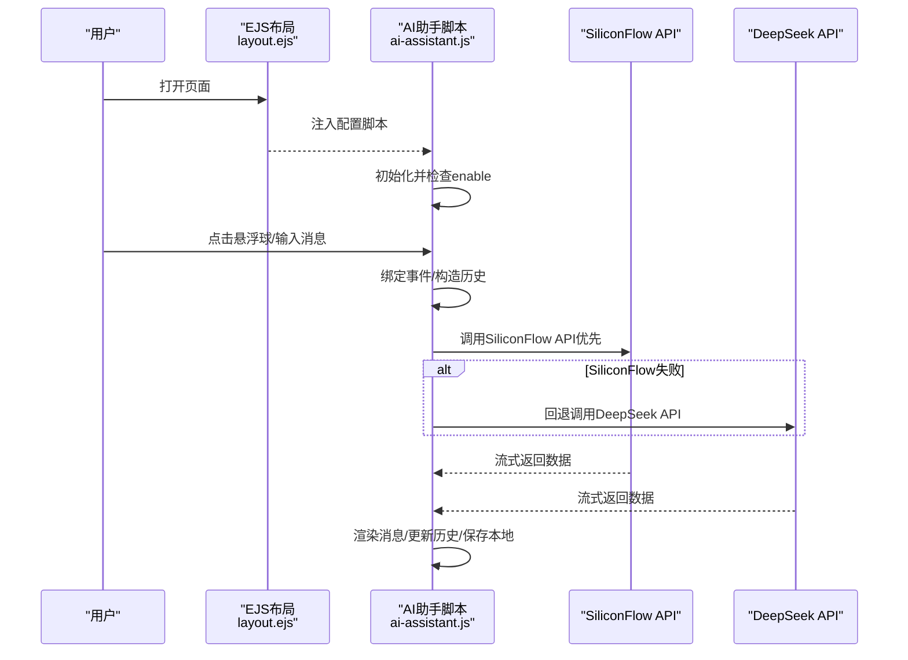
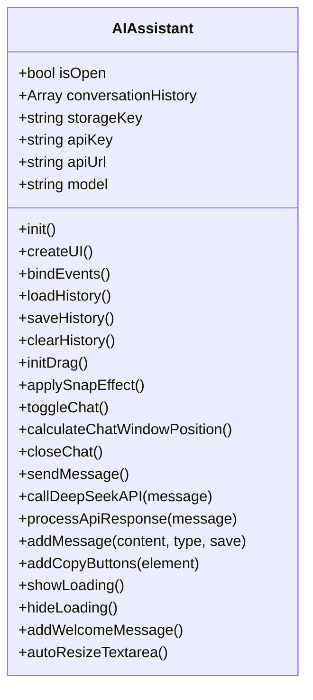
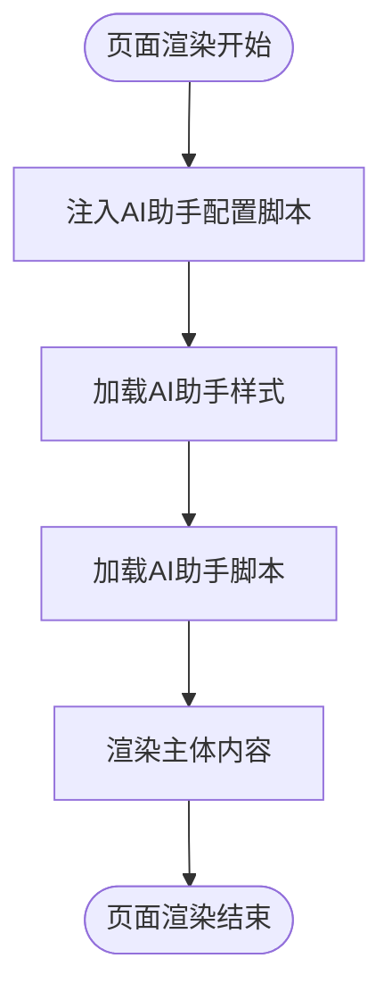
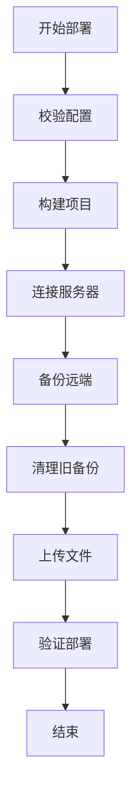
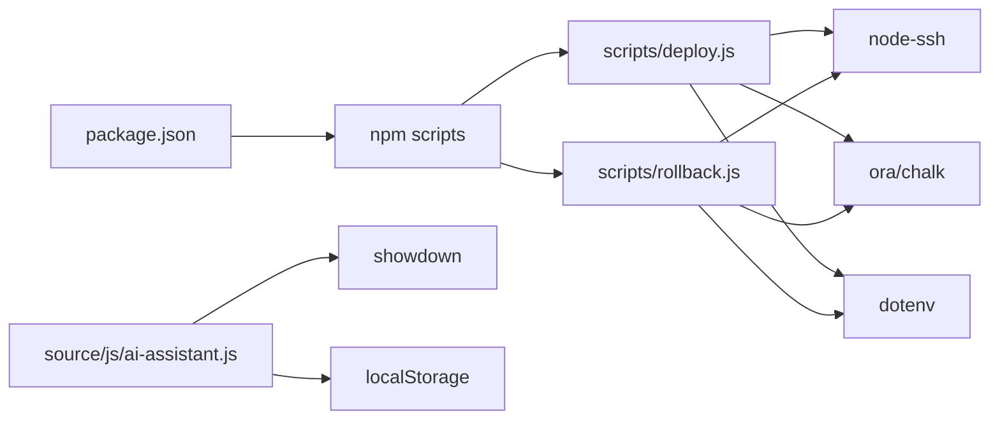

# 扩展开发指南

<cite>
**本文引用的文件**
- [ai-assistant.js](file://source/js/ai-assistant.js)
- [layout.ejs](file://themes/kira-custom/layout/layout.ejs)
- [_config.kira.yml](file://_config.kira.yml)
- [deploy.js](file://scripts/deploy.js)
- [rollback.js](file://scripts/rollback.js)
- [package.json](file://package.json)
- [README.md](file://README.md)
- [ai-assistant.styl](file://source/css/ai-assistant.styl)
</cite>

## 目录
1. [引言](#引言)
2. [项目结构](#项目结构)
3. [核心组件](#核心组件)
4. [架构总览](#架构总览)
5. [详细组件分析](#详细组件分析)
6. [依赖关系分析](#依赖关系分析)
7. [性能考量](#性能考量)
8. [故障排查指南](#故障排查指南)
9. [结论](#结论)
10. [附录](#附录)

## 引言
本指南围绕现有系统进行扩展开发，重点以“AI助手模块”为例，深入剖析其事件绑定、API调用与状态管理机制；同时提供通过修改EJS模板定制页面结构与布局的方法；介绍Hexo插件开发的基础思路（自定义标签、过滤器、生成器）；并展示如何安全地扩展现有deploy.js脚本以支持多环境部署与额外验证步骤。文档力求以循序渐进的方式帮助不同技术背景的读者快速上手并稳定扩展。

## 项目结构
该项目采用Hexo静态站点生成器，结合自定义主题与脚本化部署流程。关键扩展点分布在前端交互（ai-assistant.js）、主题模板（layout.ejs）、主题配置（_config.kira.yml）、部署脚本（deploy.js/rollback.js）以及包脚本（package.json）。

```mermaid
graph TB
A["Hexo站点<br/>_config.yml"] --> B["主题布局<br/>themes/kira-custom/layout/layout.ejs"]
B --> C["AI助手脚本注入<br/><script src=\"/js/ai-assistant.js\"/>"]
B --> D["AI助手配置注入<br/><script id=\"ai-assistant-config\">JSON</script>"]
C --> E["AI助手样式<br/>source/css/ai-assistant.styl"]
A --> F["主题配置<br/>_config.kira.yml"]
F --> D
A --> G["部署脚本<br/>scripts/deploy.js"]
G --> H["回滚脚本<br/>scripts/rollback.js"]
G --> I["包脚本命令<br/>package.json"]
```

图表来源
- [layout.ejs](file://themes/kira-custom/layout/layout.ejs#L41-L66)
- [ai-assistant.js](file://source/js/ai-assistant.js#L1-L120)
- [_config.kira.yml](file://_config.kira.yml#L138-L150)
- [deploy.js](file://scripts/deploy.js#L1-L60)
- [rollback.js](file://scripts/rollback.js#L1-L40)
- [package.json](file://package.json#L1-L20)

章节来源
- [README.md](file://README.md#L15-L38)
- [package.json](file://package.json#L1-L20)

## 核心组件
- AI助手模块（前端交互与状态管理）
  - 事件绑定：悬浮球点击、拖拽、移动端触摸、输入框回车、清空历史等
  - API调用：优先使用硅基流动API，失败回退至DeepSeek API，支持流式响应
  - 状态管理：对话历史、本地存储、加载状态、欢迎消息、复制按钮
- 主题模板与配置
  - EJS模板通过script注入AI助手配置，便于在页面层面控制开关与参数
  - 主题配置文件集中管理AI助手启用、模型与密钥等
- 部署与回滚脚本
  - 自动化构建、备份、上传、验证与清理旧版本
  - 回滚脚本基于备份文件恢复

章节来源
- [ai-assistant.js](file://source/js/ai-assistant.js#L1-L120)
- [layout.ejs](file://themes/kira-custom/layout/layout.ejs#L41-L66)
- [_config.kira.yml](file://_config.kira.yml#L138-L150)
- [deploy.js](file://scripts/deploy.js#L60-L120)
- [rollback.js](file://scripts/rollback.js#L58-L120)

## 架构总览
AI助手从前端到后端的交互链路如下：页面加载时由EJS注入配置，AI助手脚本根据配置决定是否初始化；用户交互触发事件，脚本构造消息历史并调用API；API返回流式数据，前端逐步渲染并更新状态；对话历史持久化到本地存储。



图表来源
- [layout.ejs](file://themes/kira-custom/layout/layout.ejs#L41-L66)
- [ai-assistant.js](file://source/js/ai-assistant.js#L1-L120)
- [ai-assistant.js](file://source/js/ai-assistant.js#L520-L703)

## 详细组件分析

### AI助手模块（ai-assistant.js）
- 事件绑定
  - 悬浮球点击与触摸：切换聊天窗口显示/隐藏
  - 拖拽：支持鼠标与触摸，拖拽结束应用左右吸附效果
  - 输入框：回车发送、自动高度调整、移动端焦点处理
  - 外部点击：点击页面空白处关闭窗口
  - 清空历史：确认后清除本地存储与消息区域
- API调用与回退策略
  - 优先使用硅基流动API，支持多密钥轮询；失败则回退到DeepSeek API
  - 流式响应：逐段解析choices.delta.content，首token出现时隐藏loading并创建消息节点
  - 最大token与温度等参数可按需调整
- 状态管理
  - 对话历史：数组形式保存，最多保留最近若干轮
  - 本地存储：键名统一，异常保护
  - 加载状态：动态插入/移除loading节点
  - 欢迎消息：首次无历史时自动添加
  - 复制按钮：为代码块添加复制能力，支持成功/失败反馈
- UI与交互细节
  - 聊天窗口位置：根据悬浮球位置与屏幕宽度自动计算左右吸附
  - 移动端适配：键盘弹出时全屏聊天窗口，失焦后恢复原位
  - 样式：Markdown渲染、滚动条美化、暗色模式支持



图表来源
- [ai-assistant.js](file://source/js/ai-assistant.js#L1-L120)
- [ai-assistant.js](file://source/js/ai-assistant.js#L153-L249)
- [ai-assistant.js](file://source/js/ai-assistant.js#L290-L433)
- [ai-assistant.js](file://source/js/ai-assistant.js#L446-L530)
- [ai-assistant.js](file://source/js/ai-assistant.js#L532-L703)
- [ai-assistant.js](file://source/js/ai-assistant.js#L705-L828)

章节来源
- [ai-assistant.js](file://source/js/ai-assistant.js#L1-L120)
- [ai-assistant.js](file://source/js/ai-assistant.js#L153-L249)
- [ai-assistant.js](file://source/js/ai-assistant.js#L290-L433)
- [ai-assistant.js](file://source/js/ai-assistant.js#L446-L530)
- [ai-assistant.js](file://source/js/ai-assistant.js#L532-L703)
- [ai-assistant.js](file://source/js/ai-assistant.js#L705-L828)

### EJS模板与页面结构定制（layout.ejs）
- 配置注入
  - 通过script标签将主题配置中的ai_assistant序列化为JSON注入页面，供前端脚本读取
- 资源加载
  - 引入AI助手样式与脚本，确保在页面主体之后加载
- 结构组织
  - header、sidebar、主内容区、右侧栏等组件通过include方式组合
- 扩展建议
  - 在模板中增加条件判断以控制AI助手的显示区域或行为
  - 通过主题配置新增字段并在模板中读取，实现更灵活的布局控制



图表来源
- [layout.ejs](file://themes/kira-custom/layout/layout.ejs#L41-L66)

章节来源
- [layout.ejs](file://themes/kira-custom/layout/layout.ejs#L1-L66)

### 主题配置与AI助手开关（_config.kira.yml）
- ai_assistant启用与模型配置
  - enable：控制是否启用AI助手
  - silicon_flow/deepseek：分别配置API密钥、模型与URL（默认URL在脚本中硬编码）
- 扩展建议
  - 新增字段用于控制API超时、最大token、温度等参数
  - 支持多套密钥轮询策略与失败阈值

章节来源
- [_config.kira.yml](file://_config.kira.yml#L138-L150)

### 部署脚本扩展（deploy.js）
- 核心流程
  - 配置校验：主机、用户名、远端路径、认证方式（密码或私钥）
  - 构建：执行hexo clean/generate并校验输出
  - 连接：建立SSH连接
  - 备份：对远端目录打包备份
  - 清理：删除旧备份（可配置保留份数）
  - 上传：同步public目录到远端
  - 验证：检查index.html存在且非空
- 扩展点
  - 多环境部署：通过环境变量区分不同服务器与路径
  - 额外验证：如校验静态资源完整性、CDN缓存失效、数据库迁移等
  - 并发优化：上传并发度、进度回调、断点续传（需引入第三方库）
  - 安全加固：密钥轮换、只读权限、白名单IP、审计日志



图表来源
- [deploy.js](file://scripts/deploy.js#L22-L36)
- [deploy.js](file://scripts/deploy.js#L62-L85)
- [deploy.js](file://scripts/deploy.js#L103-L125)
- [deploy.js](file://scripts/deploy.js#L127-L159)
- [deploy.js](file://scripts/deploy.js#L161-L189)
- [deploy.js](file://scripts/deploy.js#L191-L208)
- [deploy.js](file://scripts/deploy.js#L210-L235)

章节来源
- [deploy.js](file://scripts/deploy.js#L22-L36)
- [deploy.js](file://scripts/deploy.js#L62-L85)
- [deploy.js](file://scripts/deploy.js#L103-L125)
- [deploy.js](file://scripts/deploy.js#L127-L159)
- [deploy.js](file://scripts/deploy.js#L161-L189)
- [deploy.js](file://scripts/deploy.js#L191-L208)
- [deploy.js](file://scripts/deploy.js#L210-L235)

### 回滚脚本（rollback.js）
- 功能：查找最新备份并解压覆盖当前目录，随后删除已使用的备份文件
- 注意事项：删除当前目录内容前需谨慎，避免误删挂载点或关键目录

章节来源
- [rollback.js](file://scripts/rollback.js#L58-L120)

### Hexo插件开发基础（概念性说明）
- 自定义标签：在渲染阶段拦截特定标签，生成HTML或调用外部服务
- 过滤器：对渲染后的HTML进行二次加工（如注入统计脚本、修正链接）
- 生成器：在生成阶段动态产出页面或资源（如sitemap、RSS）
- 最佳实践
  - 保持幂等与可逆，避免破坏已有内容
  - 提供开关与配置项，支持多环境差异化
  - 记录日志与错误，便于定位问题
  - 缓存热点数据，减少重复计算

（本节为概念性说明，不直接分析具体文件）

## 依赖关系分析
- 前端依赖
  - showdown：Markdown渲染
  - 浏览器fetch：流式API调用
  - localStorage：对话历史持久化
- 后端依赖
  - node-ssh：SSH连接与远程命令执行
  - ora/chalk：进度提示与彩色输出
  - dotenv：环境变量加载
- 包脚本
  - 通过npm scripts统一入口，便于CI/CD集成



图表来源
- [package.json](file://package.json#L1-L20)
- [deploy.js](file://scripts/deploy.js#L1-L20)
- [rollback.js](file://scripts/rollback.js#L1-L10)
- [ai-assistant.js](file://source/js/ai-assistant.js#L1-L12)

章节来源
- [package.json](file://package.json#L1-L20)
- [deploy.js](file://scripts/deploy.js#L1-L20)
- [rollback.js](file://scripts/rollback.js#L1-L10)
- [ai-assistant.js](file://source/js/ai-assistant.js#L1-L12)

## 性能考量
- 前端
  - 流式渲染：仅在首token出现时创建消息节点，减少DOM抖动
  - 自动高度：限制最大高度，避免频繁重排
  - 移动端：键盘弹出时全屏渲染，失焦后恢复原位，提升可用性
- 后端
  - 上传并发：合理设置并发度，平衡速度与带宽占用
  - 备份清理：按保留份数清理旧备份，避免磁盘膨胀
  - 日志与错误：统一错误处理与退出码，便于CI/CD识别失败

（本节提供通用建议，不直接分析具体文件）

## 故障排查指南
- AI助手无法初始化
  - 检查EJS是否注入配置脚本，确认enable为true
  - 查看浏览器控制台是否存在网络错误或解析异常
- API调用失败
  - 硅基流动API密钥轮询失败：检查密钥有效性与限额
  - 回退到DeepSeek仍失败：检查网络连通性与模型参数
- 部署失败
  - 配置缺失：核对SERVER_HOST/SERVER_USER/REMOTE_PATH/认证方式
  - 远程目录不存在：确认备份创建逻辑与目录权限
  - 验证失败：检查index.html是否存在且非空
- 回滚失败
  - 无备份文件：确认备份是否成功创建
  - 删除当前目录风险：回滚前做好本地备份

章节来源
- [layout.ejs](file://themes/kira-custom/layout/layout.ejs#L41-L66)
- [_config.kira.yml](file://_config.kira.yml#L138-L150)
- [deploy.js](file://scripts/deploy.js#L22-L36)
- [deploy.js](file://scripts/deploy.js#L127-L159)
- [deploy.js](file://scripts/deploy.js#L191-L208)
- [rollback.js](file://scripts/rollback.js#L58-L120)

## 结论
通过对AI助手模块、EJS模板、主题配置与部署脚本的系统分析，我们明确了扩展的关键路径：前端事件与状态管理、模板注入与布局控制、主题配置与多API策略、部署流程与回滚机制。遵循本文的最佳实践与安全建议，可在不影响核心流程稳定性的前提下，安全高效地新增交互功能、集成新的AI服务、定制页面结构，并增强部署与运维能力。

## 附录
- 可复用扩展清单
  - 新增交互功能：在ai-assistant.js中新增事件绑定与状态更新，必要时扩展localStorage键
  - 集成新AI服务：在callDeepSeekAPI中新增服务分支，支持多密钥轮询与回退策略
  - 定制页面结构：在layout.ejs中增加条件判断与资源注入，配合主题配置字段
  - 多环境部署：通过环境变量区分服务器与路径，新增额外验证步骤
  - 安全加固：密钥轮换、最小权限、审计日志、失败告警

（本节为总结性内容，不直接分析具体文件）