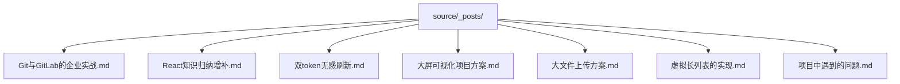
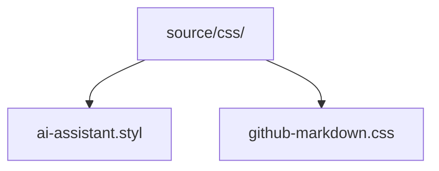
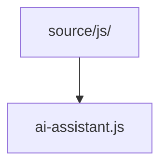
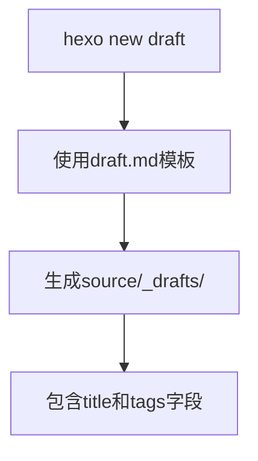
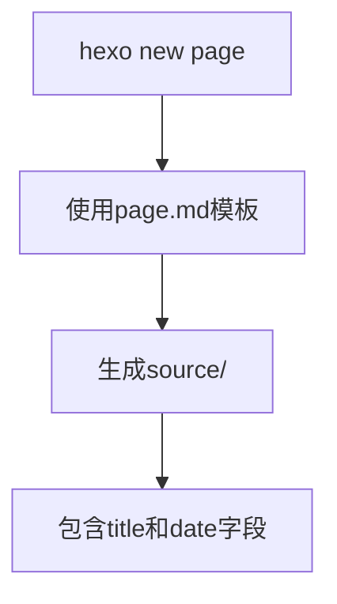
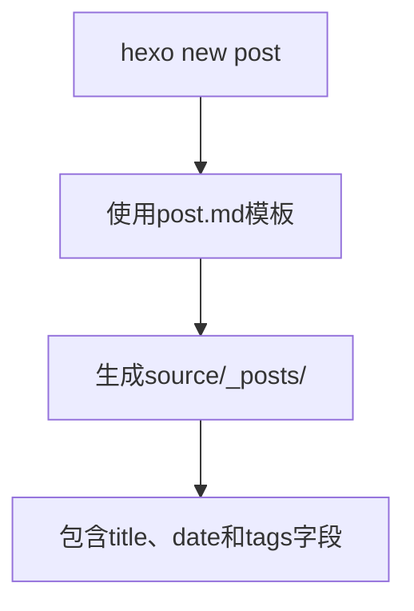
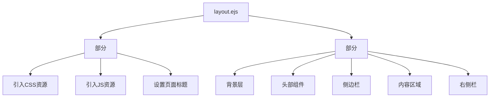
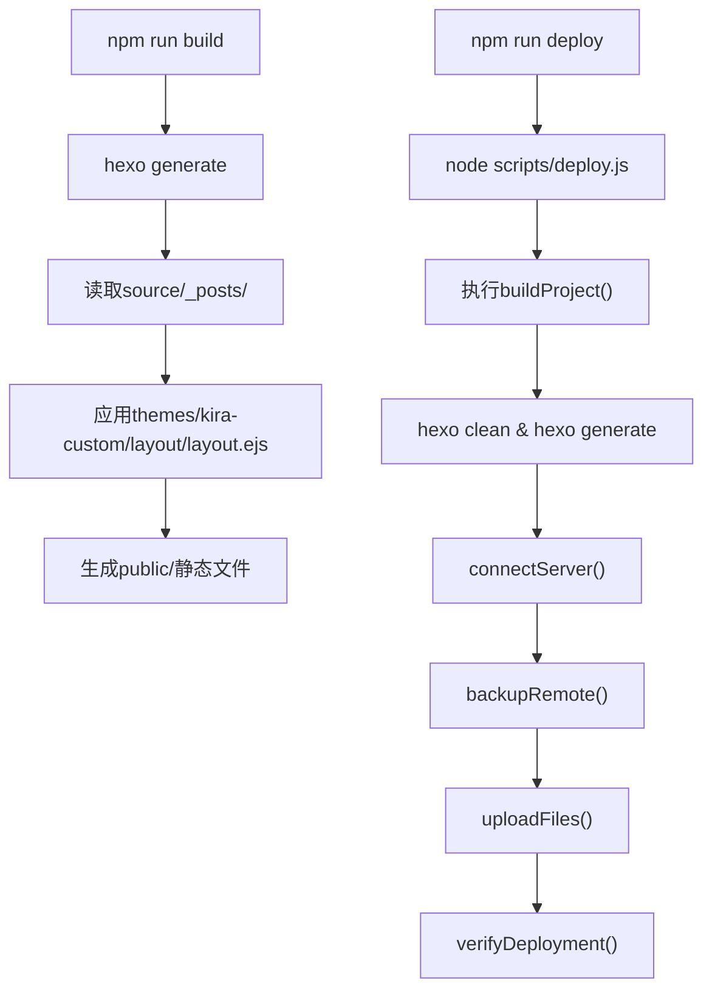

# 目录结构解析

<cite>
**本文档引用的文件**  
- [package.json](file://package.json)
- [myblog/package.json](file://myblog/package.json)
- [scaffolds/draft.md](file://scaffolds/draft.md)
- [scaffolds/page.md](file://scaffolds/page.md)
- [scaffolds/post.md](file://scaffolds/post.md)
- [myblog/scaffolds/draft.md](file://myblog/scaffolds/draft.md)
- [myblog/scaffolds/page.md](file://myblog/scaffolds/page.md)
- [myblog/scaffolds/post.md](file://myblog/scaffolds/post.md)
- [source/_posts/Git与GitLab的企业实战.md](file://source/_posts/Git与GitLab的企业实战.md)
- [source/css/github-markdown.css](file://source/css/github-markdown.css)
- [source/js/ai-assistant.js](file://source/js/ai-assistant.js)
- [themes/kira-custom/layout/layout.ejs](file://themes/kira-custom/layout/layout.ejs)
- [scripts/deploy.js](file://scripts/deploy.js)
- [_config.yml](file://_config.yml)
- [myblog/_config.yml](file://myblog/_config.yml)
- [_config.kira.yml](file://_config.kira.yml)
- [myblog/_config.kira.yml](file://myblog/_config.kira.yml)
</cite>

## 目录结构解析

本项目是一个基于Hexo框架的静态博客系统，采用模块化设计，具有清晰的目录结构和职责划分。项目根目录下包含多个核心目录，如`source`、`scaffolds`、`themes`和`scripts`，每个目录都有明确的职责。项目中存在两个相似的目录结构：一个是根目录下的现代结构，另一个是`myblog/`目录下的旧版结构。开发者应优先操作根目录下的现代结构，`myblog/`目录可能是历史遗留或用于特定环境的配置。

### 核心目录结构

项目的主要目录结构如下：
- `source/`：存放所有源内容文件，包括文章、页面和静态资源
- `scaffolds/`：存放内容生成的模板文件
- `themes/`：存放主题文件，控制网站外观和布局
- `scripts/`：存放部署和回滚等自动化脚本
- `myblog/`：旧版项目结构，包含与根目录相似的文件结构

**Section sources**
- [package.json](file://package.json)
- [myblog/package.json](file://myblog/package.json)

## source目录结构与职责划分

`source`目录是博客内容的核心存储位置，其中的`_posts`、`css`和`js`子目录各司其职，共同构建了博客的内容和样式体系。

### _posts目录：文章内容管理

`source/_posts`目录专门用于存放博客文章，每篇文章以Markdown格式存储，文件名通常包含日期和标题。该目录中的文件是博客系统生成文章页面的主要来源。Hexo会自动读取此目录下的所有Markdown文件，根据文件中的YAML front-matter（如`title`、`date`、`tags`）生成相应的文章页面。

**Diagram sources**
- [source/_posts/Git与GitLab的企业实战.md](file://source/_posts/Git与GitLab的企业实战.md)

**Section sources**
- [source/_posts/Git与GitLab的企业实战.md](file://source/_posts/Git与GitLab的企业实战.md)

### css目录：样式文件管理

`source/css`目录存放自定义CSS样式文件，用于扩展或覆盖主题的默认样式。本项目中包含`ai-assistant.styl`和`github-markdown.css`两个文件。`github-markdown.css`文件定义了Markdown内容的渲染样式，确保文章内容在页面上以GitHub风格显示，包括代码块、表格、列表等元素的样式。

**Diagram sources**
- [source/css/github-markdown.css](file://source/css/github-markdown.css)

**Section sources**
- [source/css/github-markdown.css](file://source/css/github-markdown.css)

### js目录：客户端脚本管理

`source/js`目录存放自定义JavaScript文件，用于实现页面的交互功能。本项目中的`ai-assistant.js`文件实现了AI助手悬浮球功能，集成了DeepSeek API，支持实时对话。该文件通过EJS模板在页面中引用，为博客增加了智能化的交互体验。

**Diagram sources**
- [source/js/ai-assistant.js](file://source/js/ai-assistant.js)

**Section sources**
- [source/js/ai-assistant.js](file://source/js/ai-assistant.js)

## scaffolds目录：内容生成模板

`scaffolds`目录包含三个模板文件：`draft.md`、`page.md`和`post.md`，它们在使用`hexo new`命令创建新内容时作为生成模板。

### draft.md：草稿模板

`draft.md`模板用于创建草稿文章。当执行`hexo new draft <title>`命令时，Hexo会根据此模板生成一个位于`source/_drafts`目录下的Markdown文件。该模板仅包含`title`和`tags`字段，不包含`date`字段，适合用于尚未确定发布日期的内容。

**Diagram sources**
- [scaffolds/draft.md](file://scaffolds/draft.md)
- [myblog/scaffolds/draft.md](file://myblog/scaffolds/draft.md)

**Section sources**
- [scaffolds/draft.md](file://scaffolds/draft.md)
- [myblog/scaffolds/draft.md](file://myblog/scaffolds/draft.md)

### page.md：页面模板

`page.md`模板用于创建独立页面，如关于页、友链页等。当执行`hexo new page <title>`命令时，Hexo会根据此模板生成一个位于`source`目录下的Markdown文件。该模板包含`title`和`date`字段，适合用于创建不需要归类到文章流中的静态页面。

**Diagram sources**
- [scaffolds/page.md](file://scaffolds/page.md)
- [myblog/scaffolds/page.md](file://myblog/scaffolds/page.md)

**Section sources**
- [scaffolds/page.md](file://scaffolds/page.md)
- [myblog/scaffolds/page.md](file://myblog/scaffolds/page.md)

### post.md：文章模板

`post.md`模板是创建博客文章的默认模板。当执行`hexo new post <title>`或简写`hexo new <title>`命令时，Hexo会根据此模板生成一个位于`source/_posts`目录下的Markdown文件。该模板包含`title`、`date`和`tags`字段，是创建正式博客文章的标准格式。

**Diagram sources**
- [scaffolds/post.md](file://scaffolds/post.md)
- [myblog/scaffolds/post.md](file://myblog/scaffolds/post.md)

**Section sources**
- [scaffolds/post.md](file://scaffolds/post.md)
- [myblog/scaffolds/post.md](file://myblog/scaffolds/post.md)

## themes/kira-custom/layout：EJS模板与页面渲染

`themes/kira-custom/layout`目录下的`layout.ejs`文件是博客的主布局模板，决定了页面的整体结构和资源加载方式。

### layout.ejs：主布局模板

`layout.ejs`文件定义了HTML文档的基本结构，包括`<head>`和`<body>`部分。在`<head>`部分，该模板通过`<%- css() %>`和`<%- js() %>`语法动态引入CSS和JavaScript资源，确保所有样式和脚本正确加载。`<body>`部分包含了页面的主要结构，如背景、头部、侧边栏和内容区域。

**Diagram sources**
- [themes/kira-custom/layout/layout.ejs](file://themes/kira-custom/layout/layout.ejs)

**Section sources**
- [themes/kira-custom/layout/layout.ejs](file://themes/kira-custom/layout/layout.ejs)

## 构建流程与脚本命令协同

`package.json`文件中的脚本命令定义了项目的构建和部署流程，各目录在这些命令的执行过程中协同工作。

### package.json脚本命令

`package.json`文件定义了多个npm脚本，用于执行不同的构建任务。`build`脚本执行`hexo generate`命令，将`source`目录下的Markdown文件生成静态HTML文件；`server`脚本启动本地服务器预览博客；`deploy`脚本执行自定义的`scripts/deploy.js`，实现自动化部署。

**Diagram sources**
- [package.json](file://package.json)
- [scripts/deploy.js](file://scripts/deploy.js)

**Section sources**
- [package.json](file://package.json)
- [scripts/deploy.js](file://scripts/deploy.js)

## 常见误解澄清

### myblog/目录的用途

项目中存在`myblog/`目录，其结构与根目录相似，包含`scaffolds`、`source`、`package.json`和配置文件。这可能是项目迁移过程中的旧版结构或用于特定环境的配置。开发者应优先操作根目录下的文件，因为`package.json`中的脚本命令指向的是根目录的配置。`myblog/`目录可能用于备份或测试，不应作为主要开发目录。

### 优先操作的现代目录结构

开发者应优先操作根目录下的现代目录结构，包括`source/`、`scaffolds/`、`themes/`和`scripts/`。这些目录与`package.json`中的脚本命令直接关联，确保构建和部署流程的正确执行。避免在`myblog/`目录下进行开发，以防止配置冲突和部署错误。

**Section sources**
- [package.json](file://package.json)
- [myblog/package.json](file://myblog/package.json)
- [_config.yml](file://_config.yml)
- [myblog/_config.yml](file://myblog/_config.yml)
- [_config.kira.yml](file://_config.kira.yml)
- [myblog/_config.kira.yml](file://myblog/_config.kira.yml)