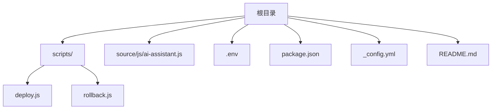
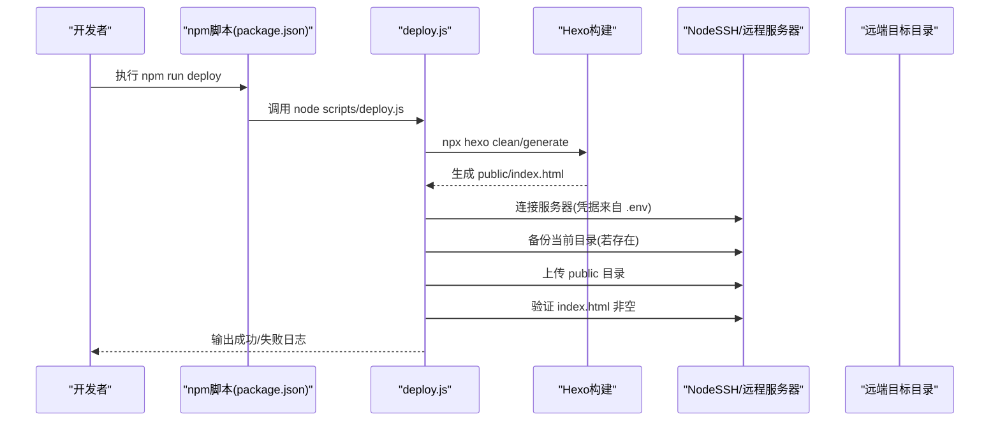
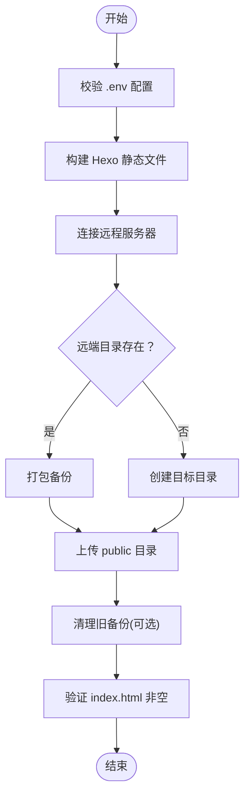
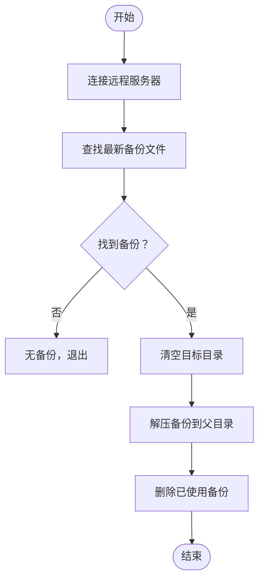
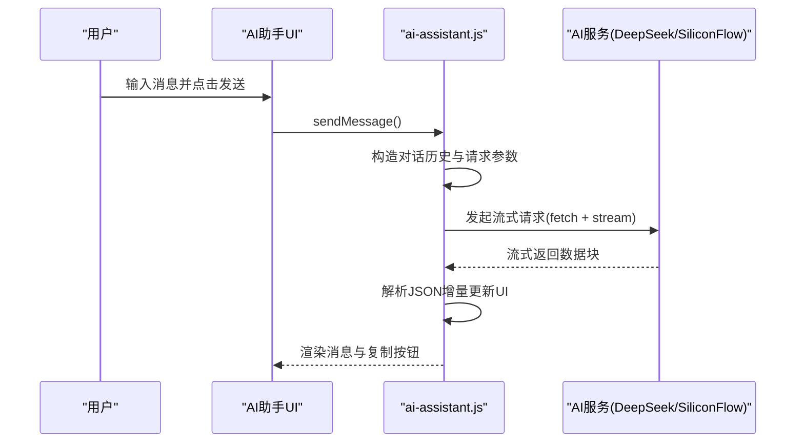
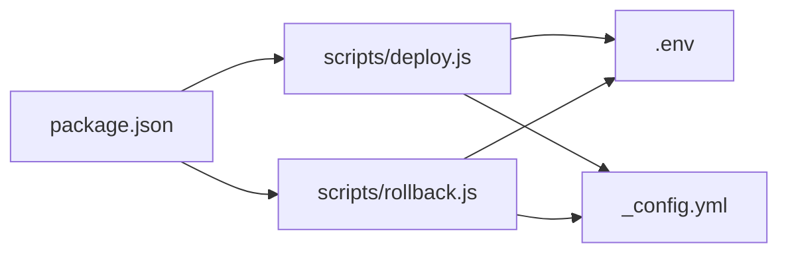

# 调试技巧与验证方法

<cite>
**本文引用的文件**
- [scripts/deploy.js](file://scripts/deploy.js)
- [scripts/rollback.js](file://scripts/rollback.js)
- [source/js/ai-assistant.js](file://source/js/ai-assistant.js)
- [.env](file://.env)
- [package.json](file://package.json)
- [_config.yml](file://_config.yml)
- [README.md](file://README.md)
</cite>

## 目录
1. [简介](#简介)
2. [项目结构](#项目结构)
3. [核心组件](#核心组件)
4. [架构总览](#架构总览)
5. [详细组件分析](#详细组件分析)
6. [依赖关系分析](#依赖关系分析)
7. [性能考量](#性能考量)
8. [故障排查指南](#故障排查指南)
9. [结论](#结论)
10. [附录](#附录)

## 简介
本文件面向本地开发与部署全流程，提供一套完整的调试策略，覆盖以下方面：
- 如何启用Hexo的调试模式查看生成细节
- 如何使用console.log与浏览器开发者工具调试ai-assistant.js的交互逻辑
- 如何在本地模拟deploy.js的SSH部署过程，包括利用.env配置测试连接、手动执行上传命令和验证远程文件状态
- rollback.js的触发条件与恢复机制，演示如何安全测试回滚功能而不影响生产环境
- 常见错误码与排查路径，如SSH连接失败、文件权限异常、Markdown解析错误等，并提供对应的日志分析技巧

## 项目结构
该项目采用Hexo静态站点生成器，结合自定义部署脚本与主题配置。关键目录与文件如下：
- scripts：自动化部署与回滚脚本
- source/js：前端交互逻辑（AI助手）
- .env：部署所需服务器与目标路径配置
- package.json：脚本入口与依赖声明
- _config.yml：Hexo站点配置
- README.md：快速开始与部署说明

**图表来源**
- [scripts/deploy.js](file://scripts/deploy.js#L1-L235)
- [scripts/rollback.js](file://scripts/rollback.js#L1-L140)
- [source/js/ai-assistant.js](file://source/js/ai-assistant.js#L1-L828)
- [.env](file://.env#L1-L14)
- [package.json](file://package.json#L1-L38)
- [_config.yml](file://_config.yml#L1-L116)
- [README.md](file://README.md#L1-L193)

**章节来源**
- [README.md](file://README.md#L1-L193)

## 核心组件
- 部署脚本（deploy.js）：负责构建、备份、上传、验证与清理旧版本；通过.env注入SSH凭据与目标路径
- 回滚脚本（rollback.js）：在远程查找最新备份并恢复，删除已使用的备份文件
- AI助手（ai-assistant.js）：集成API调用、流式响应处理、历史记录与复制按钮等交互逻辑
- 配置与脚本入口（.env、package.json、_config.yml）：提供部署参数、脚本命令与Hexo配置

**章节来源**
- [scripts/deploy.js](file://scripts/deploy.js#L1-L235)
- [scripts/rollback.js](file://scripts/rollback.js#L1-L140)
- [source/js/ai-assistant.js](file://source/js/ai-assistant.js#L1-L828)
- [.env](file://.env#L1-L14)
- [package.json](file://package.json#L1-L38)
- [_config.yml](file://_config.yml#L1-L116)

## 架构总览
下图展示部署与回滚的整体流程，以及与Hexo构建的关系。

**图表来源**
- [package.json](file://package.json#L1-L38)
- [scripts/deploy.js](file://scripts/deploy.js#L1-L235)
- [_config.yml](file://_config.yml#L1-L116)

## 详细组件分析

### 部署脚本（deploy.js）调试要点
- 启用调试模式
  - 使用Hexo自带的调试能力：在本地开发时，可通过命令行参数或环境变量启用更详细的日志输出（具体参数请参考Hexo官方文档）。在本项目中，建议先在本地执行构建命令以验证生成流程是否正常。
- 日志与进度
  - 脚本使用彩色日志与进度提示，便于定位阶段问题。关注“clean”“generate”“upload”“verify”等关键步骤的日志输出。
- SSH连接与凭据
  - 凭据来源于.env文件，支持密码或私钥两种方式。若连接失败，优先检查主机、端口、用户名与凭据是否正确。
- 备份与清理
  - 若远端目录存在，脚本会打包备份；随后清理超出保留数量的历史备份。
- 上传与验证
  - 上传时会忽略隐藏文件与node_modules；验证通过检查index.html是否存在且非空。

**图表来源**
- [scripts/deploy.js](file://scripts/deploy.js#L1-L235)
- [.env](file://.env#L1-L14)

**章节来源**
- [scripts/deploy.js](file://scripts/deploy.js#L1-L235)
- [.env](file://.env#L1-L14)

### 回滚脚本（rollback.js）调试要点
- 触发条件
  - 当远程不存在任何备份文件时，脚本会直接失败并退出；因此在执行回滚前，需确保部署脚本已至少执行过一次并生成了备份。
- 恢复机制
  - 查找最新备份文件，清空目标目录后解压备份至父目录，再将内容恢复到目标路径；最后删除已使用的备份文件。
- 安全性
  - 清空目标目录后再解压，可避免残留新增文件导致的不一致；但此操作对生产环境具有破坏性，务必在测试环境先行验证。

**图表来源**
- [scripts/rollback.js](file://scripts/rollback.js#L1-L140)

**章节来源**
- [scripts/rollback.js](file://scripts/rollback.js#L1-L140)

### AI助手（ai-assistant.js）调试要点
- 配置加载
  - 从页面脚本标签、全局变量或主题配置中读取API配置；可在浏览器控制台观察配置加载日志。
- 事件绑定与交互
  - 悬浮球、拖拽、发送、清空、关闭等事件均在初始化时绑定；可在开发者工具中断点调试事件回调。
- API调用与流式响应
  - 优先尝试多个API密钥；失败时回退到备用API；使用流式读取并逐步渲染；注意解析JSON时的异常处理。
- Markdown渲染与复制按钮
  - 使用转换器将AI返回内容渲染为Markdown；为代码块动态添加复制按钮，便于验证渲染效果。

**图表来源**
- [source/js/ai-assistant.js](file://source/js/ai-assistant.js#L1-L828)

**章节来源**
- [source/js/ai-assistant.js](file://source/js/ai-assistant.js#L1-L828)

## 依赖关系分析
- 脚本入口
  - package.json中定义了build、clean、deploy、back、deploy:hexo、server等脚本，分别对应Hexo命令与自定义脚本。
- 部署依赖
  - deploy.js依赖dotenv加载.env，使用node-ssh建立SSH连接，通过child_process调用hexo命令，使用ora/chalk美化日志。
- 回滚依赖
  - rollback.js复用deploy.js的配置结构，同样依赖dotenv与node-ssh。
- Hexo配置
  - _config.yml控制站点生成行为，如public_dir、highlight、marked等；这些会影响构建产物与后续部署验证。

**图表来源**
- [package.json](file://package.json#L1-L38)
- [scripts/deploy.js](file://scripts/deploy.js#L1-L235)
- [scripts/rollback.js](file://scripts/rollback.js#L1-L140)
- [.env](file://.env#L1-L14)
- [_config.yml](file://_config.yml#L1-L116)

**章节来源**
- [package.json](file://package.json#L1-L38)
- [scripts/deploy.js](file://scripts/deploy.js#L1-L235)
- [scripts/rollback.js](file://scripts/rollback.js#L1-L140)
- [_config.yml](file://_config.yml#L1-L116)

## 性能考量
- 并发与传输
  - 上传时使用并发控制，避免过多并发导致远端压力过大；可根据网络状况调整并发参数。
- 构建优化
  - 在本地先执行clean与generate，确保生成产物最小化；必要时开启Hexo的详细日志以定位慢点。
- 验证策略
  - 部署后仅验证index.html存在且非空，避免过度验证带来的额外开销。

[本节为通用建议，无需特定文件来源]

## 故障排查指南

### 一、本地开发与Hexo调试
- 启用详细日志
  - 在本地执行构建命令前，确认Hexo版本与配置无误；如需更详细的日志，参考Hexo官方文档的调试参数。
- 验证构建产物
  - 确认public/index.html存在且内容合理；若缺失，检查_source与主题配置是否正确。

**章节来源**
- [_config.yml](file://_config.yml#L1-L116)
- [README.md](file://README.md#L1-L193)

### 二、浏览器与AI助手调试
- 使用浏览器开发者工具
  - 在ai-assistant.js的关键函数（如sendMessage、processApiResponse、callDeepSeekAPI）设置断点，观察请求参数、响应流与错误分支。
- 观察控制台日志
  - 注意配置加载、API切换、解析异常等日志输出，有助于定位问题。

**章节来源**
- [source/js/ai-assistant.js](file://source/js/ai-assistant.js#L1-L828)

### 三、本地模拟SSH部署流程
- 准备.env
  - 确认SERVER_HOST、SERVER_PORT、SERVER_USER、SERVER_PASSWORD或SERVER_PRIVATE_KEY_PATH、REMOTE_DEST_PATH、KEEP_RELEASES均已正确填写。
- 连接测试
  - 先在终端使用SSH客户端连接服务器，验证凭据与网络连通性；若失败，优先修正凭据与防火墙设置。
- 手动上传验证
  - 在本地执行构建后，使用rsync或scp将public目录上传到REMOTE_DEST_PATH，然后在远程检查index.html是否存在且非空。
- 远程文件状态核对
  - 登录服务器检查目标目录结构、权限与文件大小；确保未包含node_modules与隐藏文件。

**章节来源**
- [.env](file://.env#L1-L14)
- [scripts/deploy.js](file://scripts/deploy.js#L1-L235)

### 四、回滚功能安全测试
- 触发条件
  - 仅当远程存在至少一个backup_*.tar.gz文件时，回滚脚本才可执行；否则会直接报错退出。
- 测试步骤
  - 在测试环境先执行一次部署，确保生成备份；随后手动删除目标目录中的部分文件，模拟“部署失败”的场景；再执行回滚脚本，验证恢复后的文件完整性。
- 生产环境注意事项
  - 回滚会清空目标目录后再解压备份，具有破坏性；务必在测试环境充分验证后再谨慎应用于生产。

**章节来源**
- [scripts/rollback.js](file://scripts/rollback.js#L1-L140)

### 五、常见错误码与排查路径
- SSH连接失败
  - 现象：连接阶段失败，日志显示连接错误
  - 排查：核对SERVER_HOST、SERVER_PORT、SERVER_USER；确认密码或私钥路径有效；检查服务器防火墙与SSH服务状态
- 文件权限异常
  - 现象：上传后远端文件不可读或目录权限不足
  - 排查：登录服务器检查目标目录权限；必要时调整所属用户与权限；确认上传时未包含node_modules与隐藏文件
- Markdown解析错误
  - 现象：页面渲染异常或代码块显示不正确
  - 排查：检查文章front-matter与正文语法；确认主题与渲染器配置（如marked）未被意外修改；在本地先验证生成效果

**章节来源**
- [scripts/deploy.js](file://scripts/deploy.js#L1-L235)
- [scripts/rollback.js](file://scripts/rollback.js#L1-L140)
- [_config.yml](file://_config.yml#L1-L116)

## 结论
通过上述调试策略与验证方法，可以在本地与远程环境中高效定位问题、验证部署流程与回滚机制，并在不影响生产环境的前提下完成安全测试。建议在每次变更后，先在测试环境执行完整流程，再推进到生产。

[本节为总结，无需特定文件来源]

## 附录
- 快速命令参考
  - 本地构建与预览：在myblog目录执行hexo clean、hexo generate、hexo server
  - 自动化部署：npm run deploy 或 node scripts/deploy.js
  - 回滚：node scripts/rollback.js

**章节来源**
- [README.md](file://README.md#L1-L193)
- [package.json](file://package.json#L1-L38)