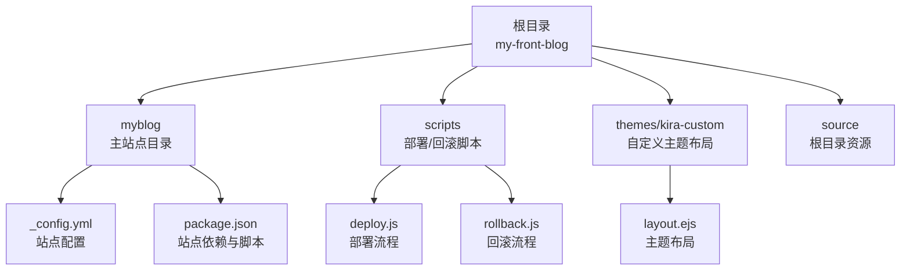
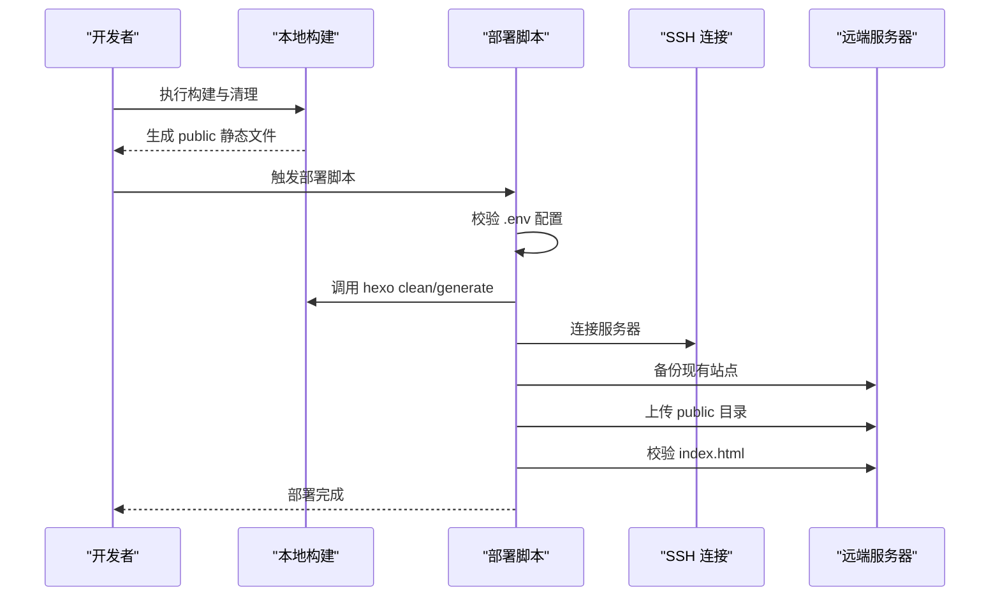
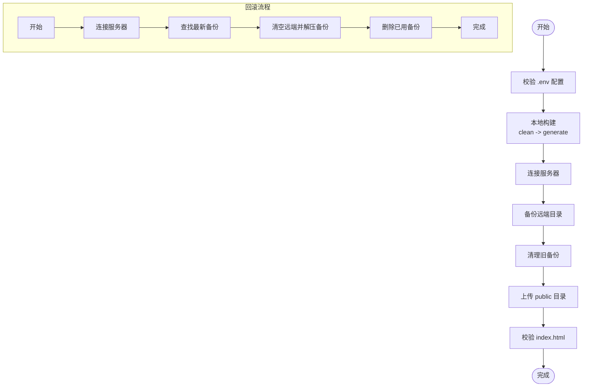
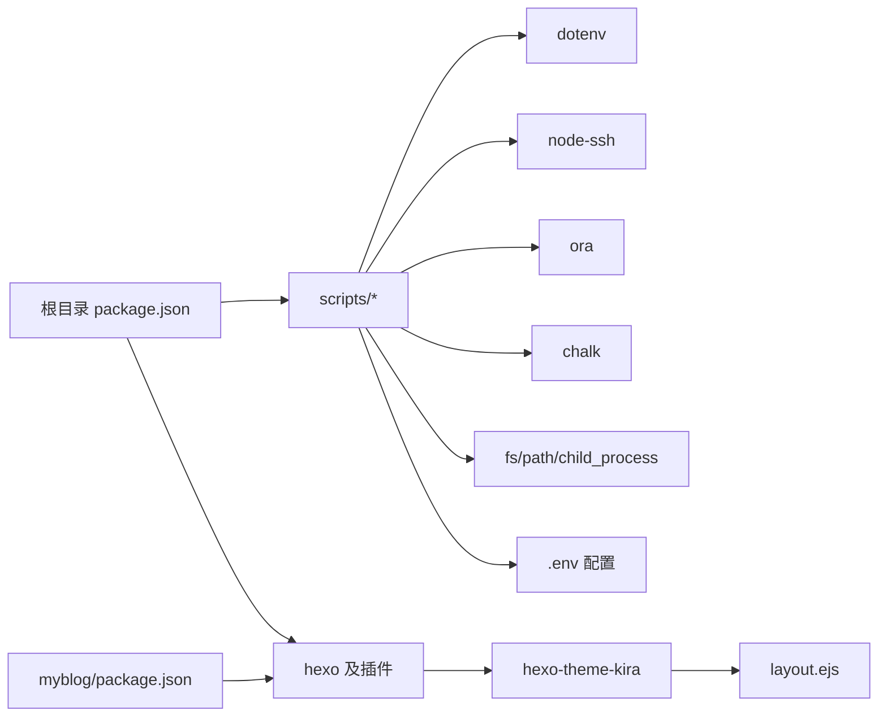

# 快速开始

<cite>
**本文引用的文件**
- [README.md](file://README.md)
- [package.json](file://package.json)
- [_config.yml](file://_config.yml)
- [.env](file://.env)
- [scripts/deploy.js](file://scripts/deploy.js)
- [scripts/rollback.js](file://scripts/rollback.js)
- [myblog/package.json](file://myblog/package.json)
- [myblog/_config.yml](file://myblog/_config.yml)
- [themes/kira-custom/layout/layout.ejs](file://themes/kira-custom/layout/layout.ejs)
</cite>

## 目录
1. [简介](#简介)
2. [项目结构](#项目结构)
3. [核心组件](#核心组件)
4. [架构总览](#架构总览)
5. [详细组件解析](#详细组件解析)
6. [依赖关系分析](#依赖关系分析)
7. [性能与可用性建议](#性能与可用性建议)
8. [故障排查指南](#故障排查指南)
9. [结论](#结论)
10. [附录](#附录)

## 简介
本指南面向首次接触 my-front-blog 的用户，带你从零开始完成环境准备、项目克隆、依赖安装、本地预览、主题布局修复、配置与部署，并提供常见问题排查方法。项目基于 Hexo 框架与 Kira 主题，内置自动化部署脚本，支持一键部署与回滚。

## 项目结构
项目采用“根目录 + 子博客目录”的组织方式：
- 根目录包含主题定制、脚本、公共资源与配置
- 子目录 myblog 作为 Hexo 主站点，包含独立的配置与依赖
- scripts 目录提供部署与回滚脚本
- themes/kira-custom 提供自定义主题布局文件

图表来源
- [README.md](file://README.md#L15-L37)
- [myblog/_config.yml](file://myblog/_config.yml#L1-L109)
- [myblog/package.json](file://myblog/package.json#L1-L27)
- [scripts/deploy.js](file://scripts/deploy.js#L1-L235)
- [scripts/rollback.js](file://scripts/rollback.js#L1-L140)
- [themes/kira-custom/layout/layout.ejs](file://themes/kira-custom/layout/layout.ejs#L1-L67)

章节来源
- [README.md](file://README.md#L15-L37)

## 核心组件
- Hexo 站点与脚本
  - 根目录 package.json 定义了构建、清理、部署、回滚与本地服务脚本
  - myblog/package.json 定义了主站点的构建与本地服务脚本
- 部署与回滚脚本
  - scripts/deploy.js：验证配置、构建站点、连接服务器、备份、上传、校验
  - scripts/rollback.js：连接服务器、查找最新备份、恢复并删除已用备份
- 配置文件
  - _config.yml：站点标题、描述、URL、分页、主题等基础配置
  - .env：服务器主机、端口、用户、认证方式与远端部署路径等
- 主题布局
  - themes/kira-custom/layout/layout.ejs：自定义主题布局与资源注入

章节来源
- [package.json](file://package.json#L1-L38)
- [myblog/package.json](file://myblog/package.json#L1-L27)
- [_config.yml](file://_config.yml#L1-L116)
- [.env](file://.env#L1-L14)
- [scripts/deploy.js](file://scripts/deploy.js#L1-L235)
- [scripts/rollback.js](file://scripts/rollback.js#L1-L140)
- [themes/kira-custom/layout/layout.ejs](file://themes/kira-custom/layout/layout.ejs#L1-L67)

## 架构总览
下图展示了从本地构建到服务器部署的整体流程，以及回滚流程的关键步骤。

图表来源
- [scripts/deploy.js](file://scripts/deploy.js#L210-L235)
- [scripts/deploy.js](file://scripts/deploy.js#L62-L85)
- [scripts/deploy.js](file://scripts/deploy.js#L103-L125)
- [scripts/deploy.js](file://scripts/deploy.js#L127-L159)
- [scripts/deploy.js](file://scripts/deploy.js#L161-L189)
- [scripts/deploy.js](file://scripts/deploy.js#L191-L208)

## 详细组件解析

### 本地开发与预览
- 环境要求
  - Node.js >= 14.x
  - Git
  - npm 或 yarn
- 安装全局 Hexo CLI
  - 在根目录执行安装命令以获得 hexo 命令
- 安装项目依赖
  - 切换到 myblog 目录后执行安装
- 重要：主题布局修复
  - 由于主题布局文件位于 node_modules 中，每次克隆后需将自定义布局复制到主题目录
- 启动本地服务
  - 在 myblog 目录执行本地服务命令，访问本地端口进行预览

章节来源
- [README.md](file://README.md#L41-L77)

### package.json 脚本命令详解
- 根目录脚本
  - build：调用 hexo generate 生成静态站点
  - clean：调用 hexo clean 清理缓存与临时文件
  - deploy：执行 scripts/deploy.js 完成自动化部署
  - back：执行 scripts/rollback.js 执行回滚
  - deploy:hexo：调用 hexo deploy（需配合部署配置）
  - server：调用 hexo server 启动本地服务
- myblog 目录脚本
  - build：调用 hexo generate
  - clean：调用 hexo clean
  - deploy：调用 hexo deploy
  - server：调用 hexo server

章节来源
- [package.json](file://package.json#L1-L38)
- [myblog/package.json](file://myblog/package.json#L1-L27)

### 配置文件与环境变量
- 站点基础配置（_config.yml）
  - 站点标题、副标题、描述、关键词、作者、语言与时区
  - URL 地址、永久链接格式、美化链接开关
  - 目录结构、分页数量、主题名称
  - Markdown 渲染与高亮配置
- 主题配置（myblog/_config.yml）
  - 站点信息与 URL 设置
  - 目录结构、分页、主题名称
  - 部署配置（type 字段留空）
- 环境变量（.env）
  - 服务器主机、端口、用户
  - 认证方式：密码或私钥路径择一
  - 远端部署目录与保留版本数

章节来源
- [_config.yml](file://_config.yml#L1-L116)
- [myblog/_config.yml](file://myblog/_config.yml#L1-L109)
- [.env](file://.env#L1-L14)

### 部署流程与回滚流程
- 部署流程（scripts/deploy.js）
  - 校验 .env 配置（主机、用户、远端路径必填；密码或私钥二选一）
  - 本地构建：hexo clean -> hexo generate
  - 连接服务器：根据 .env 使用密码或私钥登录
  - 备份：对远端目录进行打包备份
  - 清理旧备份：按 KEEP_RELEASES 保留数量清理
  - 上传：将本地 public 目录上传至远端
  - 校验：检查远端 index.html 是否存在且非空
- 回滚流程（scripts/rollback.js）
  - 连接服务器
  - 查找最新备份文件
  - 清空远端目录并解压备份覆盖
  - 删除已使用的备份文件

图表来源
- [scripts/deploy.js](file://scripts/deploy.js#L210-L235)
- [scripts/deploy.js](file://scripts/deploy.js#L62-L85)
- [scripts/deploy.js](file://scripts/deploy.js#L103-L125)
- [scripts/deploy.js](file://scripts/deploy.js#L127-L159)
- [scripts/deploy.js](file://scripts/deploy.js#L161-L189)
- [scripts/deploy.js](file://scripts/deploy.js#L191-L208)
- [scripts/rollback.js](file://scripts/rollback.js#L1-L140)

章节来源
- [scripts/deploy.js](file://scripts/deploy.js#L1-L235)
- [scripts/rollback.js](file://scripts/rollback.js#L1-L140)

### 主题布局与资源注入
- 自定义布局文件
  - themes/kira-custom/layout/layout.ejs 提供主题布局与资源注入
  - 包含样式与脚本引入、主题图标与背景、AI 助手配置注入等
- 与站点配置的关系
  - 主题配置（myblog/_config.yml）中的主题名称与相关字段会影响布局渲染
  - 若需启用 AI 助手，可在主题配置中提供相应参数并通过布局文件注入

章节来源
- [themes/kira-custom/layout/layout.ejs](file://themes/kira-custom/layout/layout.ejs#L1-L67)
- [myblog/_config.yml](file://myblog/_config.yml#L1-L109)

## 依赖关系分析
- 脚本与工具
  - scripts/deploy.js 依赖 dotenv、node-ssh、ora、chalk、child_process、fs、path
  - scripts/rollback.js 依赖 dotenv、node-ssh、ora、chalk、path
- Hexo 与主题
  - 根目录 package.json 与 myblog/package.json 均依赖 hexo 及相关渲染器与主题
- 配置与环境
  - 部署脚本读取 .env 中的服务器与部署配置
  - 站点配置由 _config.yml 与 myblog/_config.yml 共同决定

图表来源
- [package.json](file://package.json#L1-L38)
- [myblog/package.json](file://myblog/package.json#L1-L27)
- [scripts/deploy.js](file://scripts/deploy.js#L1-L20)
- [scripts/rollback.js](file://scripts/rollback.js#L1-L18)
- [themes/kira-custom/layout/layout.ejs](file://themes/kira-custom/layout/layout.ejs#L1-L67)

章节来源
- [package.json](file://package.json#L1-L38)
- [myblog/package.json](file://myblog/package.json#L1-L27)
- [scripts/deploy.js](file://scripts/deploy.js#L1-L20)
- [scripts/rollback.js](file://scripts/rollback.js#L1-L18)

## 性能与可用性建议
- 构建优化
  - 使用 hexo clean 清理缓存后再 generate，避免残留文件影响生成
  - 控制高亮与渲染器数量，减少构建时间
- 部署优化
  - 合理设置 KEEP_RELEASES，平衡存储占用与回滚需求
  - 使用私钥认证替代密码，提升安全性与稳定性
- 本地预览
  - 在 myblog 目录启动本地服务，便于快速迭代与调试

[本节为通用建议，不直接分析具体文件]

## 故障排查指南
- 端口冲突
  - 本地服务默认端口为 4000，若被占用请更换端口或关闭占用进程
- 依赖安装失败
  - 确认网络与镜像源可用，必要时切换为国内镜像
  - 清理缓存后重试安装
- 部署配置缺失
  - 检查 .env 是否包含主机、用户、远端路径；密码或私钥二选一
- SSH 连接失败
  - 确认服务器连通性与凭据正确
  - 如使用私钥，请确认路径与权限
- 构建失败
  - 执行 hexo clean 后重新 generate
  - 检查 _config.yml 与 myblog/_config.yml 的语法与字段
- 部署未生成静态文件
  - 确认本地 public 目录存在 index.html
- 回滚无备份
  - 确认远端存在 backup_*.tar.gz 文件

章节来源
- [README.md](file://README.md#L112-L147)
- [scripts/deploy.js](file://scripts/deploy.js#L22-L36)
- [scripts/rollback.js](file://scripts/rollback.js#L19-L33)

## 结论
通过本指南，你可以在本地完成环境准备、项目克隆与依赖安装，并成功启动本地预览。同时，借助内置脚本与 .env 配置，你可以一键完成部署与回滚。建议在正式部署前先在本地充分测试，并妥善维护 .env 与配置文件，以确保稳定运行。

[本节为总结性内容，不直接分析具体文件]

## 附录

### 快速命令清单（示例）
- 安装全局 Hexo CLI
  - 在根目录执行安装命令
- 安装项目依赖
  - 切换到 myblog 目录后执行安装
- 主题布局修复
  - 将自定义布局复制到主题目录
- 启动本地服务
  - 在 myblog 目录执行本地服务命令
- 执行部署
  - 在 myblog 目录执行部署脚本
- 执行回滚
  - 直接运行回滚脚本

章节来源
- [README.md](file://README.md#L47-L77)
- [README.md](file://README.md#L112-L147)