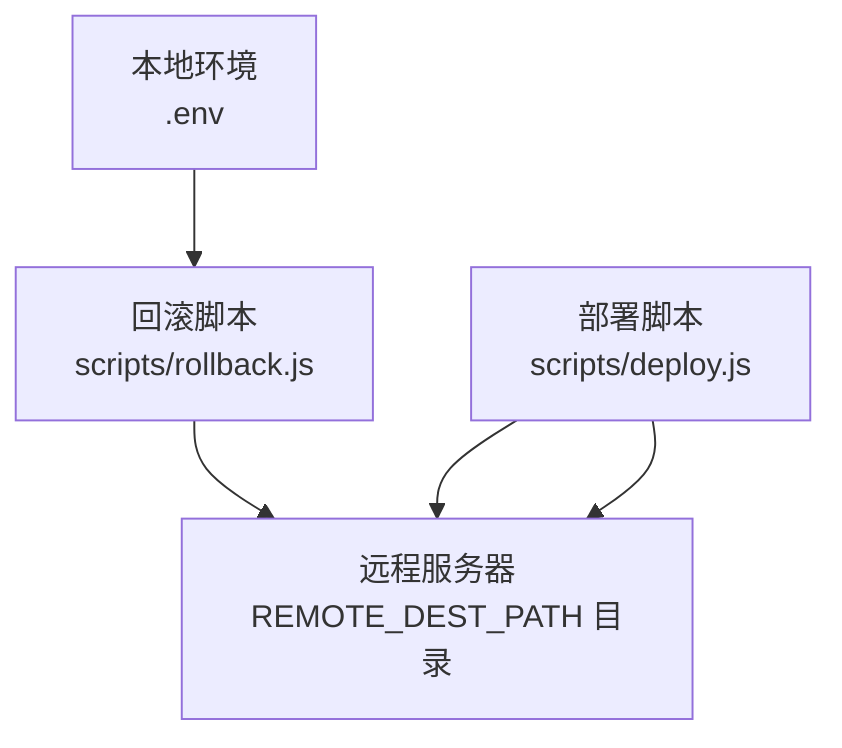
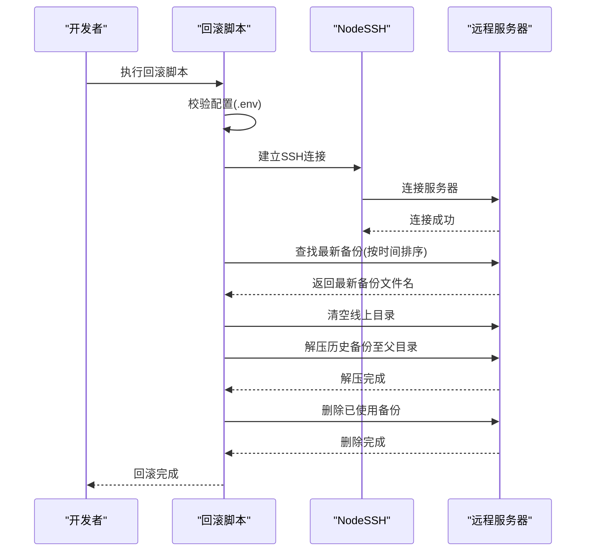
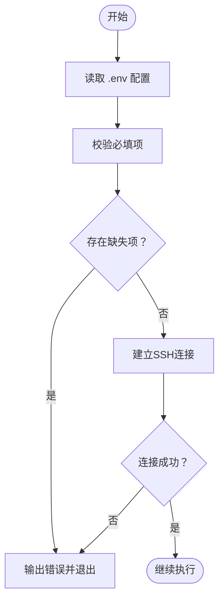
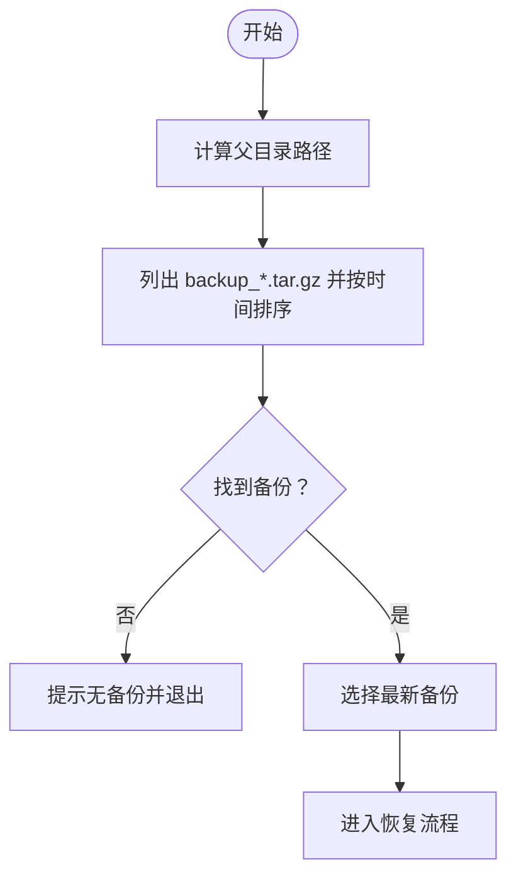
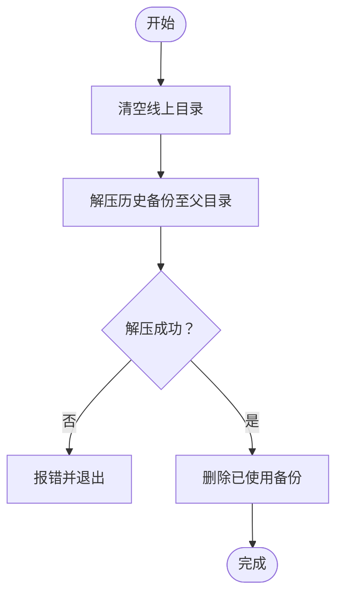
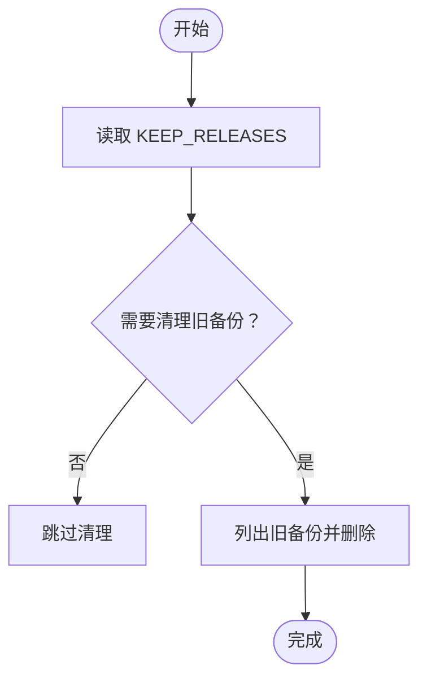
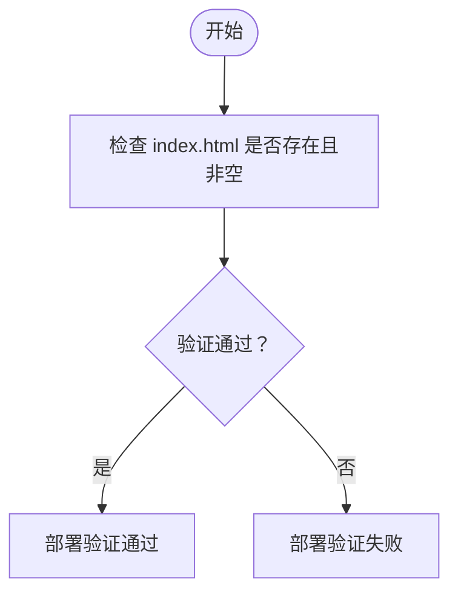
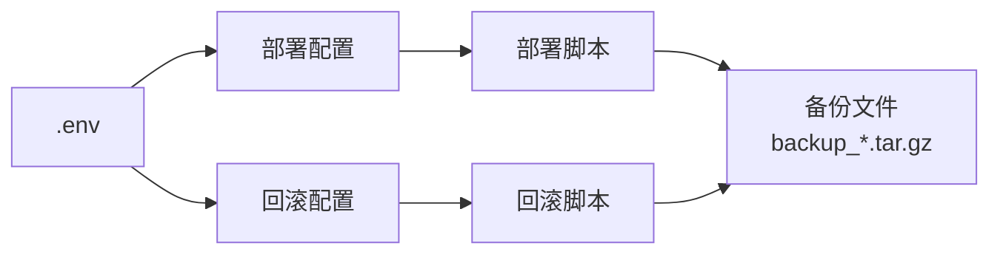

# 回滚机制

<cite>
**本文引用的文件**
- [scripts/rollback.js](file://scripts/rollback.js)
- [scripts/deploy.js](file://scripts/deploy.js)
- [.env](file://.env)
</cite>

## 目录
1. [简介](#简介)
2. [项目结构](#项目结构)
3. [核心组件](#核心组件)
4. [架构总览](#架构总览)
5. [详细组件分析](#详细组件分析)
6. [依赖关系分析](#依赖关系分析)
7. [性能考量](#性能考量)
8. [故障排查指南](#故障排查指南)
9. [结论](#结论)
10. [附录](#附录)

## 简介
本文件深入解析 rollback.js 实现的版本回滚机制，说明其如何通过 SSH 连接远程服务器、定位并选择历史备份（基于时间戳命名规则的备份文件），执行恢复流程（清空线上目录、解压历史备份、删除已使用备份），并解释 .env 中 KEEP_RELEASES 参数对备份保留数量的控制作用及手动清理过期备份的方法。同时提供异常处理策略与典型紧急回滚场景（如发布后出现严重 bug 的恢复流程）。

## 项目结构
- 回滚脚本位于 scripts/rollback.js，负责连接远程服务器并执行回滚。
- 部署脚本 scripts/deploy.js 定义了备份创建、清理旧备份、部署验证等逻辑，为回滚提供备份来源与保留策略依据。
- 环境变量配置位于 .env，包含服务器连接信息与 REMOTE_DEST_PATH、KEEP_RELEASES 等关键参数。

图表来源
- [scripts/rollback.js](file://scripts/rollback.js#L1-L139)
- [scripts/deploy.js](file://scripts/deploy.js#L1-L234)
- [.env](file://.env#L1-L14)

章节来源
- [scripts/rollback.js](file://scripts/rollback.js#L1-L139)
- [scripts/deploy.js](file://scripts/deploy.js#L1-L234)
- [.env](file://.env#L1-L14)

## 核心组件
- 配置加载与校验：从 .env 读取 SERVER_HOST、SERVER_PORT、SERVER_USER、SERVER_PASSWORD 或 SERVER_PRIVATE_KEY_PATH、REMOTE_DEST_PATH，并进行必填项校验。
- SSH 连接：使用 node-ssh 建立到远程服务器的安全连接，支持密码或私钥认证。
- 备份查找：在 REMOTE_DEST_PATH 的父目录下按时间排序查找以 backup_ 开头的 .tar.gz 文件，取最新者作为回滚目标。
- 恢复流程：清空线上目录内容，解压历史备份至父目录以重建线上目录，随后删除已使用的备份文件。
- 异常处理：连接失败、找不到备份、解压失败、删除失败等均进行错误提示并退出。

章节来源
- [scripts/rollback.js](file://scripts/rollback.js#L9-L33)
- [scripts/rollback.js](file://scripts/rollback.js#L35-L57)
- [scripts/rollback.js](file://scripts/rollback.js#L59-L121)
- [scripts/rollback.js](file://scripts/rollback.js#L123-L139)

## 架构总览
回滚脚本与部署脚本共享相同的远程路径与认证配置，回滚脚本仅负责“读取备份并恢复”，不涉及构建与上传；部署脚本负责“备份现有线上目录、清理旧备份、上传新版本、验证”。

图表来源
- [scripts/rollback.js](file://scripts/rollback.js#L9-L33)
- [scripts/rollback.js](file://scripts/rollback.js#L35-L57)
- [scripts/rollback.js](file://scripts/rollback.js#L59-L121)

## 详细组件分析

### 组件一：配置与连接
- 配置来源：从 .env 读取服务器主机、端口、用户名、认证方式（密码或私钥）、远程部署目录。
- 必填项校验：若缺少 host、username、remotePath，或同时缺少 password 和 private_key_path，则提示缺失并退出。
- SSH 连接：根据是否提供私钥路径选择不同认证方式，连接失败直接报错并退出。

图表来源
- [scripts/rollback.js](file://scripts/rollback.js#L9-L33)
- [scripts/rollback.js](file://scripts/rollback.js#L35-L57)
- [.env](file://.env#L1-L14)

章节来源
- [scripts/rollback.js](file://scripts/rollback.js#L9-L33)
- [scripts/rollback.js](file://scripts/rollback.js#L35-L57)
- [.env](file://.env#L1-L14)

### 组件二：备份查找与选择
- 备份命名规则：以 backup_ 开头、以 .tar.gz 结尾的时间戳命名文件。
- 查找策略：在 REMOTE_DEST_PATH 的父目录下按修改时间倒序列出匹配文件，取第一个作为最新备份。
- 交互式选择：当前实现直接取最新备份，未提供交互式选择界面。如需交互式选择，可在该步骤增加列表展示与用户输入处理。

图表来源
- [scripts/rollback.js](file://scripts/rollback.js#L59-L77)

章节来源
- [scripts/rollback.js](file://scripts/rollback.js#L59-L77)

### 组件三：恢复流程
- 清空线上目录：先清空 REMOTE_DEST_PATH 下的全部内容，确保线上目录完全由历史备份重建。
- 解压备份：将备份文件解压到父目录，从而重建线上目录（解压后线上目录即为备份中的目录名）。
- 删除已使用备份：恢复成功后删除该备份文件，避免占用空间。

图表来源
- [scripts/rollback.js](file://scripts/rollback.js#L86-L115)

章节来源
- [scripts/rollback.js](file://scripts/rollback.js#L86-L115)

### 组件四：KEEP_RELEASES 与备份保留
- KEEP_RELEASES 来源：部署脚本从 .env 读取 KEEP_RELEASES，默认值为 5。
- 清理策略：部署脚本在备份与上传之间执行清理，保留最近 N 个备份，其余删除。
- 回滚影响：回滚脚本不参与 KEEP_RELEASES 的清理逻辑，但会从父目录查找最新备份用于恢复。

图表来源
- [scripts/deploy.js](file://scripts/deploy.js#L87-L101)
- [.env](file://.env#L11-L14)

章节来源
- [scripts/deploy.js](file://scripts/deploy.js#L87-L101)
- [.env](file://.env#L11-L14)

### 组件五：健康检查与站点可用性
- 部署脚本提供健康检查：验证线上 index.html 是否存在且非空。
- 回滚脚本未内置健康检查：建议在回滚完成后手动或自动化地进行健康检查，确认站点可访问。

图表来源
- [scripts/deploy.js](file://scripts/deploy.js#L191-L208)

章节来源
- [scripts/deploy.js](file://scripts/deploy.js#L191-L208)

## 依赖关系分析
- 共享配置：回滚脚本与部署脚本共享 REMOTE_DEST_PATH 与认证配置，确保两者对同一远程目录进行操作。
- 备份来源：回滚脚本依赖部署脚本创建的 backup_*.tar.gz 文件；KEEP_RELEASES 控制备份数量，间接影响回滚可用性。
- 认证方式：两者均可使用密码或私钥认证，但回滚脚本未实现交互式选择目标版本，仅取最新备份。

图表来源
- [scripts/rollback.js](file://scripts/rollback.js#L9-L17)
- [scripts/deploy.js](file://scripts/deploy.js#L11-L20)
- [.env](file://.env#L1-L14)

章节来源
- [scripts/rollback.js](file://scripts/rollback.js#L9-L17)
- [scripts/deploy.js](file://scripts/deploy.js#L11-L20)
- [.env](file://.env#L1-L14)

## 性能考量
- 备份体积：较大的备份文件会增加解压与网络传输时间，建议定期清理过期备份以控制空间。
- 清理策略：KEEP_RELEASES 默认 5，可根据磁盘空间与恢复频率调整；部署脚本提供自动清理逻辑。
- 网络与并发：回滚脚本主要执行命令与文件操作，性能瓶颈通常在磁盘 I/O 与网络带宽上。

[本节为通用指导，无需特定文件引用]

## 故障排查指南
- 连接失败
  - 检查 .env 中 SERVER_HOST、SERVER_PORT、SERVER_USER、SERVER_PASSWORD 或 SERVER_PRIVATE_KEY_PATH 是否正确。
  - 确认服务器可达且 SSH 端口开放。
- 找不到备份
  - 确认 REMOTE_DEST_PATH 父目录下存在以 backup_ 开头的 .tar.gz 文件。
  - 若无备份，需先执行部署脚本完成一次备份。
- 解压失败
  - 检查备份文件完整性；若损坏，尝试使用更早的备份或手动恢复。
- 删除失败
  - 检查权限与磁盘空间；必要时手动登录服务器删除。
- 健康检查失败
  - 回滚后手动验证站点可用性，或在部署脚本基础上扩展健康检查逻辑。

章节来源
- [scripts/rollback.js](file://scripts/rollback.js#L35-L57)
- [scripts/rollback.js](file://scripts/rollback.js#L59-L121)
- [scripts/deploy.js](file://scripts/deploy.js#L191-L208)

## 结论
rollback.js 提供了简洁高效的回滚能力：通过 SSH 连接远程服务器，定位最新备份并将其解压覆盖线上目录，最后删除已使用备份。KEEP_RELEASES 由部署脚本控制备份保留数量，回滚脚本不参与清理逻辑。建议在回滚后补充健康检查，确保站点可用；如需交互式选择目标版本，可在备份查找阶段增加列表与用户输入处理。

[本节为总结，无需特定文件引用]

## 附录

### 典型用例：发布后出现严重 bug 的紧急恢复流程
- 步骤
  1) 确认问题严重程度并决定回滚。
  2) 执行回滚脚本，自动选择最新备份并恢复。
  3) 手动或自动化进行健康检查，确认站点可访问。
  4) 如需保留更多历史版本，调整 .env 中 KEEP_RELEASES 并重新部署以清理过期备份。
- 注意事项
  - 回滚前尽量记录问题现象与发生时间，便于后续定位。
  - 回滚后尽快修复问题并重新发布，避免长期停留在旧版本。

章节来源
- [scripts/rollback.js](file://scripts/rollback.js#L59-L121)
- [scripts/deploy.js](file://scripts/deploy.js#L87-L101)
- [.env](file://.env#L11-L14)