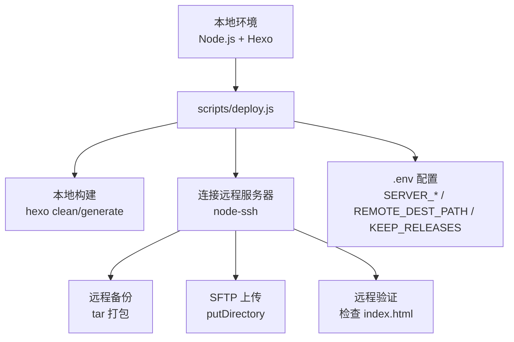
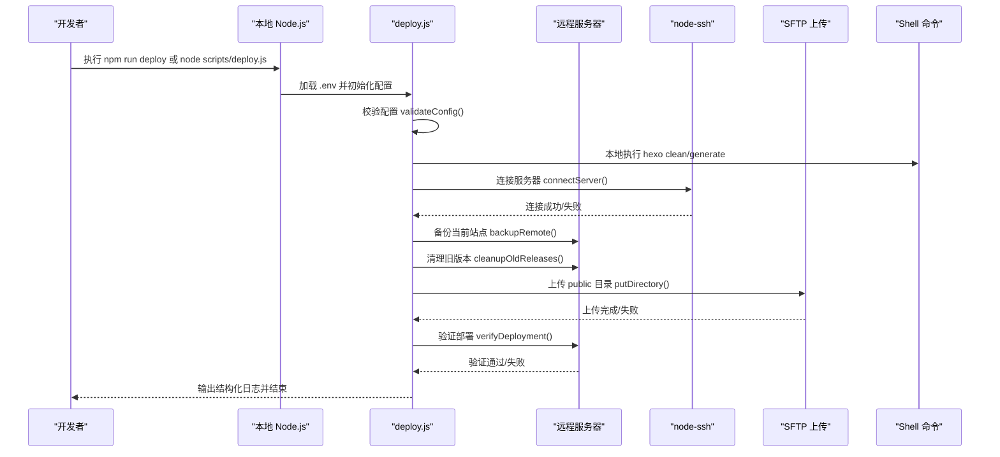
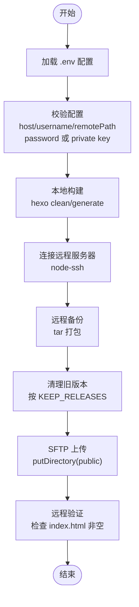
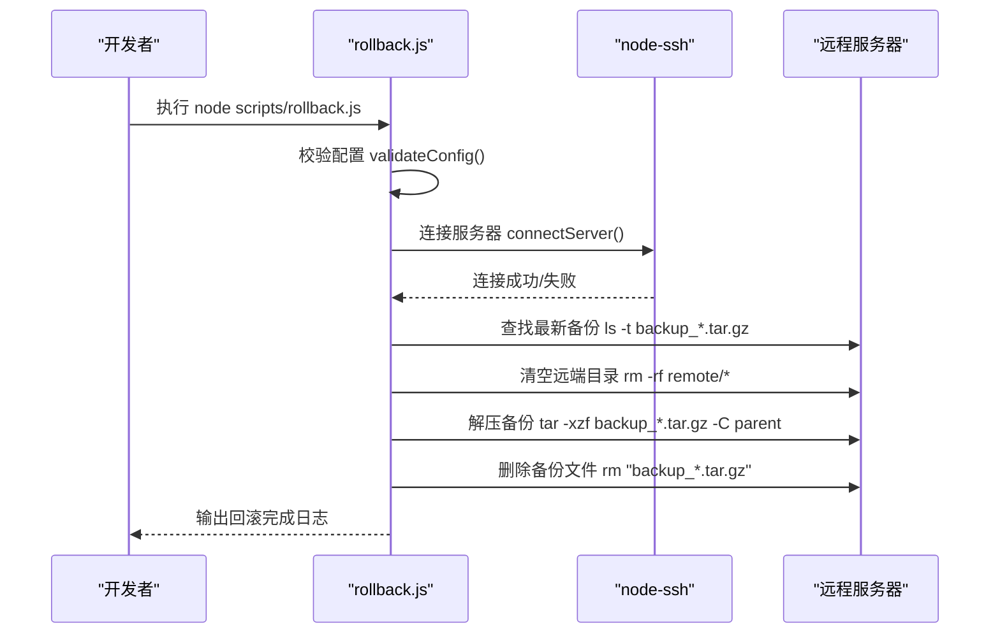
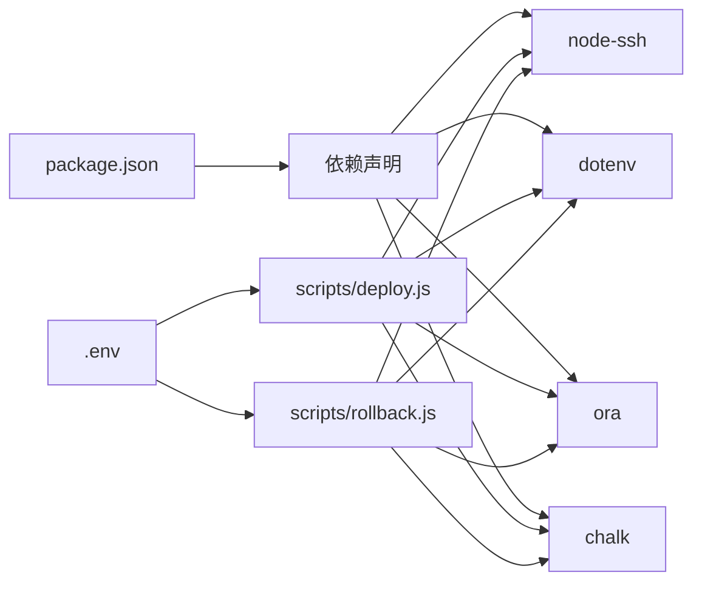

# 自动化部署

<cite>
**本文引用的文件**
- [scripts/deploy.js](file://scripts/deploy.js)
- [scripts/rollback.js](file://scripts/rollback.js)
- [.env](file://.env)
- [package.json](file://package.json)
- [README.md](file://README.md)
</cite>

## 目录
1. [简介](#简介)
2. [项目结构](#项目结构)
3. [核心组件](#核心组件)
4. [架构总览](#架构总览)
5. [详细组件分析](#详细组件分析)
6. [依赖关系分析](#依赖关系分析)
7. [性能考虑](#性能考虑)
8. [故障排查指南](#故障排查指南)
9. [结论](#结论)
10. [附录](#附录)

## 简介
本文件面向自动化部署场景，聚焦 scripts/deploy.js 的完整执行流程，说明其如何通过 node-ssh 连接远程服务器，读取 .env 中的 SERVER_HOST、SERVER_USER、SERVER_PASSWORD 或 SERVER_PRIVATE_KEY_PATH 等配置项建立安全连接；并详细拆解部署关键步骤：生成静态文件（hexo generate）、压缩打包与传输、在远程服务器上备份当前站点（按日期时间戳命名）、通过 SFTP 上传新构建的 public 目录内容、执行远程验证命令确认服务正常运行。同时提供结构化日志输出示例路径与最佳实践建议，包括使用 SSH 密钥认证提升安全性、合理设置 KEEP_RELEASES 以避免磁盘溢出。

## 项目结构
- 根目录包含博客源码、主题、脚本与配置文件。scripts/deploy.js 为部署入口，scripts/rollback.js 提供回滚能力，.env 存放部署所需环境变量，package.json 提供 npm 脚本入口。
- 部署流程涉及本地构建与远程备份/上传/验证，均通过 node-ssh 与 shell 命令完成。

图表来源
- [scripts/deploy.js](file://scripts/deploy.js#L1-L235)
- [.env](file://.env#L1-L14)
- [package.json](file://package.json#L1-L38)

章节来源
- [scripts/deploy.js](file://scripts/deploy.js#L1-L235)
- [.env](file://.env#L1-L14)
- [package.json](file://package.json#L1-L38)

## 核心组件
- 部署脚本 deploy.js
  - 读取 .env 并校验必要配置项（主机、用户、远端路径、密码或私钥）
  - 本地构建：调用 hexo clean 与 hexo generate，并校验 public/index.html 是否存在
  - 远程连接：根据是否提供私钥路径选择密钥或密码认证
  - 远程备份：若远端目录存在则打包为 backup_时间戳.tar.gz，否则创建目标目录
  - 清理旧版本：按 KEEP_RELEASES 限制保留数量
  - 上传文件：使用 putDirectory 递归上传 public 目录，过滤隐藏文件与 node_modules
  - 验证部署：检查远端 index.html 是否非空
  - 结束：释放 SSH 连接并输出成功日志
- 回滚脚本 rollback.js
  - 读取 .env 并校验配置
  - 连接远程服务器
  - 查找最新 backup_*.tar.gz 并解压覆盖，随后删除该备份文件

章节来源
- [scripts/deploy.js](file://scripts/deploy.js#L1-L235)
- [scripts/rollback.js](file://scripts/rollback.js#L1-L140)
- [.env](file://.env#L1-L14)

## 架构总览
下图展示了从本地到远程服务器的部署全链路，包括本地构建、远程备份、清理旧版本、上传与验证。

图表来源
- [scripts/deploy.js](file://scripts/deploy.js#L1-L235)
- [.env](file://.env#L1-L14)

## 详细组件分析

### 部署脚本执行流程（deploy.js）
- 配置加载与校验
  - 从 .env 读取 SERVER_HOST、SERVER_PORT、SERVER_USER、SERVER_PASSWORD、SERVER_PRIVATE_KEY_PATH、REMOTE_DEST_PATH、KEEP_RELEASES
  - 校验 host、username、remotePath 必填；且必须提供 password 或 privateKeyPath 其一
- 本地构建
  - 使用子进程调用 npx hexo clean 与 npx hexo generate
  - 构建完成后检查 public/index.html 是否存在
- 远程连接
  - 依据是否存在 SERVER_PRIVATE_KEY_PATH 决定使用私钥路径或密码进行认证
  - 连接失败时输出错误并退出
- 远程备份
  - 若远端目录存在，则打包为 backup_时间戳.tar.gz；否则先创建目录
  - 备份命令通过 execCommand 在远程执行
- 清理旧版本
  - 通过 ls -tp 排序并 tail -n +N+1 删除超出 KEEP_RELEASES 数量的旧备份
- 上传文件
  - 使用 putDirectory 递归上传 public 目录，过滤隐藏文件与 node_modules
  - 上传失败时输出错误并退出
- 部署验证
  - 通过 execCommand 检查远端 index.html 是否非空，作为部署成功的简单验证
- 日志输出
  - 使用 ora 显示进度与状态，chalk 输出彩色日志，便于追踪部署状态

图表来源
- [scripts/deploy.js](file://scripts/deploy.js#L1-L235)
- [.env](file://.env#L1-L14)

章节来源
- [scripts/deploy.js](file://scripts/deploy.js#L1-L235)
- [.env](file://.env#L1-L14)

### SSH 连接与认证配置
- 认证方式
  - 若提供 SERVER_PRIVATE_KEY_PATH，则使用私钥路径进行认证
  - 否则使用 SERVER_PASSWORD 进行密码认证
- 连接参数
  - 包含 host、port、username，以及上述二选一的认证字段
- 错误处理
  - 连接失败时输出失败提示并退出进程

章节来源
- [scripts/deploy.js](file://scripts/deploy.js#L103-L125)
- [.env](file://.env#L1-L14)

### 备份与清理策略
- 备份
  - 若远端目录存在，使用 tar -czf 打包为 backup_时间戳.tar.gz，并放置于父目录
  - 若不存在，先创建目标目录
- 清理旧版本
  - 通过 ls -tp 获取按时间排序的备份列表，使用 tail -n +N+1 保留最近 N 个，其余删除
  - 该步骤为非关键步骤，失败仅记录警告

章节来源
- [scripts/deploy.js](file://scripts/deploy.js#L127-L159)
- [scripts/deploy.js](file://scripts/deploy.js#L87-L101)

### 文件上传与过滤
- 上传范围
  - 上传本地 public 目录至远端 REMOTE_DEST_PATH
- 过滤规则
  - 忽略以 . 开头的隐藏文件
  - 忽略 node_modules 目录
- 并发与进度
  - 使用 putDirectory 的并发参数控制上传速度与稳定性
  - 未实现细粒度进度回调，但可通过日志观察整体进度

章节来源
- [scripts/deploy.js](file://scripts/deploy.js#L161-L189)

### 部署验证
- 验证方式
  - 通过 execCommand 检查远端 index.html 是否非空
- 失败处理
  - 验证失败时输出失败提示，不自动回滚（可在后续版本扩展）

章节来源
- [scripts/deploy.js](file://scripts/deploy.js#L191-L208)

### 回滚脚本（rollback.js）
- 连接与配置
  - 与部署脚本复用相同的配置读取与校验逻辑
- 回滚流程
  - 查找最新 backup_*.tar.gz
  - 先清空远端目录内容，再解压备份覆盖
  - 成功后删除已使用的备份文件
- 错误处理
  - 未找到备份时直接退出；解压失败时输出错误并退出

图表来源
- [scripts/rollback.js](file://scripts/rollback.js#L1-L140)

章节来源
- [scripts/rollback.js](file://scripts/rollback.js#L1-L140)

## 依赖关系分析
- 外部依赖
  - node-ssh：用于 SSH 连接与远程命令执行
  - dotenv：加载 .env 环境变量
  - ora/chalk：提供进度与彩色日志输出
  - child_process/spawn：用于本地执行 hexo 命令
- 内部依赖
  - deploy.js 与 rollback.js 共享相同的 .env 配置读取与校验逻辑
  - 两者均依赖 node-ssh 与 path/posix 处理远程路径

图表来源
- [package.json](file://package.json#L1-L38)
- [scripts/deploy.js](file://scripts/deploy.js#L1-L235)
- [scripts/rollback.js](file://scripts/rollback.js#L1-L140)
- [.env](file://.env#L1-L14)

章节来源
- [package.json](file://package.json#L1-L38)
- [scripts/deploy.js](file://scripts/deploy.js#L1-L235)
- [scripts/rollback.js](file://scripts/rollback.js#L1-L140)
- [.env](file://.env#L1-L14)

## 性能考虑
- 上传并发
  - putDirectory 支持并发参数，可根据网络与服务器性能调整以平衡速度与稳定性
- 本地构建
  - hexo clean/generate 会扫描与渲染大量文件，建议在 CI 环境中缓存依赖与构建产物
- 备份与清理
  - tar 打包与删除操作在远程执行，注意磁盘空间与 IO 压力；KEEP_RELEASES 应结合磁盘容量设定
- 日志与可观测性
  - ora 与 chalk 提供良好的终端反馈；建议在 CI 中将日志重定向到文件以便审计

## 故障排查指南
- 配置缺失
  - 现象：启动即报错并退出
  - 排查：确认 .env 中 SERVER_HOST、SERVER_USER、REMOTE_DEST_PATH、SERVER_PASSWORD 或 SERVER_PRIVATE_KEY_PATH 是否齐全
- 连接失败
  - 现象：连接阶段失败
  - 排查：核对 SERVER_HOST、SERVER_PORT、SERVER_USER；若使用私钥，请确认路径正确且权限合适；若使用密码，请确认密码正确
- 本地构建失败
  - 现象：构建阶段报错并退出
  - 排查：查看 hexo clean/generate 的输出；确保 Hexo CLI 已安装且版本满足要求
- 上传失败
  - 现象：上传阶段失败
  - 排查：检查远端 REMOTE_DEST_PATH 权限；确认本地 public 目录存在且包含有效文件
- 验证失败
  - 现象：验证阶段失败
  - 排查：确认远端 index.html 是否存在且非空；检查上传是否完整
- 回滚失败
  - 现象：回滚阶段失败
  - 排查：确认存在 backup_*.tar.gz；检查解压命令与权限；确认备份文件未被意外删除

章节来源
- [scripts/deploy.js](file://scripts/deploy.js#L22-L36)
- [scripts/deploy.js](file://scripts/deploy.js#L103-L125)
- [scripts/deploy.js](file://scripts/deploy.js#L161-L189)
- [scripts/deploy.js](file://scripts/deploy.js#L191-L208)
- [scripts/rollback.js](file://scripts/rollback.js#L19-L33)
- [scripts/rollback.js](file://scripts/rollback.js#L35-L57)
- [scripts/rollback.js](file://scripts/rollback.js#L59-L121)

## 结论
本自动化部署脚本通过 node-ssh 实现了从本地构建到远程部署的完整闭环，具备清晰的配置校验、备份与清理、上传与验证机制。配合 .env 的集中配置与结构化日志输出，能够快速定位问题并保障部署的可靠性。建议在生产环境中优先采用 SSH 私钥认证，并合理设置 KEEP_RELEASES 以避免磁盘压力。

## 附录

### 部署前准备清单
- 准备 .env 文件，至少包含以下键值：
  - SERVER_HOST：服务器地址
  - SERVER_PORT：SSH 端口（默认 22）
  - SERVER_USER：登录用户名
  - SERVER_PASSWORD 或 SERVER_PRIVATE_KEY_PATH：二选一
  - REMOTE_DEST_PATH：远端部署目录
  - KEEP_RELEASES：保留的备份数量（可选，默认 5）
- 确保远端服务器具备：
  - 可写入的 REMOTE_DEST_PATH 目录
  - tar 命令可用
  - 足够磁盘空间
- 本地环境：
  - Node.js 与 npm/yarn
  - 已安装 Hexo CLI
  - 已安装项目依赖（npm install）

章节来源
- [.env](file://.env#L1-L14)
- [package.json](file://package.json#L1-L38)
- [README.md](file://README.md#L108-L147)

### 最佳实践
- 使用 SSH 私钥认证
  - 在 .env 中设置 SERVER_PRIVATE_KEY_PATH，并确保私钥文件权限正确
  - 服务器端配置 authorized_keys，避免使用弱密码
- 合理设置 KEEP_RELEASES
  - 根据磁盘容量与发布频率设定，避免备份过多导致磁盘溢出
- 优化上传性能
  - 在 putDirectory 中适当调整并发参数，平衡速度与稳定性
- 增强可观测性
  - 在 CI 中收集日志并保存到 artifacts，便于审计与回溯
- 自动化回滚
  - 当验证失败时，可结合 rollback.js 实现自动回滚，减少停机时间

章节来源
- [scripts/deploy.js](file://scripts/deploy.js#L1-L235)
- [scripts/rollback.js](file://scripts/rollback.js#L1-L140)