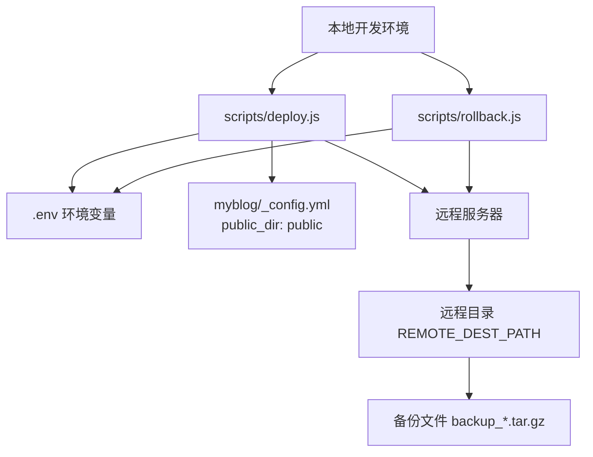
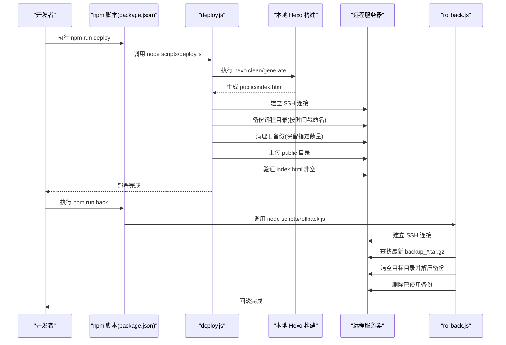
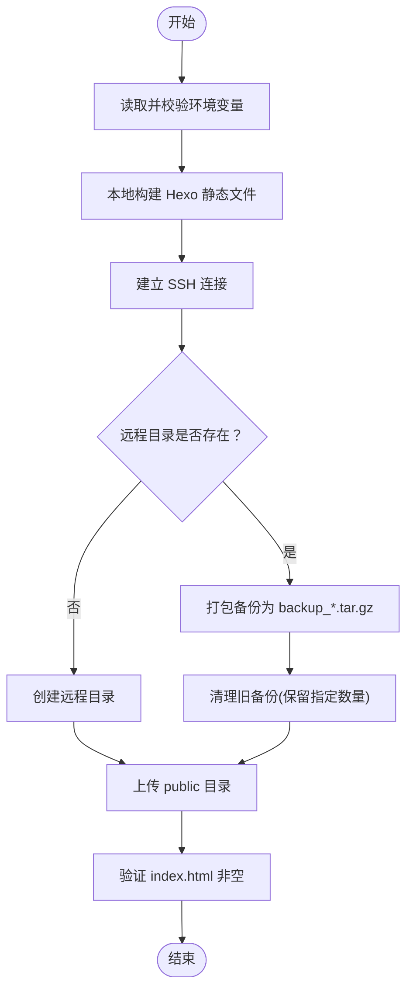
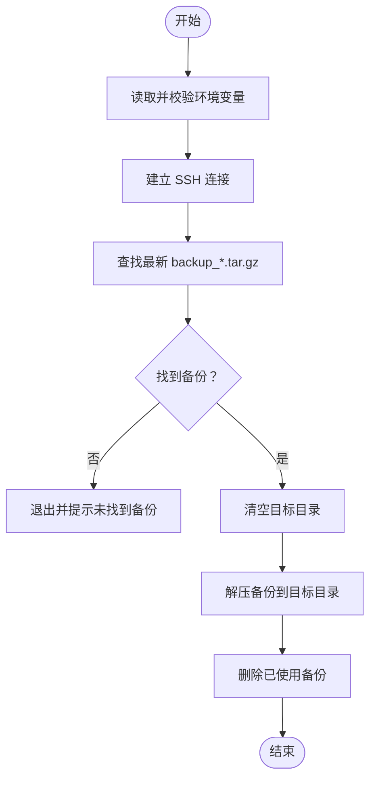
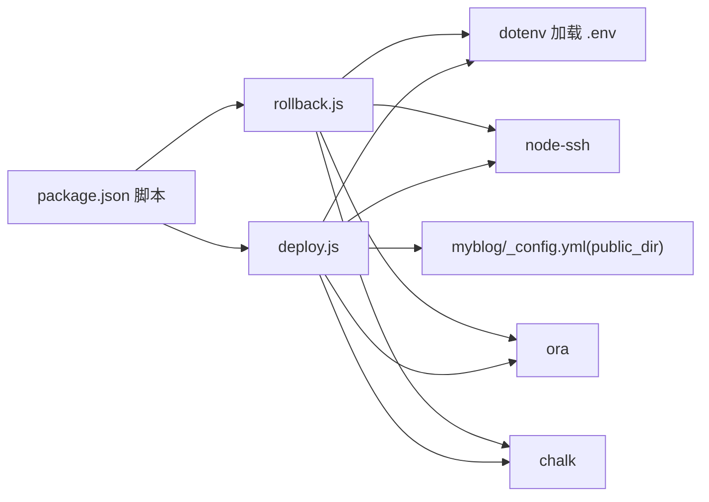

# 部署系统

<cite>
**本文引用的文件**
- [scripts/deploy.js](file://scripts/deploy.js)
- [scripts/rollback.js](file://scripts/rollback.js)
- [.env](file://.env)
- [package.json](file://package.json)
- [README.md](file://README.md)
- [myblog/_config.yml](file://myblog/_config.yml)
- [_config.yml](file://_config.yml)
- [myblog/_config.kira.yml](file://myblog/_config.kira.yml)
</cite>

## 目录
1. [简介](#简介)
2. [项目结构](#项目结构)
3. [核心组件](#核心组件)
4. [架构总览](#架构总览)
5. [详细组件分析](#详细组件分析)
6. [依赖关系分析](#依赖关系分析)
7. [性能考量](#性能考量)
8. [故障排除指南](#故障排除指南)
9. [结论](#结论)
10. [附录](#附录)

## 简介
本部署系统围绕 Hexo 静态站点生成器，提供自动化部署与版本回滚能力。核心流程包括：
- 本地构建静态文件
- 远程备份现有站点
- 上传新生成的静态文件
- 部署验证
- 回滚到最近一次备份

系统通过 Node.js 脚本结合 SSH 连接远程服务器，使用 tar 归档备份，支持 SSH 密钥或密码认证，并通过环境变量集中配置服务器参数。

## 项目结构
- scripts/deploy.js：自动化部署主脚本，负责构建、备份、上传与验证
- scripts/rollback.js：版本回滚脚本，负责查找并恢复最近一次备份
- .env：环境变量配置文件，包含服务器地址、端口、用户、认证方式与远程目录等
- package.json：定义 npm 脚本入口，便于一键执行部署与回滚
- README.md：部署与回滚操作说明
- myblog/_config.yml 与 _config.yml：Hexo 配置，决定构建输出目录等
- myblog/_config.kira.yml：主题配置，影响站点外观与功能

图表来源
- [scripts/deploy.js](file://scripts/deploy.js#L1-L235)
- [scripts/rollback.js](file://scripts/rollback.js#L1-L140)
- [.env](file://.env#L1-L14)
- [myblog/_config.yml](file://myblog/_config.yml#L23-L33)

章节来源
- [package.json](file://package.json#L5-L12)
- [README.md](file://README.md#L108-L147)

## 核心组件
- 部署脚本（deploy.js）
  - 读取环境变量并校验必要配置
  - 本地构建静态文件（调用 Hexo 命令）
  - 连接远程服务器（支持 SSH 密钥或密码）
  - 备份远程目录（按时间戳命名）
  - 清理旧备份（保留指定数量）
  - 上传新静态文件（排除隐藏文件与 node_modules）
  - 部署验证（检查 index.html 是否存在且非空）
- 回滚脚本（rollback.js）
  - 读取环境变量并校验必要配置
  - 连接远程服务器
  - 查找最新备份文件
  - 清空目标目录并解压备份恢复
  - 删除已使用的备份文件
- 环境变量（.env）
  - 服务器主机、端口、用户名
  - 认证方式：密码或私钥路径
  - 远程部署目录与保留备份数量
- npm 脚本（package.json）
  - 提供一键执行部署与回滚的命令入口

章节来源
- [scripts/deploy.js](file://scripts/deploy.js#L12-L20)
- [scripts/deploy.js](file://scripts/deploy.js#L22-L36)
- [scripts/deploy.js](file://scripts/deploy.js#L62-L85)
- [scripts/deploy.js](file://scripts/deploy.js#L103-L125)
- [scripts/deploy.js](file://scripts/deploy.js#L127-L159)
- [scripts/deploy.js](file://scripts/deploy.js#L161-L189)
- [scripts/deploy.js](file://scripts/deploy.js#L191-L208)
- [scripts/rollback.js](file://scripts/rollback.js#L9-L18)
- [scripts/rollback.js](file://scripts/rollback.js#L19-L33)
- [scripts/rollback.js](file://scripts/rollback.js#L35-L57)
- [scripts/rollback.js](file://scripts/rollback.js#L59-L121)
- [.env](file://.env#L1-L14)
- [package.json](file://package.json#L5-L12)

## 架构总览
下图展示部署与回滚的整体交互流程，包括本地构建、远程备份、上传与验证，以及回滚时的备份查找与恢复。

图表来源
- [package.json](file://package.json#L5-L12)
- [scripts/deploy.js](file://scripts/deploy.js#L62-L85)
- [scripts/deploy.js](file://scripts/deploy.js#L103-L125)
- [scripts/deploy.js](file://scripts/deploy.js#L127-L159)
- [scripts/deploy.js](file://scripts/deploy.js#L161-L189)
- [scripts/deploy.js](file://scripts/deploy.js#L191-L208)
- [scripts/rollback.js](file://scripts/rollback.js#L35-L57)
- [scripts/rollback.js](file://scripts/rollback.js#L59-L121)

## 详细组件分析

### 部署脚本（deploy.js）执行逻辑
- 环境变量读取与校验
  - 从进程环境读取服务器主机、端口、用户名、密码或私钥路径、远程目录与保留备份数
  - 校验必填项：主机、用户名、远程目录；认证方式必须提供密码或私钥路径之一
- 本地构建
  - 调用 Hexo 命令清理与生成，确保 public/index.html 存在
- 连接远程服务器
  - 使用 SSH 密钥或密码建立连接
- 远程备份
  - 若远程目录存在则打包为 backup_时间戳.tar.gz 并保存在父目录
  - 若不存在则先创建目录
- 清理旧备份
  - 仅在配置保留数量大于 0 时执行，按时间排序删除超出保留数的旧备份
- 上传新文件
  - 递归上传 public 目录，忽略隐藏文件与 node_modules
- 部署验证
  - 检查远程 index.html 是否存在且非空
- 结束
  - 释放 SSH 连接，输出成功提示

图表来源
- [scripts/deploy.js](file://scripts/deploy.js#L12-L20)
- [scripts/deploy.js](file://scripts/deploy.js#L22-L36)
- [scripts/deploy.js](file://scripts/deploy.js#L62-L85)
- [scripts/deploy.js](file://scripts/deploy.js#L103-L125)
- [scripts/deploy.js](file://scripts/deploy.js#L127-L159)
- [scripts/deploy.js](file://scripts/deploy.js#L161-L189)
- [scripts/deploy.js](file://scripts/deploy.js#L191-L208)

章节来源
- [scripts/deploy.js](file://scripts/deploy.js#L12-L20)
- [scripts/deploy.js](file://scripts/deploy.js#L22-L36)
- [scripts/deploy.js](file://scripts/deploy.js#L62-L85)
- [scripts/deploy.js](file://scripts/deploy.js#L103-L125)
- [scripts/deploy.js](file://scripts/deploy.js#L127-L159)
- [scripts/deploy.js](file://scripts/deploy.js#L161-L189)
- [scripts/deploy.js](file://scripts/deploy.js#L191-L208)

### 回滚脚本（rollback.js）执行逻辑
- 环境变量读取与校验
  - 与部署脚本相同的配置读取与校验逻辑
- 连接远程服务器
  - 使用 SSH 密钥或密码建立连接
- 查找最新备份
  - 通过时间排序列出 backup_*.tar.gz，取最新一个
- 恢复
  - 先清空目标目录，再解压备份恢复
  - 删除已使用的备份文件
- 结束
  - 释放 SSH 连接，输出成功提示

图表来源
- [scripts/rollback.js](file://scripts/rollback.js#L9-L18)
- [scripts/rollback.js](file://scripts/rollback.js#L19-L33)
- [scripts/rollback.js](file://scripts/rollback.js#L35-L57)
- [scripts/rollback.js](file://scripts/rollback.js#L59-L121)

章节来源
- [scripts/rollback.js](file://scripts/rollback.js#L9-L18)
- [scripts/rollback.js](file://scripts/rollback.js#L19-L33)
- [scripts/rollback.js](file://scripts/rollback.js#L35-L57)
- [scripts/rollback.js](file://scripts/rollback.js#L59-L121)

### .env 环境变量配置说明
- 服务器配置
  - SERVER_HOST：远程服务器 IP 或域名
  - SERVER_PORT：SSH 端口，默认 22
  - SERVER_USER：登录用户名
  - SERVER_PASSWORD：登录密码（二选一）
  - SERVER_PRIVATE_KEY_PATH：私钥文件路径（二选一）
- 部署配置
  - REMOTE_DEST_PATH：远程部署目录
  - KEEP_RELEASES：保留的备份数量（可选）

章节来源
- [.env](file://.env#L1-L14)

### npm 脚本与命令入口
- package.json 中定义了部署与回滚的 npm 脚本入口，便于一键执行
- README.md 提供了部署与回滚的使用说明

章节来源
- [package.json](file://package.json#L5-L12)
- [README.md](file://README.md#L108-L147)

## 依赖关系分析
- 部署脚本依赖
  - node-ssh：用于 SSH 连接与远程命令执行
  - dotenv：加载 .env 环境变量
  - ora：进度与状态提示
  - chalk：彩色日志输出
  - child_process/spawn：调用 Hexo 命令
- 回滚脚本依赖
  - 与部署脚本相同的依赖，用于 SSH 连接、环境变量加载、进度提示与日志输出
- Hexo 构建依赖
  - myblog/_config.yml 指定 public_dir 为 public，因此构建产物位于 public 目录
- 配置文件
  - _config.yml 与 myblog/_config.kira.yml 控制站点行为与主题配置

图表来源
- [package.json](file://package.json#L5-L12)
- [scripts/deploy.js](file://scripts/deploy.js#L1-L10)
- [scripts/rollback.js](file://scripts/rollback.js#L1-L6)
- [myblog/_config.yml](file://myblog/_config.yml#L23-L33)

章节来源
- [package.json](file://package.json#L16-L36)
- [scripts/deploy.js](file://scripts/deploy.js#L1-L10)
- [scripts/rollback.js](file://scripts/rollback.js#L1-L6)
- [myblog/_config.yml](file://myblog/_config.yml#L23-L33)

## 性能考量
- 上传并发与过滤
  - 上传时使用并发控制与过滤规则，避免传输不必要的文件（如隐藏文件与 node_modules），有助于提升上传速度
- 备份与清理
  - 仅在配置保留数量大于 0 时清理旧备份，减少远程 IO 开销
- 日志与进度
  - 使用 ora 提供进度提示，便于观察部署阶段与耗时

章节来源
- [scripts/deploy.js](file://scripts/deploy.js#L161-L189)
- [scripts/deploy.js](file://scripts/deploy.js#L87-L101)

## 故障排除指南
- 连接失败
  - 检查 SERVER_HOST、SERVER_PORT、SERVER_USER 是否正确
  - 若使用密码认证，确认 SERVER_PASSWORD 正确；若使用私钥认证，确认 SERVER_PRIVATE_KEY_PATH 指向有效私钥文件
  - 确认服务器 SSH 端口开放且防火墙允许访问
- 权限不足
  - 确认远程用户对 REMOTE_DEST_PATH 具有写入权限
  - 如需 sudo，请在服务器侧配置免密 sudo 或使用具备相应权限的账户
- 构建失败
  - 本地执行 hexo clean 与 hexo generate，确认 public/index.html 生成
  - 检查 myblog/_config.yml 与 _config.yml 的配置是否正确
- 备份或上传失败
  - 确认远程目录存在或脚本已创建
  - 检查磁盘空间与网络稳定性
- 验证失败
  - 确认远程 index.html 存在且非空
  - 如需回滚，使用回滚脚本恢复到最近一次备份
- 回滚失败
  - 确认存在 backup_*.tar.gz 备份文件
  - 检查解压命令与目录权限

章节来源
- [scripts/deploy.js](file://scripts/deploy.js#L103-L125)
- [scripts/deploy.js](file://scripts/deploy.js#L127-L159)
- [scripts/deploy.js](file://scripts/deploy.js#L161-L189)
- [scripts/deploy.js](file://scripts/deploy.js#L191-L208)
- [scripts/rollback.js](file://scripts/rollback.js#L35-L57)
- [scripts/rollback.js](file://scripts/rollback.js#L59-L121)
- [myblog/_config.yml](file://myblog/_config.yml#L23-L33)

## 结论
本部署系统通过简洁的脚本实现了完整的自动化部署与回滚流程，结合环境变量集中配置与 Hexo 构建，能够在保证安全性的同时高效地完成站点发布与恢复。建议在生产环境中优先使用 SSH 密钥认证，并合理设置保留备份数量以平衡存储与回滚需求。

## 附录

### 部署与回滚命令
- 部署：在 myblog 目录下执行 npm run deploy 或 node scripts/deploy.js
- 回滚：执行 node scripts/rollback.js

章节来源
- [package.json](file://package.json#L5-L12)
- [README.md](file://README.md#L123-L147)

### 安全最佳实践
- 使用 SSH 密钥认证替代密码认证
- 私钥文件权限应严格限制，避免泄露
- 在服务器侧限制 SSH 登录权限与目录写入权限
- 定期清理过期备份，避免占用过多磁盘空间

章节来源
- [.env](file://.env#L1-L14)
- [scripts/deploy.js](file://scripts/deploy.js#L103-L125)
- [scripts/rollback.js](file://scripts/rollback.js#L35-L57)