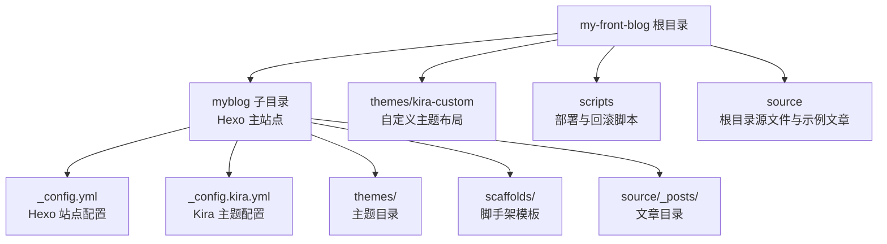
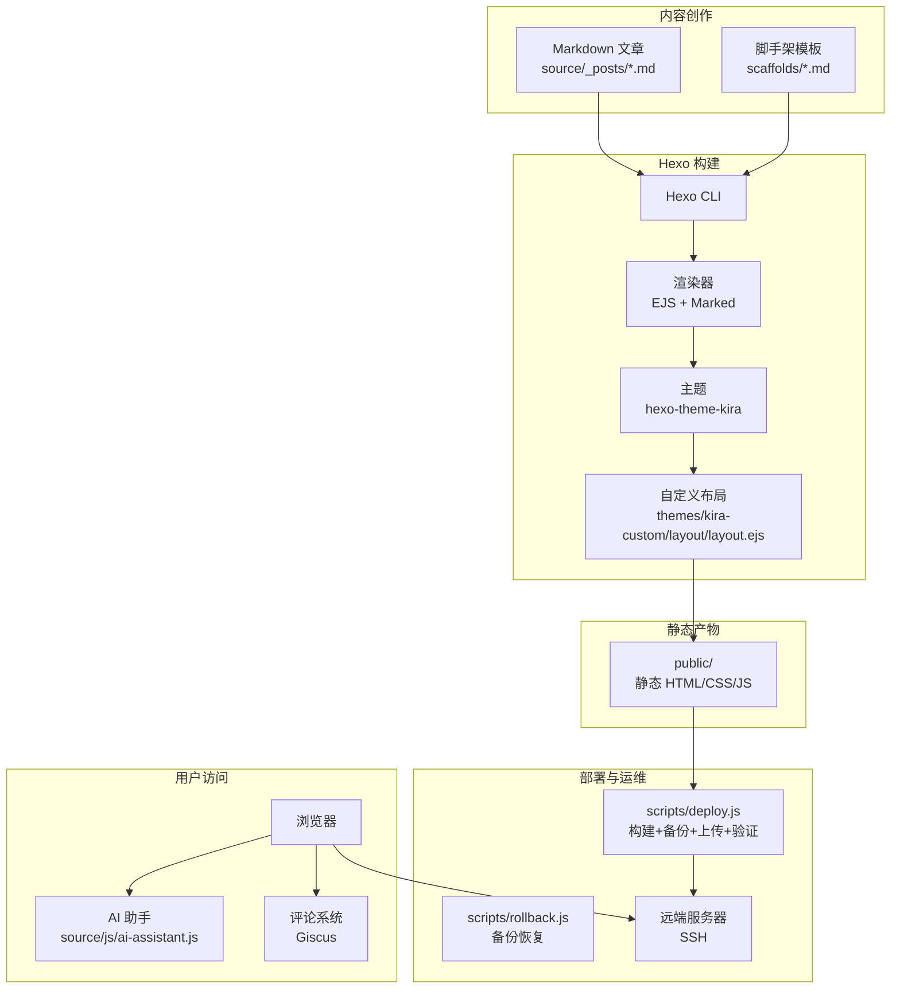
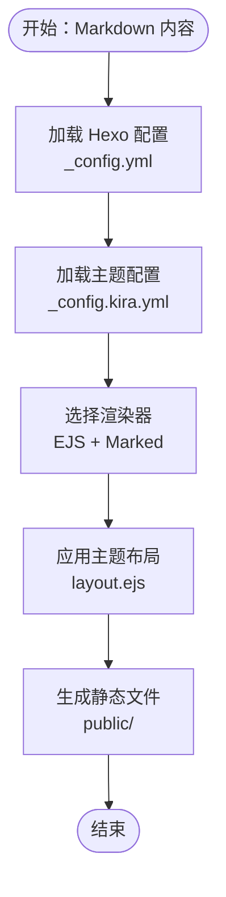
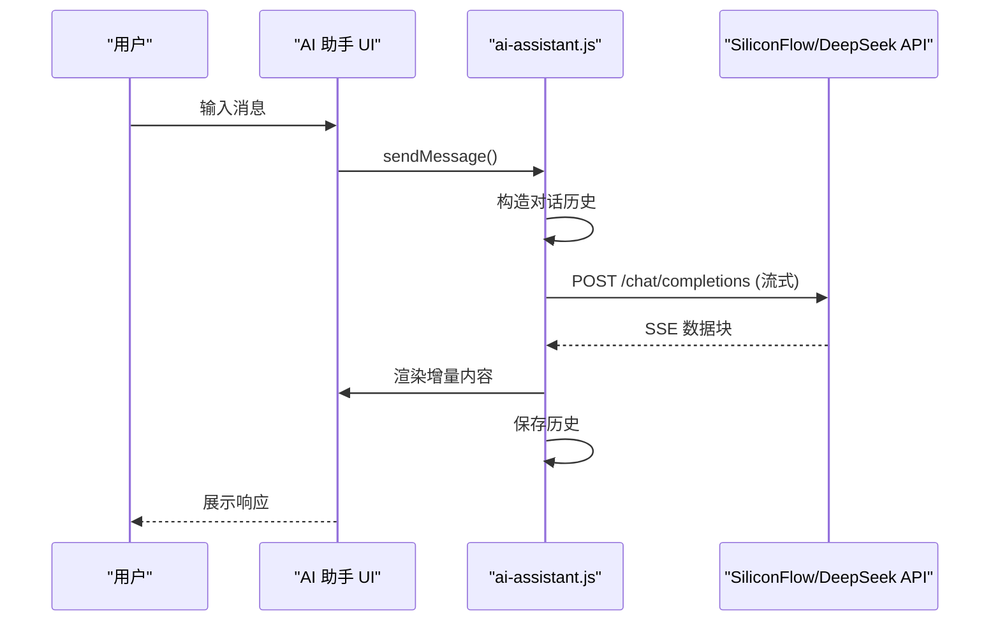
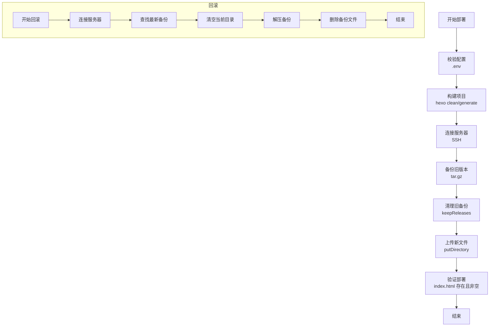
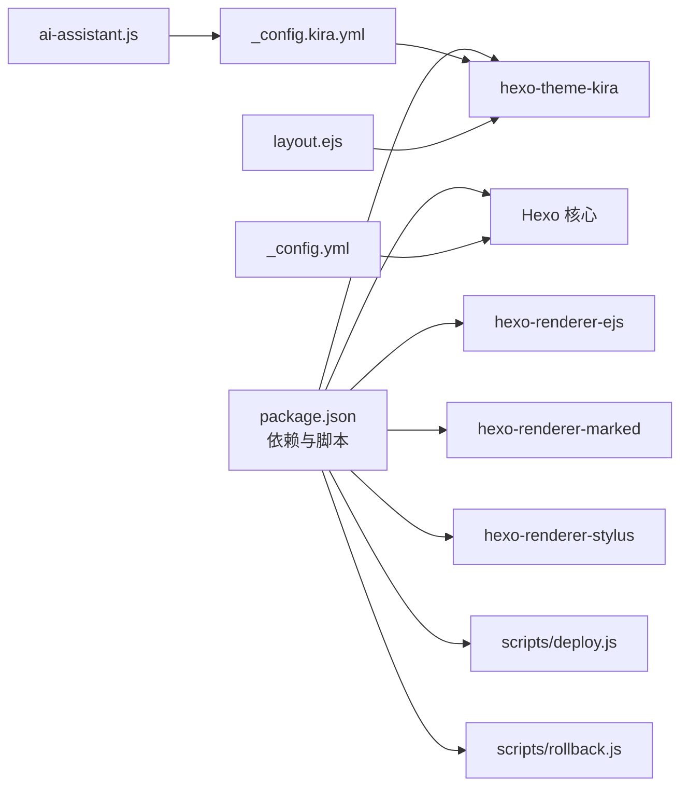

# 项目概述

<cite>
**本文引用的文件**
- [README.md](file://README.md)
- [package.json](file://package.json)
- [_config.yml](file://_config.yml)
- [_config.kira.yml](file://_config.kira.yml)
- [deploy.js](file://scripts/deploy.js)
- [rollback.js](file://scripts/rollback.js)
- [layout.ejs](file://themes/kira-custom/layout/layout.ejs)
- [ai-assistant.js](file://source/js/ai-assistant.js)
- [ai-assistant.styl](file://source/css/ai-assistant.styl)
- [双token无感刷新.md](file://source/_posts/双token无感刷新.md)
- [大文件上传方案.md](file://source/_posts/大文件上传方案.md)
- [虚拟长列表的实现.md](file://source/_posts/虚拟长列表的实现.md)
</cite>

## 目录
1. [简介](#简介)
2. [项目结构](#项目结构)
3. [核心组件](#核心组件)
4. [架构总览](#架构总览)
5. [详细组件分析](#详细组件分析)
6. [依赖关系分析](#依赖关系分析)
7. [性能考量](#性能考量)
8. [故障排查指南](#故障排查指南)
9. [结论](#结论)
10. [附录](#附录)

## 简介
my-front-blog 是一个基于 Hexo 静态站点生成器的现代化前端技术博客平台。项目以“快速部署、主题定制、AI 助手、自动化部署与回滚”为核心目标，结合 Kira 主题进行二次开发，提供简洁美观的界面与强大的内容管理能力。项目内置 AI 助手（DeepSeek API）、评论系统（Giscus）、主题配置与自定义样式，支持一键部署到服务器并具备版本回滚能力。

## 项目结构
项目采用“根目录 + myblog 子目录”的双目录组织方式：
- 根目录：存放主题定制布局、公共样式与脚本、全局配置与示例文章
- myblog 子目录：Hexo 主站点目录，包含主题、脚手架模板、源文件与配置

图表来源
- [README.md](file://README.md#L17-L37)
- [_config.yml](file://_config.yml#L1-L116)
- [_config.kira.yml](file://_config.kira.yml#L1-L150)

章节来源
- [README.md](file://README.md#L17-L37)

## 核心组件
- 静态网站生成（Hexo）
  - 使用 Hexo 作为核心引擎，将 Markdown 内容渲染为主题模板，生成静态 HTML 页面
  - 通过渲染器插件支持 EJS 模板与 Marked 解析器
- 主题定制（Kira 主题二次开发）
  - 自定义主题布局文件，注入 AI 助手配置与样式
  - 通过主题配置文件控制菜单、社交、CDN、评论系统等
- AI 助手（DeepSeek API 集成）
  - 浏览器端 JavaScript 模块，支持流式响应、多 API 密钥轮询与复制代码块
  - 配置来源于主题配置文件，支持硅基流动与 DeepSeek 两套 API
- 自动化部署与回滚
  - Node.js 脚本负责构建、备份、上传与验证，支持 SSH 连接与版本清理
  - 回滚脚本基于备份文件进行恢复
- 评论系统（Giscus）
  - 通过主题配置启用，支持 Discussions 评论生态

章节来源
- [package.json](file://package.json#L1-L38)
- [_config.yml](file://_config.yml#L1-L116)
- [_config.kira.yml](file://_config.kira.yml#L1-L150)
- [layout.ejs](file://themes/kira-custom/layout/layout.ejs#L1-L67)
- [ai-assistant.js](file://source/js/ai-assistant.js#L1-L828)
- [deploy.js](file://scripts/deploy.js#L1-L235)
- [rollback.js](file://scripts/rollback.js#L1-L140)

## 架构总览
下图展示了从内容创作到静态发布与用户访问的整体流程，以及关键组件间的交互关系。

图表来源
- [package.json](file://package.json#L1-L38)
- [_config.yml](file://_config.yml#L1-L116)
- [_config.kira.yml](file://_config.kira.yml#L1-L150)
- [layout.ejs](file://themes/kira-custom/layout/layout.ejs#L1-L67)
- [deploy.js](file://scripts/deploy.js#L1-L235)
- [rollback.js](file://scripts/rollback.js#L1-L140)

## 详细组件分析

### 静态网站生成与主题渲染
- Hexo 核心职责
  - 解析站点配置与主题配置，识别渲染器与生成器插件
  - 依据脚手架模板生成文章与页面，将 Markdown 渲染为主题模板
- 渲染器与解析器
  - EJS 模板引擎用于主题布局与组件渲染
  - Marked 解析器用于 Markdown 到 HTML 的转换
- 主题定制
  - 自定义布局文件注入主题配置与样式，支持评论系统与 AI 助手
  - 主题配置文件集中管理菜单、社交、CDN、评论与版权等

图表来源
- [_config.yml](file://_config.yml#L1-L116)
- [_config.kira.yml](file://_config.kira.yml#L1-L150)
- [layout.ejs](file://themes/kira-custom/layout/layout.ejs#L1-L67)

章节来源
- [package.json](file://package.json#L1-L38)
- [_config.yml](file://_config.yml#L1-L116)
- [_config.kira.yml](file://_config.kira.yml#L1-L150)
- [layout.ejs](file://themes/kira-custom/layout/layout.ejs#L1-L67)

### AI 助手交互组件
- 功能特性
  - 浏览器端 JavaScript 模块，支持流式响应、多 API 密钥轮询、复制代码块、拖拽吸附与移动端适配
  - 配置来源：主题配置文件中的 AI 助手开关与 API 参数
- 数据流
  - 用户输入 -> 构造对话历史 -> 调用 API（优先硅基流动，失败回退 DeepSeek）-> 流式渲染 -> 保存历史

图表来源
- [ai-assistant.js](file://source/js/ai-assistant.js#L1-L828)
- [_config.kira.yml](file://_config.kira.yml#L138-L150)
- [layout.ejs](file://themes/kira-custom/layout/layout.ejs#L40-L45)

章节来源
- [ai-assistant.js](file://source/js/ai-assistant.js#L1-L828)
- [ai-assistant.styl](file://source/css/ai-assistant.styl#L1-L383)
- [_config.kira.yml](file://_config.kira.yml#L138-L150)
- [layout.ejs](file://themes/kira-custom/layout/layout.ejs#L40-L45)

### 自动化部署与回滚机制
- 部署流程
  - 校验环境与配置 -> 清理与构建 -> 连接服务器 -> 备份旧版本 -> 上传新文件 -> 验证部署
- 回滚流程
  - 连接服务器 -> 查找最新备份 -> 清空当前目录 -> 解压备份 -> 删除已使用备份
- 配置要点
  - 通过 .env 文件提供 SSH 主机、用户、私钥路径与远端路径
  - 支持保留历史版本数量控制

图表来源
- [deploy.js](file://scripts/deploy.js#L1-L235)
- [rollback.js](file://scripts/rollback.js#L1-L140)
- [README.md](file://README.md#L112-L147)

章节来源
- [deploy.js](file://scripts/deploy.js#L1-L235)
- [rollback.js](file://scripts/rollback.js#L1-L140)
- [README.md](file://README.md#L112-L147)

### 主题定制化与样式体系
- 自定义布局
  - 在主题布局中注入主题配置与样式，引入第三方库与评论系统
- 自定义样式
  - Stylus 样式文件定义主题色、动画、响应式与暗色模式支持
- 社区与版权
  - 通过主题配置启用 Giscus 评论系统与版权信息

章节来源
- [layout.ejs](file://themes/kira-custom/layout/layout.ejs#L1-L67)
- [ai-assistant.styl](file://source/css/ai-assistant.styl#L1-L383)
- [_config.kira.yml](file://_config.kira.yml#L1-L150)

### 典型使用场景与技术优势
- 快速部署
  - 一键部署脚本自动完成构建、备份、上传与验证，减少人工干预
- 双 token 无感刷新
  - 文章演示了短期 accessToken 与 HttpOnly refreshToken 的配合，自动刷新与并发请求处理策略
- 大文件上传方案
  - 文章提供了分片上传、断点续传、并发控制与进度反馈的完整思路
- 虚拟长列表实现
  - 文章讲解了虚拟滚动原理与实现要点，适合长列表性能优化场景

章节来源
- [README.md](file://README.md#L108-L147)
- [双token无感刷新.md](file://source/_posts/双token无感刷新.md#L1-L385)
- [大文件上传方案.md](file://source/_posts/大文件上传方案.md#L1-L200)
- [虚拟长列表的实现.md](file://source/_posts/虚拟长列表的实现.md#L1-L200)

## 依赖关系分析
- 技术栈与插件
  - Hexo 核心与渲染器：EJS、Marked、Stylus
  - 主题：hexo-theme-kira
  - 部署工具：node-ssh、ora、dotenv、shelljs
- 配置耦合
  - Hexo 配置决定站点元信息、URL、分页与渲染选项
  - 主题配置决定菜单、社交、CDN、评论与 AI 助手开关与参数
  - 布局文件将主题配置注入页面，供前端脚本读取

图表来源
- [package.json](file://package.json#L1-L38)
- [_config.yml](file://_config.yml#L1-L116)
- [_config.kira.yml](file://_config.kira.yml#L1-L150)
- [layout.ejs](file://themes/kira-custom/layout/layout.ejs#L1-L67)
- [deploy.js](file://scripts/deploy.js#L1-L235)
- [rollback.js](file://scripts/rollback.js#L1-L140)

章节来源
- [package.json](file://package.json#L1-L38)
- [_config.yml](file://_config.yml#L1-L116)
- [_config.kira.yml](file://_config.kira.yml#L1-L150)

## 性能考量
- 静态生成性能
  - 合理设置分页与高亮选项，避免过度渲染
  - 使用 Stylus 与 EJS 模板减少运行时开销
- AI 助手性能
  - 流式响应与增量渲染，避免一次性渲染大量内容
  - 多 API 密钥轮询与失败回退，提升可用性
- 部署性能
  - 上传时忽略隐藏文件与 node_modules，减少传输体积
  - 保留历史版本数量可控，避免磁盘占用膨胀

## 故障排查指南
- 部署失败
  - 检查 .env 配置是否完整（主机、用户、远端路径、凭据）
  - 确认构建产物 public/index.html 是否存在
  - 查看 SSH 连接日志与备份创建状态
- 回滚失败
  - 确认是否存在可用备份文件
  - 检查远端目录权限与磁盘空间
- AI 助手不可用
  - 检查主题配置中的 API 开关与密钥
  - 确认浏览器网络与跨域策略
  - 查看前端控制台错误与流式响应状态

章节来源
- [deploy.js](file://scripts/deploy.js#L1-L235)
- [rollback.js](file://scripts/rollback.js#L1-L140)
- [_config.kira.yml](file://_config.kira.yml#L138-L150)
- [ai-assistant.js](file://source/js/ai-assistant.js#L1-L828)

## 结论
my-front-blog 通过 Hexo 与 Kira 主题的组合，构建了一个可扩展、可定制、易部署的前端技术博客平台。项目在静态生成、主题定制、AI 助手与自动化运维方面形成了完整的闭环，既满足初学者的快速上手需求，也为高级用户提供深入定制的空间。建议在生产环境中完善 CI/CD 流水线与监控告警，持续优化部署与回滚策略。

## 附录
- 基本概念
  - 静态网站生成：将内容与模板渲染为纯 HTML/CSS/JS，便于托管与加速
  - Markdown：轻量标记语言，适合写作与版本管理
  - YAML：配置文件格式，清晰表达层级与键值对
- 架构决策
  - 选择 Kira 主题进行二次开发，兼顾美观与可扩展性
  - 使用 EJS 与 Marked 保证模板灵活性与内容渲染质量
  - 通过脚本化部署与回滚，降低人为失误风险